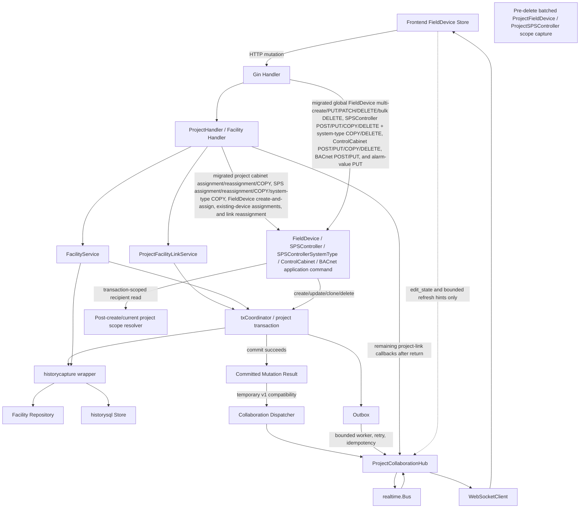
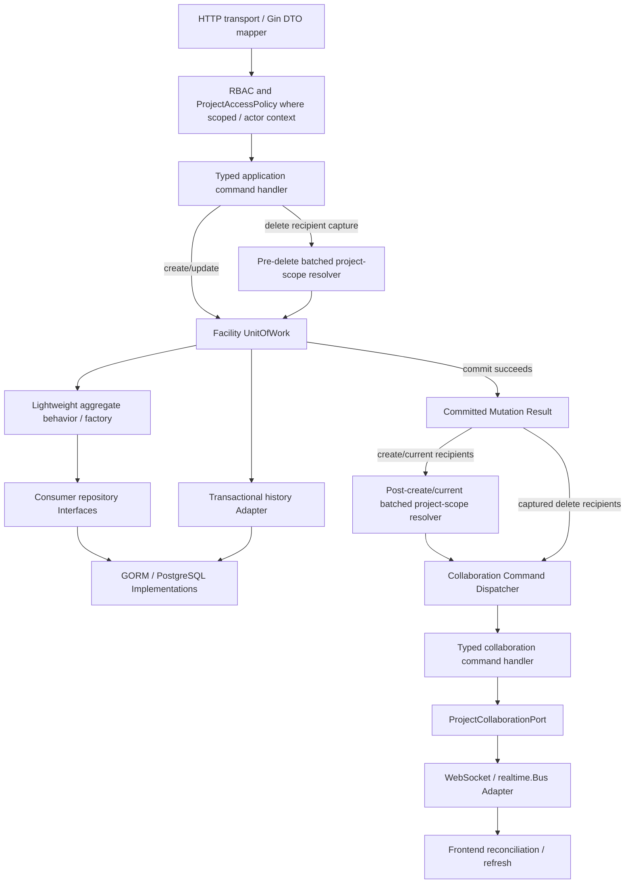

# Facility mutation architecture

Status: accepted correctness migration implemented; production sizing,
outbox-retention operations, and temporary schema-v1 server emission remain
Scope: `ControlCabinet` through `BacnetObject`
Reviewed: 2026-07-23

This document records the repository state captured before the facility
mutation refactoring started, then describes the implemented vertical slices. It is
intentionally based on existing symbols, call sites, constraints, and tests
rather than on a greenfield package design.

Sections that describe the original package inventory and migration gaps are
retained as design history. Sections 21 through 23, together with the status
annotations in Section 20, are authoritative for the completed implementation.

## 1. Executive summary

The repository already has several useful seams:

- consumer-oriented facility repository interfaces;
- an application transaction runner with transaction-scoped repository
  reconstruction;
- append-only facility/project history with before/after snapshots and restore;
- explicit project-facility link tables;
- project access and phase-permission policies;
- a project-room collaboration hub with presence, edit state, cross-node fanout,
  source-node suppression, and backpressure handling.

The main problem is not missing infrastructure. Mutation orchestration is split
between Gin handlers, facility services, project services, history repository
decorators, and the browser. That split makes commit ordering, project
recipients, audit correlation, and partial bulk outcomes implicit.

The initial direction is therefore evolutionary:

1. Keep the SQL repositories, transaction runner, history store, Gin, GORM,
   PostgreSQL, and realtime bus.
2. Add typed application mutation results and collaboration commands at one
   narrow seam.
3. Translate those commands to the existing version-1 WebSocket messages.
4. Move one facility mutation path at a time behind the seam; FieldDevice,
   SPSController and ControlCabinet create/update, global FieldDevice
   multi-create (including failed-item savepoint isolation), bulk-delete,
   single/bulk existing-device project assignment, project ObjectData
   activation/deactivation, FieldDevice, SPSController,
   and ControlCabinet single delete, global and project-scoped SPSController and
   ControlCabinet clone, both SPSControllerSystemType copy routes, global
   SPSControllerSystemType delete, standalone BACnet-object PUT, and both
   BACnet-object POST ownership paths, plus project-scoped ControlCabinet
   restore isolation/dispatch, are the first completed slices.
5. Keep `internal/service/facility` as a temporary compatibility implementation,
   then shrink it as application handlers assume orchestration.
6. Do not add a `Tenant` model.

The former project-link/global-delete conflation is closed on the three project
hierarchy DELETE routes: each removes only its exact association. Global
facility deletion is a distinct command family and now performs bounded
descendant snapshots, set-wise history, project-link cleanup, and ownership-
aware BACnet detach/delete handling. Browser-authored committed
`entity_delta` messages are rejected and logged; server-originated v1 deltas
remain only as a rollout compatibility projection.

Project deletion now also follows the accepted facility boundary: only an
active `SUPERADMIN` or `ADMIN_FZAG` may execute the application command, every
hierarchy-link table must be empty for that project, and no global facility row
is deleted. Project-owned ObjectData is removed in 100-row history batches,
memberships and the project row are removed in the same transaction, and the
v2 project refresh is persisted before commit.

## 2. Current package structure and dependency direction

The active facility model is spread across:

| Concern                          | Current files                                                                          | Current role                                                                                                            |
| -------------------------------- | -------------------------------------------------------------------------------------- | ----------------------------------------------------------------------------------------------------------------------- |
| Facility entities                | `backend/internal/domain/facility/*.go`                                                | Persistence-shaped structs, GORM relations, request/result helper types                                                 |
| High-volume ports                | `backend/internal/domain/facility/fielddevice/*.go`                                    | FieldDevice and Specification store capabilities                                                                        |
| Hierarchy ports                  | `backend/internal/domain/facility/hierarchy/*.go`                                      | SPSControllerSystemType queries and batch deletion                                                                      |
| ObjectData/BACnet ports          | `backend/internal/domain/facility/objectdata/*.go`                                     | Template and BACnet store capabilities                                                                                  |
| Facility application Modules     | `backend/internal/application/facility/*.go`                                           | Typed mutation results plus migrated FieldDevice, SPSController, ControlCabinet, and BACnet create/update orchestration |
| Collaboration application Module | `backend/internal/application/collaboration/*.go`                                      | Typed commands, one Dispatcher switch, typed handlers, realtime port                                                    |
| Mutation implementation          | `backend/internal/service/facility/*.go`                                               | Validation, transaction orchestration, bulk behavior, copy behavior                                                     |
| Partially extracted Modules      | `backend/internal/service/facility/{fielddevice,hierarchy,objectdata,alarm,reference}` | Repository groupings and selected helpers                                                                               |
| Transaction seam                 | `backend/internal/application/transaction/operation.go`                                | Opaque UnitOfWork, Runner, Factory, Boundary, Operation                                                                 |
| SQL Implementations              | `backend/internal/repository/facilitysql/*.go`                                         | GORM/PostgreSQL persistence                                                                                             |
| History adapters                 | `backend/internal/repository/historycapture/*.go`                                      | Repository decorators that capture before/after state                                                                   |
| History store                    | `backend/internal/repository/historysql/*.go`                                          | Events, scopes, snapshots, timeline, restore                                                                            |
| Project orchestration            | `backend/internal/service/project/*.go`                                                | Membership, access, link assignment, hierarchy deletion/copy                                                            |
| Collaboration transport          | `backend/internal/infrastructure/realtime/project_collaboration*.go`                   | Rooms, presence, edit state, wire DTOs, bus publication                                                                 |
| Transport                        | `backend/internal/handler/{facility,project}/*.go`                                     | DTO mapping, authorization calls, and remaining project-link realtime callbacks                                         |
| Composition                      | `backend/internal/wire/*.go`                                                           | Explicit repository, service, handler, and runtime construction                                                         |

The domain structs have little Depth: their public fields expose nearly every
state transition, and validation is in the service package. The useful
Interfaces are the small store ports. They should remain while orchestration
moves into application Modules.

## 3. Entity hierarchy and current rules

The implemented hierarchy is:

```text
Building
└── ControlCabinet
    └── SPSController
        └── SPSControllerSystemType
            └── FieldDevice
                ├── Specification
                └── BacnetObject
                    ├── BacnetObjectAlarmValue
                    ├── StateText reference
                    ├── NotificationClass reference
                    ├── AlarmType reference
                    └── optional software reference
```

`ObjectData` is a separate template model. It can own template BACnet objects
through `object_data_bacnet_objects`, but it is not an ancestor of a
FieldDevice.

### 3.1 Baseline responsibility inventory

This table records the starting behavior that motivated the migration. It is
not the final implementation status; resolved delete, revision, constraint,
history, and collaboration behavior is summarized in Sections 21 and 22.

| Type                      | Identity and parent                                                                      | Local and cross-entity rules                                                                                                                                                                                       | Creation/update/move                                                                                                                                                                | Copy/delete/project/history/realtime                                                                                                                                                                                                                                                          |
| ------------------------- | ---------------------------------------------------------------------------------------- | ------------------------------------------------------------------------------------------------------------------------------------------------------------------------------------------------------------------ | ----------------------------------------------------------------------------------------------------------------------------------------------------------------------------------- | --------------------------------------------------------------------------------------------------------------------------------------------------------------------------------------------------------------------------------------------------------------------------------------------- |
| `ControlCabinet`          | `domain.Base.ID`; required `BuildingID`                                                  | Cabinet number required, max 11, unique within building                                                                                                                                                            | Migrated POST owns create/history atomicity; migrated PUT makes an optional building move explicit and transactionally regenerates descendant SPS device names                      | Both copy paths retain `HierarchyCopier` policy and correlate decorated hierarchy/link writes; migrated global delete captures direct recipients and commits root history atomically while existing descendant cascades and project-link behavior remain unchanged                            |
| `SPSController`           | ID; required `ControlCabinetID`                                                          | Device name and GA device unique per cabinet; IP unique per VLAN; generated name depends on building/cabinet/GA                                                                                                    | Migrated POST preserves atomic controller/system-type creation; migrated PUT makes content, system-type replacement, and an optional cabinet move one application-owned transaction | Global and project-scoped clone keep `HierarchyCopier` policy, allocate GA/name, clear IP, correlate decorated rows/links, and publish after commit. Migrated single delete captures direct recipients and commits root history atomically, while descendant cascade history remains deferred |
| `SPSControllerSystemType` | ID; parents `SPSControllerID` and referenced `SystemTypeID`                              | Number must be in the referenced SystemType range and unique in the in-memory assignment set; no equivalent DB unique constraint                                                                                   | Assigned/replaced by SPS update; replacement removal is rejected while FieldDevices exist, while the distinct global DELETE retains its database-cascade behavior                   | Copy allocates lowest available number; both routes correlate hierarchy history; global DELETE now makes root history atomic but deliberately preserves realtime silence and existing descendant/link cleanup gaps                                                                            |
| `FieldDevice`             | ID; required `SPSControllerSystemTypeID`                                                 | Required SystemPart/Apparat; ApparatNr 1–99 and unique in `(system type association, system part, apparat, number)` by service check only                                                                          | Global multi-create has a typed request-wide result/history envelope while preserving one transaction per accepted item; template, explicit BACnet, update, and bulk paths remain   | Single and bulk delete own per-item mutation/history transactions, capture direct links before deletion, and publish bounded post-commit refreshes; existing child cascade/orphan behavior is unchanged                                                                                       |
| `Specification`           | Own ID; optional unique `FieldDeviceID`; FieldDevice also stores `SpecificationID`       | At most one intended per FieldDevice, represented by two links                                                                                                                                                     | Creation updates both rows transactionally; patch can create or clear fields                                                                                                        | Treated as FieldDevice-dependent lifecycle data; direct hierarchy cascades can orphan it; independently audited; no direct realtime command                                                                                                                                                   |
| `BacnetObject`            | Own ID; optional `FieldDeviceID`; optional template association; optional self-reference | TextFix required; standalone path checks sibling TextFix uniqueness and software type; validation differs in replace/patch paths                                                                                   | Standalone create/update, FieldDevice replace, ObjectData replace, bulk patch; both POST ownership paths and standalone PUT now run through typed application transactions          | IDs and in-copy software references are remapped; alarm values are dependent; independent history identity; no standalone delete HTTP use case; direct-only changes target containing FieldDevices, while project templates use a project refresh                                             |
| `BacnetObjectAlarmValue`  | Own ID; required `BacnetObjectID`                                                        | Unique per `(bacnet object, alarm type field)`                                                                                                                                                                     | Materialized from alarm definitions; PUT replaces the complete collection through a typed application transaction                                                                   | Dependent on BacnetObject; separately audited/restored; replacement now produces canonical delete/create changes and post-commit owner-scoped reconciliation; not copied by the current hierarchy copier                                                                                      |
| `ObjectData`              | Own ID; optional `ProjectID`; not a FieldDevice parent                                   | Description is unique within nullable project scope; owns Apparats and template BACnet associations; project activation rejects a different existing owner; project removal deactivates without clearing ownership | Transactional template create/update replaces selected associations and BACnet templates; project POST/DELETE now use typed activation/deactivation commands                        | Copied as project template data; supplies a factory input for FieldDevice BACnet creation; has its own history and project visibility                                                                                                                                                         |

Primary definitions are
`backend/internal/domain/facility/control_cabinet.go:8`,
`sps_controller.go:8`, `sps_controller_system_type.go:8`,
`field_device.go:8`, `specification.go:8`, `bacnet_object.go:8`, and
`alarm_value.go:22`; the template definition is in `object_data.go:8`.

### 3.2 Proposed aggregate boundaries

The target does not load or persist the hierarchy as one aggregate. The
proposed boundaries are:

| Aggregate or lifecycle boundary     | Contents                                                                                                                             | Consistency and transaction rule                                                                                                                                                                                                                                                      |
| ----------------------------------- | ------------------------------------------------------------------------------------------------------------------------------------ | ------------------------------------------------------------------------------------------------------------------------------------------------------------------------------------------------------------------------------------------------------------------------------------- |
| `ControlCabinet`                    | Cabinet root; `BuildingID` is an external parent reference                                                                           | Cabinet-local validation and an explicit move-to-building operation. Descendant rename, copy, and delete are hierarchy application use cases over bounded repository batches, not entity methods or an in-memory cabinet tree.                                                        |
| `SPSController`                     | Controller root plus its system-type assignment collection for assign/replace operations                                             | Device-name, GA, IP/VLAN, and assignment-number rules are checked in one controller command. FieldDevices are never loaded as children.                                                                                                                                               |
| `SPSControllerSystemType` lifecycle | A persisted assignment owned by the SPS configuration, addressed independently for high-volume FieldDevice parent queries            | Target creation/removal is coordinated through the SPS root and checks FieldDevice existence through a specialized query. The legacy global DELETE is retained as a separately migrated compatibility command; neither path is a gateway for loading descendants.                     |
| `FieldDevice`                       | FieldDevice root and its optional `Specification` lifecycle                                                                          | Base and Specification changes that require item atomicity share one transaction. Apparat/SystemPart/parent changes become explicit move or reassignment commands because they affect uniqueness and recipients.                                                                      |
| `BacnetObject`                      | BACnet root plus alarm values; references to StateText, NotificationClass, AlarmType, and optional software target remain identities | It is an independent aggregate. Standalone CRUD locks/validates only the target and required siblings. Replace/patch is a specialized collection application service that validates a batched final state and can coordinate multiple BACnet aggregates with one FieldDevice command. |
| `ObjectData`                        | Template root and its template associations                                                                                          | Independent template aggregate. `NewFieldDeviceFromObjectData` is a factory/application workflow that copies data; a created FieldDevice does not retain aggregate ownership by ObjectData.                                                                                           |
| Project-facility links              | Explicit association records, outside facility aggregates                                                                            | Managed by project application use cases. They determine access/collaboration scope but are not embedded collections on facility roots.                                                                                                                                               |

`BacnetObject` is not part of the in-memory `FieldDevice` aggregate because it
has its own identity, CRUD paths, history/restore identity, self-references, and
alarm-value lifecycle. Treating every BACnet row as a FieldDevice child would
make a single-object edit load and contend on an arbitrarily large collection.
It is also more than opaque dependent data because direct object operations and
references need stable identity. The specialized collection service preserves
FieldDevice-level replace semantics without sacrificing this independent
boundary.

These boundaries allow a command to coordinate several aggregates in one
database transaction when the use case requires atomicity; they do not imply
that all descendants are loaded together. Cross-aggregate invariants use
existence, uniqueness, and batched final-state queries. Cascades, hierarchy
copy, project-link reconciliation, history batching, and realtime recipient
resolution remain application responsibilities.

## 4. Current repository Interfaces

The generic capabilities in
`backend/internal/domain/repository.go:28-58` are appropriately small:
`Reader`, `Creator`, `Updater`, `Deleter`, and `Paginator`.

Specialized Interfaces express real requirements and should not be collapsed
into a generic CRUD repository:

- `domain/facility/repository.go:38-58` contains hierarchy uniqueness and lookup
  operations.
- `domain/facility/fielddevice/field_device_store.go:13-33` contains batched ID
  loading, pagination/filtering, ApparatNr conflict queries, and `BulkCreate`.
- `domain/facility/fielddevice/specification_store.go:15-23` contains
  FieldDevice-oriented child queries/deletes.
- `domain/facility/hierarchy/sps_controller_system_type_store.go:16-24`
  contains controller/project queries and batch hierarchy capabilities.
- `domain/facility/objectdata/bacnet_object_store.go:12-20` contains
  FieldDevice-oriented BACnet queries and batch deletes.
- `domain/project/project_{control_cabinet,sps_controller,field_device}.go`
  defines the explicit project-link repositories.

The SQL Implementations live in `backend/internal/repository/facilitysql` and
`projectsql`. Infrastructure-only `map[string]any` usage, such as the GORM
update map in `field_device_repo.go:69-83`, is acceptable at that serialization
boundary.

## 5. Transaction model

`backend/internal/application/transaction/operation.go` defines an opaque
UnitOfWork and generic transaction Operation.
`backend/internal/infrastructure/transaction/gorm_runner.go:27-36` implements
it with `gorm.DB.Transaction`.

Facility composition in `backend/internal/service/facility/tx.go` and
`backend/internal/wire/service_modules.go:13-24` reconstructs every repository
against the transaction handle. `wire.NewRepositories(tx)` reapplies the
history decorators, so mutations and decorator-generated history share the same
database transaction when this path is used.

Current transaction behavior is inconsistent:

| Operation                                                                               | Current boundary                                                                                                                                                                    |
| --------------------------------------------------------------------------------------- | ----------------------------------------------------------------------------------------------------------------------------------------------------------------------------------- |
| FieldDevice create / create with BACnet                                                 | One transaction per call                                                                                                                                                            |
| `PUT /facility/field-devices/:id` base update plus optional BACnet/template replacement | Application-owned transaction includes authoritative before/after reads, data, decorated history, direct project resolution, and schema-v2 outbox; v1 compatibility dispatch follows commit |
| Direct FieldDevice `MultiCreate`                                                        | Typed application wrapper supplies one OperationID/BatchID; existing service still opens one transaction per accepted item and request remains partial-success                      |
| Project `MultiCreateAndAssignFieldDevices`                                              | One outer project transaction plus one nested GORM savepoint per accepted FieldDevice item; failed roots/children/history roll back locally while successful items remain staged    |
| Legacy direct `FieldDeviceService.Update`                                               | No explicit transaction                                                                                                                                                             |
| `DELETE /facility/field-devices/:id`                                                    | Application-owned row/history transaction captures direct links and persists schema-v2 delete scope before commit; v1 compatibility dispatch follows                                |
| FieldDevice bulk update                                                                 | No request or per-item transaction; phase-level partial writes remain observable                                                                                                    |
| `DELETE /facility/field-devices/bulk-delete`                                            | Application-owned independent transaction per input ID; each changed item captures project links and persists v2 scope before delete, while one prefetched root/link set feeds the bounded v1 compatibility refresh |
| `PUT /facility/bacnet-objects/:id`                                                      | Application-owned authoritative load/patch/write/history transaction captures FieldDevice/ObjectData owners and persists targeted or project-fallback v2 scope before commit         |
| ControlCabinet update                                                                   | Transaction includes descendant SPS name regeneration, direct project resolution, history, and schema-v2 outbox                                                                    |
| ControlCabinet create                                                                   | Application-owned validation/write/history/reload transaction                                                                                                                       |
| `DELETE /facility/control-cabinets/:id`                                                 | Application-owned root/history transaction captures direct links and schema-v2 scope before delete; v1 compatibility dispatch follows commit                                         |
| SPS create with system types / replace system types                                     | One transaction                                                                                                                                                                     |
| SPS update                                                                              | Application-owned content/move/system-type/history transaction with direct project resolution and schema-v2 outbox                                                                 |
| `DELETE /facility/sps-controllers/:id`                                                  | Application-owned root/history transaction captures direct links and schema-v2 scope before delete; v1 compatibility dispatch follows commit                                         |
| Global SPSController clone                                                              | Application-owned transaction around the existing deep `HierarchyCopier`; all decorated copy writes share one OperationID/BatchID and dispatch follows commit                       |
| Project-scoped SPSController clone                                                      | Application-owned transaction around deep copy plus root/descendant project-link creation; all decorated writes share one OperationID/BatchID and dispatch follows commit           |
| Global ControlCabinet clone                                                             | Application-owned transaction around the existing deep `HierarchyCopier`; all decorated copy writes share one OperationID/BatchID and dispatch follows commit                       |
| Project-scoped ControlCabinet clone                                                     | Application-owned transaction around deep copy plus root/descendant project-link creation; all decorated writes share one OperationID/BatchID and dispatch follows commit           |
| Project-scoped SPSControllerSystemType copy                                             | One application-owned transaction covers number allocation, deep child copy, descendant project links, and correlated history; typed owning-SPS refresh follows commit              |
| Global SPSControllerSystemType copy                                                     | One application-owned transaction covers number allocation, deep child copy, authoritative reload, and correlated history; no realtime dispatch preserves existing behavior         |
| `DELETE /facility/sps-controller-system-types/:id`                                      | Application-owned minimal-root transaction commits the decorated assignment delete and history together; missing rows remain successful and no realtime dispatch preserves behavior |
| `POST /projects/:id/field-devices` existing-device assignment                           | Application-owned project-link/history transaction with the access-checked ProjectID; notification and typed FieldDevice refresh follow commit                                      |
| Project multi-create with `field_device_ids`                                            | One project precheck and independent application-owned link/history transaction per input ID; compact partial result plus one bounded refresh after all commits                     |
| `PUT /projects/:id/field-devices/:linkId`                                               | Application-owned authoritative link/history transaction with ProjectID ownership validation; notification and typed new-FieldDevice refresh follow commit                          |
| `POST /projects/:id/control-cabinets`                                                   | Application-owned root-plus-descendant project-link/history transaction; exact inserted descendant IDs are audited and one cabinet refresh follows commit                           |
| `PUT /projects/:id/control-cabinets/:linkId`                                            | Application-owned authoritative root-link plus additive two-level descendant history transaction; typed new-cabinet refresh follows commit                                          |
| `POST /projects/:id/sps-controllers`                                                    | Application-owned root-plus-descendant project-link/history transaction; exact inserted FieldDevice link IDs are audited and one SPS refresh follows commit                         |
| `PUT /projects/:id/sps-controllers/:linkId`                                             | Application-owned authoritative root-link plus additive-descendant history transaction; notification and typed new-SPS refresh follow commit                                        |
| Project cabinet/SPS/FieldDevice link DELETE                                             | Application-owned exact-link/history transaction validates stored ProjectID and persists schema-v2 reconciliation; no global facility or descendant project rows are deleted; v1 compatibility follows commit |
| Project ObjectData add/remove                                                           | Application-owned project existence/ownership/update/history transaction persists a targeted `object_data` v2 scope; canonical result and v1 full-project compatibility refresh follow commit |
| Global history restore                                                                  | Explicit history-store transaction; transport calls it directly and no committed collaboration command is emitted                                                                   |
| Project-scoped ControlCabinet restore                                                   | Project access plus current/historical root-link validation, then one outer transaction for restore rows/history, current recipient resolution, and schema-v2 project reconciliation |

The former nested-boundary defect in project-scoped FieldDevice multi-create is
closed: the transaction-scoped FieldDevice service receives a GORM runner rooted
at the outer transaction, so every accepted item gets a savepoint. Its partial
error remains a result value, but its staged root, children, and history are
rolled back before the outer create-and-link workflow continues.

## 6. Current bulk semantics

### 6.1 `FieldDeviceService.MultiCreate`

Implementation:
`backend/internal/service/facility/field_device_writer.go:205-375`.

- The request is not atomic.
- Direct facility usage gives each accepted item its own transaction.
- Validation and persistence failures are returned per input index.
- Parent lookups are cached; used Apparat numbers are loaded once per distinct
  uniqueness scope.
- Proposed Apparat numbers are reserved in request order and checked within the
  batch.
- A reservation is not released if a later persistence phase for that item
  fails.
- `ObjectDataID` and explicit BACnet objects are mutually exclusive.
- An empty explicit BACnet collection is indistinguishable from an omitted
  collection on create.
- The project-scoped outer transaction now supplies the transaction-scoped
  FieldDevice service with a nested GORM runner. Each accepted item therefore
  retains root/child/history atomicity through a savepoint while successful
  items remain staged for later project-link creation and the outer commit.
- The global facility route now delegates to
  `application/facility/fielddevice/multi_create.go`. It leaves every result,
  validation rule, and per-item transaction unchanged while installing one
  OperationID as history BatchID before the compatibility workflow runs.
- Successful items produce canonical FieldDevice create changes in input-result
  order. BACnet/template child writes remain repository-audited under the same
  batch instead of being loaded into the application result.
- The global route does not publish collaboration: newly generated FieldDevice
  IDs have no project links. Project-scoped create-and-assign remains a distinct
  outer-transaction and realtime migration.

### 6.2 `FieldDeviceService.BulkUpdate`

Implementation:
`backend/internal/service/facility/field_device_writer.go:377-556`.

- Existing FieldDevices are fetched in one batch and reused through
  `existingMap` and `proposedMap`.
- There is no request or item transaction.
- Base, Specification, and BACnet phases are attempted independently.
- A failed phase does not roll back another successful phase for the same item.
- A BACnet patch validates the collection, then updates rows sequentially; a
  mid-loop database error can leave earlier rows committed.
- Per-item `success` is true only when every requested phase succeeds.
- Field validation errors, ApparatNr suggestions, and suggestion options are
  returned in the established `BulkOperationResult`.
- Duplicate IDs share a proposed-map entry but are processed repeatedly.
- A request with no recognized phase becomes a failure with no useful message.
- `FieldDeviceService.ExecuteBulkUpdate` now returns an index-aligned internal
  `fielddevice.BulkUpdateExecution` with typed `succeeded`, `failed`, and
  `not_attempted` phase outcomes. Its compatibility `BulkUpdate` method and the
  HTTP response still return the exact legacy result without operation, batch,
  changed-ID, or phase fields.
- `failed` means the phase did not complete; it does not claim rollback. A
  repository/history error or a later BACnet row error may follow an already
  persisted technical write.
- The application mutation result includes fields from every phase known to
  have succeeded, even when a sibling phase makes the legacy item result fail.
- One generated operation ID is installed as `auditctx.BatchID` before the
  compatibility workflow runs, so history events, the internal mutation result,
  and collaboration commands share correlation.

The frontend deliberately preserves this phase-level partial success in
`frontend/src/lib/hooks/fieldDeviceEditing/bulkUpdatePhases.ts` and
`saveReconciliation.ts`; initial refactoring must not make it atomic. The v1
HTTP contract still requires inference from legacy error paths. In particular,
BACnet collection-wide failures cannot yet be represented exactly in the
frontend, so publishing phase outcomes is a separate compatible API step.

### 6.3 `FieldDeviceService.BulkDelete`

Implementation:
`backend/internal/service/facility/field_device_service.go:632-658`.

- The legacy service processes each ID independently and continues after a
  failure; results stay aligned with input order.
- Missing, duplicate, and zero IDs are normally reported as success because
  the GORM delete does not check affected-row count.
- The legacy loop had no request or per-item transaction. Because its decorated
  repository deleted first and wrote history second, a history failure could
  leave a deleted row while returning that item as failed.
- The global Gin route now delegates to
  `application/facility/fielddevice/bulk_delete.go`. It preserves the same
  request-level partial success and opens one transaction per input ID, so a
  delete/history/commit failure rolls back only that item.
- One OperationID is used as history BatchID across those independent item
  transactions. Successful existing roots produce one canonical delete change
  per unique ID; repeated IDs retain repeated successful HTTP result items.
- Candidate root snapshots and direct `ProjectFieldDevice` rows are each loaded
  once before deletion. Only successfully committed, previously existing roots
  are included in realtime reconciliation.
- A project receives at most one FieldDevice refresh: targeted for at most 100
  affected IDs, otherwise the existing full FieldDevice refresh. Scope or
  dispatch failure is best effort and cannot change a committed HTTP result.
- There is still no handler-level maximum batch size. The request therefore
  opens O(input IDs) transactions, and each decorated delete still performs its
  transactional history read/write work. The two new application reads are
  set-based rather than per item.

The prefetched canonical snapshot can be stale if another writer changes the
row before its item transaction. The transaction-local history decorator
remains authoritative for persistent audit state. Resolving that difference
requires optimistic locking or a transaction-aware batch/savepoint design, not
a hierarchy-wide lock.

### 6.4 Project existing-ID FieldDevice assignment

Implementation:
`backend/internal/service/project/project_assignment.go:308-325` and
`backend/internal/application/facility/fielddevice/bulk_assign_to_project.go`.

- The `field_device_ids` branch returns two independent arrays: successful IDs
  in input order and error strings only for failed items, in failure order.
- The legacy service checks project existence once and returns exactly one
  `"project not found"` association error before attempting any item.
- It then creates links sequentially without a request or item transaction.
  Processing continues after an error; a duplicate normally produces a
  conflict error after its first occurrence succeeds.
- The migrated application handler preserves that response and precheck but
  gives each input ID an independent transaction. Link creation and decorated
  history therefore commit or roll back together without turning the request
  atomic.
- One OperationID is the BatchID for every item transaction. Successful links
  produce canonical `ProjectFieldDevice` create changes; failed items produce
  neither changes nor collaboration IDs.
- After all item commits, the validated ProjectID receives one targeted
  FieldDevice refresh for at most 100 unique successes, otherwise one full
  FieldDevice refresh. The existing `project.field_device.multi_created`
  system notification is invoked separately with the HTTP success list.
- The request has no maximum and still performs O(input IDs) transactions and
  history operations. It adds only one project existence read and never queries
  recipient scope because authorization already established the sole ProjectID.

The adjacent single-link reassignment route is not a bulk operation, but now
uses the same correlation boundary. `PUT
/projects/:id/field-devices/:linkId` loads the authoritative
`ProjectFieldDevice` inside one transaction, verifies that its stored
`ProjectID` equals the access-checked route ProjectID, captures before/after
link snapshots, and updates through the decorated repository. Link data and
history therefore commit or roll back together. The exact legacy collaboration
behavior is retained: only the new `FieldDeviceID` is included in one targeted
refresh after commit. The old-ID omission is documented as a compatibility risk
rather than changed silently.

The corresponding SPSController project-link reassignment also has one
application-owned correlation and commit boundary. `PUT
/projects/:id/sps-controllers/:linkId` authoritatively loads the root link,
rejects a stored ProjectID mismatch, updates the target through the existing
compatibility workflow, and materializes the new controller's descendant
FieldDevice links. Root update, exact descendant-link create history, and all
decorated history share one OperationID/BatchID and transaction. Existing links
inherited from the old controller are deliberately not pruned because current
link rows cannot distinguish inherited from explicit assignments. After commit,
the exact v1 behavior remains one targeted refresh containing only the new
SPSControllerID.

ControlCabinet project-link reassignment now follows the same boundary across
both descendant levels. `PUT /projects/:id/control-cabinets/:linkId` captures
the authoritative root before state, validates its stored ProjectID, updates it
through the compatibility workflow, and set-inserts the new cabinet's
SPSController and FieldDevice links. Root and exact descendant history share
one transaction and OperationID/BatchID. Old descendant links remain for the
same unresolved provenance reason, and the post-commit v1 refresh contains only
the new ControlCabinetID.

### 6.5 Child replacement and patch

- `UpdateWithBacnetObjects` is transactional.
- `replaceFieldDeviceBacnetObjects` deletes the old collection and bulk creates
  the new collection in that transaction.
- `replaceFieldDeviceBacnetObjectsFromObjectData` clones template BACnet
  objects, materializes alarm values, and remaps in-set software references.
- Bulk `patchBacnetObjects` does not run transactionally and does not currently
  reproduce every invariant from standalone BACnet create/update.
- `PUT /bacnet-objects/{id}/alarm-values` preserves full replacement semantics.
  Its migrated application Module now surrounds the SQL Adapter's nested
  delete/create transaction, decorated delete/create history, and authoritative
  response reload with one outer transaction and one OperationID/BatchID.
- Specification create coordinates `Specification.FieldDeviceID` and
  `FieldDevice.SpecificationID` transactionally; bulk patch can partially
  succeed relative to base/BACnet phases.

## 7. Clone and hierarchy copy

The `HierarchyCopier` facade is
`backend/internal/service/facility/hierarchy_copy.go`. The actual policy is in:

- `project_facility_copy.go`
- `project_facility_copy_field_device.go`
- `project_facility_copy_bacnet.go`
- `project_facility_copy_refs.go`

It correctly remains orchestration rather than an entity `Clone()` method
because it needs stores, number allocation, bulk persistence, ID maps,
software-reference remapping, and a transaction.

Current policy:

- Cabinet: same building; generate next unique cabinet number.
- SPS: same target cabinet; generate GA and device name; copy description,
  location, subnet, gateway, and VLAN; clear IP.
- SPSControllerSystemType: copy definition/document and allocate a number where
  needed.
- FieldDevice: generate new ID, point to copied system-type association, retain
  business values and Apparat/SystemPart references.
- Specification: generate a new ID, set `Specification.FieldDeviceID`, then
  assign `FieldDevice.SpecificationID` with one set-based write after both rows
  exist.
- BACnet: generate IDs, copy reference fields, remap in-copy software
  references with one set-based write, and clone persisted alarm values exactly
  with new IDs and remapped BACnet parents. Exact alarm-value cloning preserves
  user/import overrides instead of rematerializing type defaults.
- Project links: not copied by `HierarchyCopier`; the project use case links the
  copied hierarchy only to the requested project.

The global `POST /facility/sps-controllers/{id}/copy` route now invokes that
unchanged policy through
`application/facility/spscontroller/clone.go`. The application transaction
reconstructs `HierarchyCopier` against transaction-scoped repositories, installs
one history BatchID before the deep copy, reloads the copied root, and only then
resolves any direct links after commit. The project-scoped route now invokes
`clone_for_project.go`: it reconstructs the existing project service without an
inner runner inside one application transaction, so the deep copy plus copied
root/descendant links share the same BatchID before one target-project command
is dispatched. Project-scoped SPSControllerSystemType copy follows the same
pattern in `clone_system_type_for_project.go`: number allocation, copied
FieldDevices/Specifications/BACnet objects, and copied `ProjectFieldDevice`
links commit together before one targeted owning-SPS refresh. The global
SPSControllerSystemType route now invokes `clone_system_type.go`, which installs
the same transaction/batch correlation and authoritative root Result but has no
project resolver or Dispatcher because the existing global route was silent.

Known defects/risks:

- Cabinet number allocation can execute up to 9,999 existence queries.
- System-type parents are processed ten at a time and descendant FieldDevice
  IDs are now scanned by a deterministic 500-ID keyset page; child BACnet and
  alarm-value fan-out inside one FieldDevice page is not independently bounded.
- A reference outside the copied set remains attached to the original object.
- Paging bounds working-set memory but does not bound total copy size, lock
  duration, history volume, or project-link fan-out inside the one transaction.
- Global system-type copy has no committed collaboration recipient policy. The
  migrated application use case deliberately preserves silence rather than
  inferring projects from unequal SPS and descendant FieldDevice link sets.

## 8. Project association and access-isolation model

There is no repository evidence for a tenant aggregate.

The actual isolation model is:

```text
authenticated user
  + global role/permission
  + project_users membership (or list-all/admin capability)
  + project phase permission
  + explicit project-facility links
  + ProjectID WebSocket room
```

`ProjectAccessPolicyService.CanAccessProject` in
`backend/internal/service/project/access_policy_service.go:24-50` allows:

- SuperAdmin or AdminFZAG;
- a role with `project.listAll`; or
- explicit `project_users` membership.

Action authorization additionally checks role permissions and phase rules in
`access_policy_service.go:52-75,180-218`. Project handlers call the access and
permission policy through
`backend/internal/handler/project/shared/access.go`. The WebSocket handler
checks project access before upgrading in
`backend/internal/handler/project/collaboration.go:18-35`; authorization does
not belong in the hub.

Project history now follows the same scope model even though its transport is a
separate handler package. `timeline.read`/`timeline.restore` remain global
middleware permissions, but the project timeline application query additionally
requires `ProjectAccessPolicyService` before adding the ProjectID scope. Project
ControlCabinet restore additionally proves a current root link or an actual
historical `ProjectControlCabinet` event. The permission migration grants both
timeline permissions only to SuperAdmin by default, so the added access check
does not change the default administrative role while protecting delegated
roles.

Team membership is not a project owner or facility isolation scope in current
code. It participates in user/team/RBAC workflows only.

Project links are explicit:

- `ProjectControlCabinet`
- `ProjectSPSController`
- `ProjectFieldDevice`

Assigning a parent creates descendant links. Reassigning a parent link creates
new descendant links but does not clearly reconcile stale links from the old
target.

The migrated single and bulk existing-FieldDevice assignments and single-link
reassignment trust only the ProjectID that passed
`ProjectAccessPolicyService` and the corresponding project-scoped create or
update permission in Gin. Create application transactions write
`ProjectFieldDevice` links and their history. Reassignment additionally loads
the link and rejects a stored ProjectID mismatch as not found before writing.
Each command dispatches only to that validated ProjectID. They perform no
project-scope inference and cannot leak assigned IDs into another room.
Existing notification events are invoked through a notification-only callback
after the application command returns; the handler no longer uses the combined
hub callback for these routes.

Project ControlCabinet assignment uses the same isolation rule. Gin first
checks membership and `project.control_cabinet.create` for the route ProjectID.
The application then passes only that validated ProjectID and the requested
ControlCabinetID to a transaction-scoped compatibility workflow. That workflow
creates the root `ProjectControlCabinet` and materializes descendant
`ProjectSPSController` and `ProjectFieldDevice` rows. The transaction cannot
publish to any other room; one cabinet-scoped refresh goes only to the
access-checked project after commit.

ControlCabinet reassignment additionally loads the root link inside the
transaction and requires its stored ProjectID to equal the route ProjectID that
passed membership and `project.controlcabinet.update`. Only that validated
ProjectID is used for the canonical result and collaboration command; neither
old/new descendant links nor client input can expand the recipient set.

Project SPSController assignment follows the identical boundary with
`project.spscontroller.create`. Its compatibility workflow creates the root
`ProjectSPSController` and descendant `ProjectFieldDevice` rows in one
application-owned transaction. Only the validated route ProjectID is placed in
the mutation result and collaboration envelope; no hierarchy-derived or
client-supplied alternate project scope is accepted.

Project SPSController reassignment retains that isolation rule. The application
loads the link inside the transaction and verifies its stored ProjectID equals
the route ProjectID already accepted by membership and
`project.spscontroller.update` checks. Only that validated ProjectID enters the
canonical result and collaboration envelope. Neither the old controller's
projects nor any hierarchy-derived project IDs are trusted as recipients.

The production set-insert adapters now use PostgreSQL `RETURNING id` for
descendant project links. `historycapture` records only those returned IDs, so
an `ON CONFLICT DO NOTHING` row that already belonged to the project is not
misreported as created by the current assignment. This remains set-based and
does not add one query per descendant.

The link rows contain no provenance that distinguishes an explicit
`ProjectFieldDevice` assignment from one materialized by assigning a cabinet or
SPSController. A FieldDevice parent move therefore cannot safely infer whether
to retain, delete, or create a link. The initial move slice deliberately
preserves the existing link rows and resolves collaboration recipients from the
current direct `ProjectFieldDevice` rows. It neither trusts a request ProjectID
nor broadens recipients from the destination hierarchy.

### 8.1 Critical delete ambiguity

`projectAssignment.remove` in
`backend/internal/service/project/project_assignment.go:224-302` does not merely
unlink the requested project. It deletes all matching project links and the
physical facility hierarchy. Existing characterization tests assert this
behavior.

For an entity linked to projects A and B, a user authorized only in A can
therefore trigger deletion affecting B. This refactoring must not silently
reinterpret that behavior. Before migrating project delete commands, record an
ADR choosing between:

1. project-local unlink, with separate globally authorized facility deletion;
2. project-owned facility data with enforced single ownership; or
3. shared data with reference-aware deletion rules.

No tenant model is implied by this decision.

### 8.2 Collaboration recipient resolution

Current global cabinet/SPS notification lookup uses only direct link
repositories through
`handler/project/facility_refresh_broadcaster.go`. History scope resolution
already uses unions across direct cabinet, SPS, and FieldDevice links in
`repository/historysql/scope.go:331-419`.

The target resolver must:

- accept entity IDs in batches;
- use all existing explicit link levels that confer project association;
- return deterministic, deduplicated ProjectIDs;
- capture old and new recipients for moves;
- capture recipients before delete/unlink;
- use current links after create/copy;
- never trust a client-supplied ProjectID for a global facility mutation.

For the initial FieldDevice move slice, history scope resolution already unions
the old and new hierarchy paths from the captured before/after snapshots. That
keeps the audit trail discoverable from both parents without querying one row at
a time. Realtime recipient union remains blocked on link provenance and the
project-association policy above; treating hierarchy ancestry as authorization
without that decision could leak the moved entity to an unrelated project.

The initial SPSController move slice follows the same conservative rule. It
keeps every existing `ProjectSPSController` row and resolves realtime recipients
from those direct links after commit. History is broader for discoverability,
not authorization: it unions both cabinets/buildings, direct links for both
cabinets, the moved controller's direct links, and its descendant FieldDevice
links. It deliberately excludes projects attached only to unrelated descendants
of the old cabinet.

The initial ControlCabinet move slice preserves its direct
`ProjectControlCabinet` rows and uses only those rows for the same recipients as
the former handler broadcaster. Because descendants keep the same cabinet ID,
their existing SPS/FieldDevice project links are not reconciled. History adds
both old and new Building scopes from the cabinet before/after snapshots, while
the cabinet's normal set-based scope resolver retains current direct and
descendant project visibility.

The standalone BACnet update slice resolves direct recipients from the union of
old/new `FieldDeviceID` values and current `ProjectFieldDevice` links. After
commit, one lightweight `BacnetObjectOwnerReader` projection also resolves every
persisted ObjectData association for the changed row. Recipient project IDs are
deduplicated: a direct-only project receives the filtered FieldDevice IDs, while
an ObjectData-associated project receives one existing full-project v1 refresh,
which supersedes a targeted refresh when both ownership paths reach the same
project. Global templates have no recipient. Neither path accepts a ProjectID
from the client.

The FieldDevice-owned BACnet create slice resolves recipients after commit from
the authoritative committed `FieldDeviceID` and current `ProjectFieldDevice`
rows. It deduplicates project links and never accepts a ProjectID from the
client. The ObjectData-owned branch instead loads the persisted ObjectData
inside the mutation transaction. A project-scoped template emits the existing
full-project v1 refresh after commit; a global template has no recipient. The
specialized SQL/history Adapter creates the BACnet row and owner join before the
single history decorator resolves scopes.

## 9. Current collaboration flow

The hub in
`backend/internal/infrastructure/realtime/project_collaboration.go` preserves:

- project rooms;
- multiple connections per user;
- presence;
- edit-state and changed-field tracking;
- initial ephemeral snapshot;
- entity deltas and refresh requests;
- cross-node bus fanout;
- source-node loop prevention;
- ping/pong and connection cleanup;
- bounded send queues and slow-client eviction.

Committed facility state no longer enters through the browser. The hub accepts
client `edit_state` and bounded `refresh_request` hints, rejects and logs
client-authored `entity_delta`, and emits committed state only from server
commands. Schema-v2 `committed_event` messages originate from the durable
outbox consumer.

The active FieldDevice save flow is:

```text
FieldDeviceState
  -> useFieldDeviceEditing.saveAllPendingEdits
  -> PATCH facility FieldDevice bulk endpoint
  -> BulkUpdateHandler preserves the legacy partial result
  -> one batched ProjectFieldDevice lookup
  -> typed FacilityHierarchyRefreshRequired per affected project
  -> realtime Adapter emits the existing v1 refresh_request
  -> optimistic/partial reconciliation
  -> other project pages refetch affected FieldDevices
```

References:

- `frontend/src/lib/hooks/useFieldDeviceEditing.svelte.ts:972-1089`
- `frontend/src/lib/hooks/fieldDeviceEditing/saveReconciliation.ts:47-157`
- `backend/internal/application/facility/fielddevice/bulk_update.go`
- `backend/internal/infrastructure/realtime/collaboration_command_adapter.go`
- `backend/internal/infrastructure/realtime/project_collaboration.go:767-793`

The initiating browser retains its HTTP save reconciliation and ignores its own
actor-scoped refresh. Server v1 messages remain readable during rollout, but
the hub no longer accepts client-authored committed messages.

ControlCabinet and SPSController global POST/PUT/copy/DELETE, both
project-scoped root-copy routes, project-scoped SPSControllerSystemType copy,
and the migrated FieldDevice paths use the application Dispatcher. The global
facility handlers no longer depend on the legacy project refresh broadcaster;
the unwired broadcaster and its isolated tests have now been removed rather
than retained as a second notification seam.
Project handlers own remaining direct hub callbacks in
`backend/internal/handler/project/handler.go`. The system-type copy's separate
asynchronous project notification is preserved through a notification-only
callback; it no longer invokes the hub callback.
Project ObjectData POST/DELETE likewise retain their existing notification-only
events, while their committed full-project refresh now comes from the typed
application command after the ObjectData/history transaction commits.
Global SPSControllerSystemType copy also uses the application transaction and
canonical Result, but intentionally has no Dispatcher edge because no previous
global realtime callback or unambiguous project-recipient rule exists.
Global SPSControllerSystemType DELETE now uses the same typed transaction and
canonical root Result, but also retains its previous realtime silence. It does
not infer recipients or silently invent a complete global descendant-delete
policy.
Global FieldDevice multi-create likewise has no collaboration edge: it creates
unlinked facility rows, and guessing a ProjectID from their hierarchy would
change the explicit project-link isolation model. Its application result is
currently consumed by history correlation and the unchanged HTTP mapper.

## 10. Current history and audit model

The persistent model in `backend/internal/domain/history/history.go` contains:

- `ChangeEvent` with action, actor, entity, batch, before/after/diff/metadata;
- `ChangeEventScope`;
- `EntityVersion` historical snapshots;
- restore request/result types.

`EntityVersion` is restore history, not an optimistic concurrency counter.

Authentication middleware writes the actor to `auditctx`; `historysql.Store`
reads it. Facility and project repositories are decorated in
`backend/internal/wire/repositories.go`.

### 10.1 What works

- A decorated update loads the before row, persists, then records after/diff.
- Decorated delete loads snapshots before deletion.
- When invoked through a transaction-scoped repository, mutation and history
  commit or roll back together.
- `UpdateHandler` in
  `backend/internal/application/facility/fielddevice/update.go` always
  reconstructs the legacy workflow over the application-owned transaction.
- `MultiCreateHandler` in
  `backend/internal/application/facility/fielddevice/multi_create.go` supplies
  one request-wide BatchID before the existing per-item transactions. A failed
  item still rolls back through the compatibility service while successful
  FieldDevice/BACnet/alarm history remains correlated across the request.
- `UpdateHandler` in
  `backend/internal/application/facility/spscontroller/update.go` does the same
  for controller content, cabinet moves, and optional system-type replacement.
- `CreateHandler` in
  `backend/internal/application/facility/spscontroller/create.go` preserves the
  controller/system-type transaction, supplies one history BatchID, reloads the
  committed root, and resolves direct project links after commit.
- `CloneHandler` in
  `backend/internal/application/facility/spscontroller/clone.go` reconstructs
  the existing deep `HierarchyCopier` inside an application transaction so the
  copied root and descendants share one BatchID; its canonical Result remains a
  compact root projection.
- `CloneForProjectHandler` in
  `backend/internal/application/facility/spscontroller/clone_for_project.go`
  extends that transaction to root/descendant project links and publishes only
  to the access-checked target project after commit.
- `CloneSystemTypeForProjectHandler` in
  `backend/internal/application/facility/spscontroller/clone_system_type_for_project.go`
  extends the same boundary through copied FieldDevices, Specifications, BACnet
  objects, and descendant project links; one BatchID covers every decorated
  write before a target-project command is dispatched.
- `CloneSystemTypeHandler` in
  `backend/internal/application/facility/spscontroller/clone_system_type.go`
  gives the global copy and its decorated children one BatchID and reloads the
  authoritative copied assignment; it intentionally returns no ProjectIDs and
  dispatches nothing.
- `DeleteSystemTypeHandler` in
  `backend/internal/application/facility/spscontroller/delete_system_type.go`
  loads one assignment snapshot and commits the decorated root delete/history
  in one transaction. Missing rows remain idempotent and it dispatches nothing.
- `DeleteHandler` in
  `backend/internal/application/facility/spscontroller/delete.go` captures
  direct project links before deletion, commits the decorated root delete and
  history together, and dispatches only after commit.
- `UpdateHandler` in
  `backend/internal/application/facility/controlcabinet/update.go` owns the
  cabinet load/update transaction, including the legacy service's paged
  descendant SPS-name regeneration.
- `CreateHandler` in
  `backend/internal/application/facility/controlcabinet/create.go` owns cabinet
  validation, decorated row/history persistence, committed reload, and
  post-commit direct-link recipient resolution.
- `CloneHandler` in
  `backend/internal/application/facility/controlcabinet/clone.go` reconstructs
  the existing deep `HierarchyCopier` inside an application transaction, gives
  every decorated copied row one operation BatchID, reloads the authoritative
  copied root, and resolves current direct links only after commit.
- `CloneForProjectHandler` in
  `backend/internal/application/facility/controlcabinet/clone_for_project.go`
  extends that boundary through the existing project service so copied
  cabinet, descendants, and all materialized project links commit under the
  same BatchID before one target-project command is dispatched.
- `DeleteHandler` in
  `backend/internal/application/facility/controlcabinet/delete.go` captures
  direct cabinet links before deletion, loads only the root in its transaction,
  and commits the decorated root delete/history before dispatch. It deliberately
  does not turn the whole descendant hierarchy into one in-memory aggregate.
- `UpdateHandler` in
  `backend/internal/application/facility/bacnetobject/update.go` owns the
  authoritative standalone patch/write transaction and supplies one history
  BatchID before any after-commit recipient lookup.
- `CreateHandler` in
  `backend/internal/application/facility/bacnetobject/create.go` owns the
  FieldDevice-parent create transaction, reloads the committed row, and uses
  the same OperationID as repository-history BatchID before recipient lookup.
- `ReplaceAlarmValuesHandler` in
  `backend/internal/application/facility/bacnetobject/replace_alarm_values.go`
  owns child delete/create history and response reload in the same outer
  transaction, then reuses the BACnet root's dual-owner recipient policy.
- BACnet replacement/template history receives the application OperationID as
  `ChangeEvent.BatchID` through `auditctx`; an explicit store mutation BatchID
  still takes precedence.
- Restore is transactional and uses one batch ID for hierarchy restore.
- Project-scoped ControlCabinet restore now treats the existing history Store
  as the atomic restore Adapter: application dispatch can only occur after that
  Store's transaction returns. Its returned BatchID is the collaboration
  OperationID/correlation ID.
- Timeline pages are bounded.

### 10.2 Remaining maintenance constraints

- Every new business mutation must enter through an explicit application
  transaction. Direct use of a decorated repository outside that boundary is
  unsupported because the data and history statements would otherwise
  autocommit independently.
- Partial-success bulk commands intentionally retain one transaction per item.
  Their shared BatchID is correlation only, and the persistent history work
  remains proportional to the number of successful items.
- Global hierarchy delete no longer relies on database cascades for required
  audit behavior: the bounded cleaner snapshots descendants, writes history
  set-wise, removes project links, and applies the BACnet ownership policy.
- Exact descendant project-link inserts report the IDs actually inserted, so
  conflict no-ops do not create false history. Future generic
  `ON CONFLICT DO NOTHING` paths must preserve that rule.
- Global system-type copy derives recipients from the owning SPSController.
  Global restore has no generally valid project-recipient rule and therefore
  remains an administrative history operation rather than a project realtime
  command. Project-scoped ControlCabinet restore publishes only after commit.
- PostgreSQL integration covers `to_jsonb` snapshots, successful restore,
  unique-conflict rollback, bounded hierarchy deletion, assignment
  provenance, and live revisions. Production retention, resource sizing, and
  extreme-volume execution remain operational concerns.

### 10.3 Duplicate change model

The former `backend/internal/service/changecapture` sparse `Change` model had
string Domain/Type values and no before/after, actor, scope, batch, or
transaction contract. `FieldDeviceService` invoked it in addition to using
decorated repositories. Production configured it as a Noop, but a persistent
Implementation would have created competing audit models and likely duplicate
events.

That Module and its facility `ChangeRecorder` configuration have now been
removed. Transactional `historycapture` decorators are the only persistent
facility audit path. The decorators depend on their own consumer-oriented
`historycapture.ChangeStore` Interface; `historysql.Store` remains the production
Implementation. This gives tests a narrow Adapter and keeps history storage
inside the repository transaction without coupling facility services to an
audit recorder.

## 11. Canonical mutation result

The application representation in
`backend/internal/application/facility/mutation/result.go` adapts to the
existing history model rather than replacing it:

```go
type Result struct {
    OperationID uuid.UUID
    BatchID     *uuid.UUID
    ActorID     *uuid.UUID
    OccurredAt  time.Time
    ProjectIDs  []uuid.UUID
    Changes     []EntityChange
}

type EntityChange struct {
    EntityType    EntityType
    EntityID      uuid.UUID
    ParentID      *uuid.UUID
    Action        history.Action
    Before        json.RawMessage
    After         json.RawMessage
    ChangedFields []FieldName
    Revision      *uint64
}
```

Rules:

- typed `EntityType` and `FieldName` values replace arbitrary strings;
- snapshots use JSON only at the persistence/serialization seam;
- `Revision` remains nil until a real optimistic-lock column exists;
- one operation ID covers one application command;
- one batch ID groups a bulk or hierarchy-copy history set;
- ProjectIDs are server-resolved, deterministic, and deduplicated;
- partial bulk results include fields from phases known to have completed plus
  a conservative request-derived reconciliation set for failed phases whose
  legacy nontransactional writes may be indeterminate.

Mappings:

1. `EntityChange` -> existing `historysql.Mutation`/`ChangeEvent` in the same
   transaction.
2. `Result` -> one or more typed collaboration commands after commit.
3. `Result` -> existing HTTP DTO plus optional operation/batch metadata during a
   compatible API extension.
4. `Result.ProjectIDs` -> project-link reconciliation and collaboration
   recipients.

During migration, history decorators remain the transactional persistence
Adapter. Step 4 removed the competing sparse recorder, supplied batch context,
and made plural capture query-bounded, but persisted snapshots are still
produced by the decorators rather than directly from `EntityChange`. The
application result is therefore canonical for post-commit consumers while
`historysql.Mutation` remains the history Adapter's explicit mapping. Moving
that mapping into migrated command handlers is still required before the
decorators can be retired.

## 12. Collaboration command model and dispatcher

The application collaboration Module in
`backend/internal/application/collaboration` now contains:

```go
type Envelope struct {
    SchemaVersion uint16
    EventID       uuid.UUID
    OperationID   uuid.UUID
    CorrelationID uuid.UUID
    ProjectID     uuid.UUID
    ActorID       *uuid.UUID
    OccurredAt    time.Time
    Sequence      *uint64
}

type FacilityHierarchyRefreshRequired struct {
    Envelope
    Scope     FacilityScope
    EntityIDs []uuid.UUID
}

type ControlCabinetState struct {
    ID               uuid.UUID
    BuildingID       uuid.UUID
    ControlCabinetNr *string
    CreatedAt        time.Time
    UpdatedAt        time.Time
}

type ControlCabinetUpdated struct {
    Envelope
    ControlCabinet ControlCabinetState
}

type ControlCabinetCreated struct {
    Envelope
    ControlCabinet ControlCabinetState
}

type ControlCabinetCloned struct {
    Envelope
    SourceControlCabinetID uuid.UUID
    ControlCabinet         ControlCabinetState
}

type ControlCabinetDeleted struct {
    Envelope
    ControlCabinetID uuid.UUID
    BuildingID       uuid.UUID
}

type ControlCabinetMoved struct {
    Envelope
    ControlCabinet ControlCabinetState
    FromBuildingID uuid.UUID
    ToBuildingID   uuid.UUID
}

type FieldDeviceUpdated struct {
    Envelope
    FieldDeviceID uuid.UUID
}

type FieldDeviceMoved struct {
    Envelope
    FieldDeviceID                 uuid.UUID
    FromSPSControllerSystemTypeID uuid.UUID
    ToSPSControllerSystemTypeID   uuid.UUID
}

type BacnetObjectUpdated struct {
    Envelope
    BacnetObjectID uuid.UUID
    FieldDeviceIDs []uuid.UUID
}

type BacnetObjectCreated struct {
    Envelope
    BacnetObjectID uuid.UUID
    FieldDeviceID  uuid.UUID
}

type SPSControllerState struct {
    ID                uuid.UUID
    ControlCabinetID  uuid.UUID
    GADevice          *string
    DeviceName        string
    DeviceDescription *string
    DeviceLocation    *string
    IPAddress         *string
    Subnet            *string
    Gateway           *string
    VLAN              *string
    CreatedAt         time.Time
    UpdatedAt         time.Time
}

type SPSControllerCreated struct {
    Envelope
    SPSController SPSControllerState
}

type SPSControllerCloned struct {
    Envelope
    SourceSPSControllerID uuid.UUID
    SPSController         SPSControllerState
}

type SPSControllerSystemTypeCloned struct {
    Envelope
    SourceSPSControllerSystemTypeID uuid.UUID
    SPSControllerSystemTypeID       uuid.UUID
    SPSControllerID                 uuid.UUID
}

type SPSControllerUpdated struct {
    Envelope
    SPSControllerID uuid.UUID
}

type SPSControllerMoved struct {
    Envelope
    SPSControllerID      uuid.UUID
    FromControlCabinetID uuid.UUID
    ToControlCabinetID   uuid.UUID
}

type SPSControllerDeleted struct {
    Envelope
    SPSControllerID  uuid.UUID
    ControlCabinetID uuid.UUID
}
```

`FacilityHierarchyRefreshRequired` serves the partial-success bulk path;
`FieldDeviceUpdated` serves an ordinary committed single update,
`FieldDeviceMoved` identifies an actual parent change, and
`FieldDeviceDeleted`, `SPSControllerDeleted`, and `ControlCabinetDeleted`
retain their pre-delete parent identities. The SPSController update and move pair distinguishes controller
content/system-type updates from cabinet moves, while create and clone carry a
narrow committed state projection; clone also retains the source identity.
`SPSControllerSystemTypeCloned` retains both assignment IDs and the owning
SPSController so v1 can request one authoritative controller refresh. The
BACnet update command carries only FieldDevice IDs already filtered for its
ProjectID, while the create command carries its one committed parent; the
realtime Adapter maps both commands to the exact version-1
`refresh_request` contract. ControlCabinet update/move instead map to the exact
existing v1 `entity_delta`: current clients use that message to refresh
dependent SPS/FieldDevice views after descendant names change. Cabinet create
and clone carry the same narrow committed state; clone additionally retains the
source identity. Cabinet delete maps to the exact existing targeted v1
`control_cabinet` refresh. `FieldDevicesCreated` carries a typed, compact
projection of only the successful rows from project create-and-assign. The v1
Adapter is the sole place that converts that projection to the legacy
`[]map[string]any` payload.

Design rules:

- commands are concrete Go types, not `{kind, payload any}`;
- the Dispatcher contains one controlled type switch;
- each command has an injected typed handler;
- a `ProjectCollaborationPort` is implemented by realtime infrastructure;
- the WebSocket Adapter maps commands to wire DTOs and contains no domain rules;
- all construction is explicit in `backend/internal/wire`;
- no globals, `init()` registration, reflection, or service locator.

## 13. After-commit publication

The required durable order is:

1. authorize at the HTTP/application entry point;
2. enter the transaction;
3. capture recipients required for update/delete/unlink from transaction-scoped
   project-link repositories;
4. load minimal aggregate state;
5. validate and mutate;
6. persist data, history, revision where available, and one schema-v2 outbox
   event per affected project with operation/batch context;
7. return a mutation Result and the captured project scope;
8. let the transaction runner commit;
9. optionally emit the temporary schema-v1 compatibility command;
10. let the bounded outbox worker claim in per-project sequence order;
11. translate the stored typed command to `committed_event` and fan it out.

The schema-v1 compatibility Adapter remains best effort and cannot change a
committed HTTP result. Schema-v2 delivery is retried from PostgreSQL, consumers
are idempotent by EventID, and clients recover sequence/revision gaps with an
authoritative HTTP refresh. PostgreSQL remains the source of truth.

Global FieldDevice multi-create deliberately has multiple commit gates because
partial success is its public contract:

```text
Gin DTO mapper
  -> typed MultiCreateCommand
  -> one OperationID installed as audit history BatchID
  -> compatibility MultiCreate validation/cache pass
  -> one existing transaction per accepted item
  -> optional ObjectData-derived or explicit BACnet child creation in that item transaction
  -> index-aligned partial result + canonical successful root changes
  -> unchanged HTTP 200 response and no collaboration command
```

The application handler does not place an outer transaction around the request.
Doing so would turn already committed successes into an all-or-nothing batch.
Each accepted item still commits or rolls back with its own child history; the
shared BatchID correlates the successful transactions without claiming that the
request itself was atomic.

Project-scoped FieldDevice create-and-assign deliberately retains its different
outer transaction composition:

```text
Project Gin handler
  -> ProjectAccessPolicyService membership + create-permission checks
  -> typed MultiCreateForProjectCommand with the validated ProjectID
  -> one application-owned outer GORM transaction and OperationID/BatchID
  -> transaction-scoped ProjectFacilityLinkService compatibility workflow
  -> transaction-scoped FieldDeviceService MultiCreate plus successful link writes
  -> unchanged index-aligned partial HTTP result + canonical successful root changes
  -> outer commit
  -> typed FieldDevicesCreated for the validated ProjectID only
  -> exact v1 field_device entity_delta, or full field_device refresh fallback
```

The handler no longer calls the WebSocket hub. Hard project/link/commit errors
roll back all writes and history and emit nothing. Item errors remain values
inside the legacy result, but each accepted item now runs inside a nested GORM
savepoint. A later BACnet/alarm failure rolls back that item's root, children,
and history before the loop continues; only items marked successful remain
staged for project links and publication. Request ordering, cached validation,
and the index-aligned partial-result contract are unchanged.

Assigning one existing FieldDevice to a project uses a smaller project-link
commit gate:

```text
Project Gin handler
  -> ProjectAccessPolicyService membership + create-permission checks
  -> typed AssignToProjectCommand with validated ProjectID and FieldDeviceID
  -> application-owned GORM transaction and OperationID/BatchID
  -> transaction-scoped ProjectFacilityLinkService compatibility workflow
  -> decorated ProjectFieldDevice create plus history
  -> canonical ProjectFieldDevice create change
  -> commit
  -> typed targeted FieldDevice refresh for that ProjectID
  -> notification-only project.field_device.created callback
```

The exact 201 link DTO and error mapping are retained. Realtime dispatch is
best effort and cannot turn a committed link into an HTTP failure. The
notification callback remains outside the transaction, matching its previous
asynchronous behavior, but it no longer also reaches the hub.

The `field_device_ids` multi-assignment branch preserves partial commits:

```text
Project Gin handler
  -> membership + project-scoped create-permission checks
  -> typed BulkAssignToProjectCommand
  -> one authoritative project existence read
  -> one OperationID/history BatchID
  -> independent ProjectFieldDevice link/history transaction per input ID
  -> unchanged success-ID and association-error arrays
  -> canonical changes for successful links only
  -> one targeted refresh at <=100 unique successes, otherwise full refresh
  -> notification-only project.field_device.multi_created callback
```

All item transactions finish before dispatch. A failed item does not erase
earlier successes and never appears in collaboration payloads. A missing
project retains the legacy single `"project not found"` error and performs no
item write.

Reassigning one existing project link uses one authoritative link transaction:

```text
Project Gin handler
  -> membership + project-scoped update-permission checks
  -> typed ReassignProjectLinkCommand
  -> application-owned GORM transaction and OperationID/BatchID
  -> transaction-scoped ProjectFieldDevice repository loads link by LinkID
  -> stored ProjectID must equal the access-checked route ProjectID
  -> decorated link update/history + canonical before/after change
  -> commit
  -> typed targeted refresh for the committed new FieldDeviceID and validated ProjectID
  -> notification-only project.field_device.updated callback
```

The exact 200 link DTO, not-found mapping, and v1 new-ID-only refresh are
retained. Write/history/commit failures publish nothing. A best-effort realtime
failure after commit is reported without converting a committed reassignment
into an HTTP error. Refreshing both old and new IDs could improve remote cache
reconciliation, but would alter the established wire behavior and remains a
versioned compatibility decision.

Assigning an existing ControlCabinet preserves the descendant-link policy
behind one commit gate:

```text
Project Gin handler
  -> membership + project-scoped ControlCabinet create-permission checks
  -> typed controlcabinet.AssignToProjectCommand
  -> application-owned GORM transaction and OperationID/BatchID
  -> transaction-scoped ProjectFacilityLinkService compatibility workflow
  -> decorated ProjectControlCabinet create
  -> set-based ProjectSPSController and ProjectFieldDevice descendant inserts
  -> exact inserted descendant IDs returned to transactional history
  -> canonical root ProjectControlCabinet create change
  -> commit
  -> typed targeted control_cabinet refresh for the validated ProjectID
  -> notification-only project.control_cabinet.created callback
```

The exact 201 project-link DTO and existing error mapping remain unchanged.
Root, descendants, and their history roll back together on workflow/history or
commit failure; no collaboration command is emitted. Existing descendant links
skipped by `ON CONFLICT DO NOTHING` no longer receive false create events for
the current operation.

Reassigning a ControlCabinet project link keeps the two-level additive policy
behind the same commit gate:

```text
Project Gin handler
  -> membership + project-scoped ControlCabinet update-permission checks
  -> typed controlcabinet.ReassignProjectLinkCommand
  -> application-owned GORM transaction and OperationID/BatchID
  -> transaction-scoped root-link reader + ProjectFacilityLinkService Adapter
  -> authoritative ProjectControlCabinet load and stored-ProjectID validation
  -> decorated root update plus exact SPSController/FieldDevice link creates/history
  -> canonical root ProjectControlCabinet before/after change
  -> commit
  -> typed targeted control_cabinet refresh for the new ID and validated ProjectID
  -> notification-only project.control_cabinet.updated callback
```

The exact 200 DTO and not-found mapping remain unchanged. Old descendant links
are not pruned. Root, descendant, history, and commit failures publish nothing;
a post-commit dispatch failure is reported without changing the successful HTTP
result.

Assigning an existing SPSController is the smaller parent-assignment variant:

```text
Project Gin handler
  -> membership + project-scoped SPSController create-permission checks
  -> typed spscontroller.AssignToProjectCommand
  -> application-owned GORM transaction and OperationID/BatchID
  -> transaction-scoped ProjectFacilityLinkService compatibility workflow
  -> decorated ProjectSPSController create
  -> set-based descendant ProjectFieldDevice inserts with exact returned IDs
  -> canonical root ProjectSPSController create change
  -> commit
  -> typed targeted sps_controller refresh for the validated ProjectID
  -> notification-only project.sps_controller.created callback
```

The exact 201 link response and current error mapping are retained. Root,
descendant links, and their history roll back together, and failed transactions
emit no collaboration command or notification.

Reassigning an SPSController project link uses the same compatibility workflow
for additive descendant materialization:

```text
Project Gin handler
  -> membership + project-scoped SPSController update-permission checks
  -> typed spscontroller.ReassignProjectLinkCommand
  -> application-owned GORM transaction and OperationID/BatchID
  -> transaction-scoped root-link reader + ProjectFacilityLinkService Adapter
  -> authoritative ProjectSPSController load and stored-ProjectID validation
  -> decorated root update plus exact descendant ProjectFieldDevice creates/history
  -> canonical root ProjectSPSController before/after change
  -> commit
  -> typed targeted sps_controller refresh for the new ID and validated ProjectID
  -> notification-only project.sps_controller.updated callback
```

The exact 200 link DTO and not-found mapping are unchanged. Old descendant links
remain intact, matching the characterized service behavior. Any root,
descendant, history, or commit failure publishes nothing; post-commit realtime
failure is best effort and cannot turn the committed update into an HTTP error.

Steps 2 and 5 implement this order for
`PUT /facility/field-devices/:id`:

```text
Gin DTO mapper
  -> UpdateCommand
  -> GORM transaction
  -> transaction-scoped FieldDeviceService Adapter
  -> historycapture + historysql on the same *gorm.DB
  -> commit
  -> batched ProjectFieldDevice resolution
  -> FieldDeviceUpdated or FieldDeviceMoved
  -> v1 targeted refresh_request
```

The application first loads the authoritative FieldDevice and derives a typed
`MoveCommand` by merging the compatibility PUT's optional placement fields with
the current placement. The domain `MoveTo` method enforces local placement
validity. The transaction-scoped legacy service Adapter remains responsible for
destination existence and ApparatNr uniqueness, both of which require
repositories. A parent move gives all affected history rows one operation batch
ID and dispatches only after commit.

The route still has the existing global `fielddevice.update` permission and no
ProjectID input. It therefore cannot add a project-membership check without an
API/authorization decision. This slice deliberately preserves that observable
authorization boundary; project-room joins continue to use
`ProjectAccessPolicyService`.

FieldDevice single DELETE applies the same commit gate while preserving the
legacy missing-row behavior:

```text
Gin path mapper
  -> typed DeleteCommand
  -> GORM transaction, minimal authoritative FieldDevice load, and direct ProjectFieldDevice lookup
  -> decorated root delete history with OperationID as BatchID
  -> schema-v2 FieldDeviceDeleted outbox records
  -> canonical delete EntityChange from the captured before snapshot
  -> commit
  -> FieldDeviceDeleted per captured ProjectID
  -> existing v1 targeted field_device refresh_request
```

Recipient/outbox failure rolls the delete and history back; a committed delete
therefore always has durable scope. Missing rows still return 204, produce no
mutation change, and dispatch nothing. This slice intentionally does not add
explicit Specification/BACnet deletion or change database cascades;
child-history completeness is a separate bounded hierarchy-delete design.

FieldDevice bulk DELETE preserves independent outcomes while applying that
commit gate once per input item:

```text
Gin JSON mapper
  -> typed BulkDeleteCommand
  -> one set-based candidate snapshot read
  -> one set-based ProjectFieldDevice read for the v1 aggregate projection
  -> one OperationID/history BatchID for the request
  -> independent GORM transaction per input ID
  -> transaction-scoped direct-link read and schema-v2 outbox per changed item
  -> decorated root delete and history commit or rollback together per item
  -> unchanged index-aligned BulkOperationResult
  -> canonical unique successful delete changes
  -> at most one targeted/full FieldDevice refresh per affected ProjectID
```

Missing and repeated IDs remain successful compatibility results. A failed
item does not roll back earlier successes, and no command includes its ID. The
application captures durable direct-link scope in each delete transaction; it
never trusts a project supplied by the client. V1 compatibility dispatch begins
only after every item transaction has returned, so no project observes an
intermediate request state through that compatibility path.

The initial SPSController slice uses the same ordering for
`PUT /facility/sps-controllers/:id`:

```text
Gin DTO mapper
  -> typed SPSController UpdateCommand
  -> GORM transaction
  -> authoritative load on transaction-scoped SPSControllerService Adapter
  -> content + optional MoveToControlCabinet + optional system-type replacement
  -> historycapture + historysql with one operation BatchID
  -> committed reload and Mutation Result
  -> commit
  -> one batched ProjectSPSController lookup
  -> SPSControllerUpdated or SPSControllerMoved
  -> v1 targeted refresh_request
```

The service Adapter regenerates the device name from the destination building,
cabinet, and GA and retains its existing uniqueness/reference checks. A
cross-cabinet GA suggestion now excludes the current controller only when that
controller actually belongs to the requested cabinet; the backend accepts the
legacy `sps_controller_id` query alias while new frontend requests use the
documented `exclude_id`.

SPSController POST now uses the same boundary while retaining the legacy
controller-plus-system-types transaction:

```text
Gin DTO mapper
  -> typed SPSController CreateCommand
  -> GORM transaction
  -> transaction-scoped SPSControllerService Adapter
  -> GA assignment, generated name, uniqueness, and system-type validation
  -> controller and assignment history share one OperationID/BatchID
  -> authoritative committed root reload and create EntityChange
  -> commit
  -> one ProjectSPSController lookup
  -> SPSControllerCreated per current linked project
  -> existing v1 sps_controller entity_delta
```

The canonical Result lists the controller root; assignment rows remain captured
by the decorated repositories with the same BatchID. This avoids loading the
assignment collection merely to build a WebSocket payload and preserves the
unchanged SPSController response DTO.

The global SPSController copy endpoint now uses a typed clone command without
moving deep-copy rules out of `HierarchyCopier`:

```text
Gin path mapper
  -> typed SPSController CloneCommand with source identity
  -> GORM transaction
  -> transaction-scoped SPSControllerService / HierarchyCopier Adapter
  -> root, system types, FieldDevices, Specifications, and BACnet rows copied by existing policy
  -> all decorated writes share one OperationID/BatchID
  -> authoritative copied-root reload and compact create EntityChange
  -> commit
  -> one ProjectSPSController lookup for the copied ID
  -> SPSControllerCloned per current linked project
  -> existing v1 sps_controller entity_delta
```

The source is never mutated and the application Result intentionally contains
only the copied SPS root; descendant events remain in transactional history
under the same batch. The global copier does not create project links, so its
normal recipient set is empty, exactly as before. If a server-owned direct link
exists after commit, the typed Adapter emits the same strict-v1 delta formerly
sent by Gin.

Project-scoped SPSController copy has a distinct typed command because its
validated ProjectID and link creation are part of the use case:

```text
Project Gin handler validates membership + project-scoped create permission
  -> typed CloneForProjectCommand with ProjectID and source SPSControllerID
  -> one application-owned GORM transaction
  -> transaction-scoped ProjectFacilityLinkService without an inner runner
  -> existing HierarchyCopier deep copy
  -> copied root/descendant project-link creation
  -> all decorated rows and links share one OperationID/BatchID
  -> commit
  -> one SPSControllerCloned command to the validated and newly linked ProjectID
  -> existing v1 sps_controller entity_delta
```

The application does not resolve recipients from a client assertion: the
handler first runs the existing `ProjectAccessPolicyService` and phase-aware
permission check, and the transaction must successfully create the target
project link. No command is sent to source or unrelated projects. The existing
route still permits a source controller that is not linked to the target
project; tightening source visibility is a separate authorization decision.

Project-scoped SPSControllerSystemType copy uses the same outer boundary while
retaining its child-specific link policy:

```text
Project Gin handler validates membership + system-type create permission
  -> typed CloneSystemTypeForProjectCommand with target ProjectID and source assignment ID
  -> one application-owned GORM transaction
  -> transaction-scoped ProjectFacilityLinkService without an inner runner
  -> HierarchyCopier allocates the lowest free number and copies child rows
  -> copied descendant FieldDevices are linked only to the validated project
  -> all decorated hierarchy/link writes share one OperationID/BatchID
  -> commit
  -> SPSControllerSystemTypeCloned for the validated target ProjectID
  -> exact v1 targeted sps_controller refresh_request for the owning controller
  -> existing asynchronous project notification through a notification-only seam
```

A copy, descendant-link, or outer-commit failure emits neither collaboration nor
notification. The canonical Result contains the copied assignment root while
decorators persist child history under the same batch. The notification event
key and metadata stay unchanged, but the handler no longer reaches the
WebSocket hub through that callback.

Global SPSControllerSystemType DELETE is a separate compatibility command:

```text
Gin path mapper
  -> typed DeleteSystemTypeCommand
  -> one application-owned GORM transaction
  -> minimal authoritative SPSControllerSystemType load
  -> decorated root delete history with OperationID as BatchID
  -> existing database cascade policy
  -> canonical assignment delete EntityChange
  -> commit
  -> unchanged 204 and no collaboration command
```

An absent assignment still executes the idempotent repository delete, returns
204, records no canonical change, and emits nothing. Delete, history, and outer
commit failures roll back together. The command does not load descendants or
invent project recipients. Complete descendant snapshots/history and global
project-link cleanup remain a separate bounded-delete decision.

SPSController single DELETE captures direct project recipients and persists its
schema-v2 scope in the destructive transaction:

```text
Gin path mapper
  -> typed SPSController DeleteCommand
  -> GORM transaction with minimal authoritative SPSController and ProjectSPSController loads
  -> decorated root delete history with OperationID as BatchID
  -> schema-v2 SPSControllerDeleted outbox records
  -> canonical delete EntityChange from the captured before snapshot
  -> commit
  -> SPSControllerDeleted per captured ProjectID
  -> existing v1 targeted sps_controller refresh_request
```

The endpoint remains idempotent: an absent controller still returns 204,
records no canonical change, and emits nothing. A recipient/outbox failure
rolls the root and history back. This slice
does not load the controller's hierarchy. Database cascades and their existing
child-history gaps are unchanged and remain part of the bounded hierarchy
delete design.

ControlCabinet PUT follows the same commit boundary while preserving a
different v1 projection:

```text
Gin DTO mapper
  -> typed ControlCabinet UpdateCommand
  -> GORM transaction and authoritative cabinet load
  -> optional MoveToBuilding local transition
  -> transaction-scoped ControlCabinetService Adapter
  -> cabinet validation/write + paged descendant SPS-name regeneration
  -> transactional history with one operation BatchID
  -> committed reload and Mutation Result
  -> commit
  -> one batched ProjectControlCabinet lookup
  -> ControlCabinetUpdated or ControlCabinetMoved
  -> existing v1 control_cabinet entity_delta
```

The committed delta carries only the five cabinet fields already present on the
wire. It intentionally does not serialize the domain aggregate or descendant
rows. Existing remote-client behavior then refreshes the dependent hierarchy;
the initiating client retains its HTTP response and local save reconciliation.

ControlCabinet POST now uses the same narrow projection and exact v1 delta:

```text
Gin DTO mapper
  -> typed ControlCabinet CreateCommand
  -> GORM transaction
  -> transaction-scoped ControlCabinetService Adapter validates building and number
  -> decorated create history shares the OperationID as BatchID
  -> authoritative committed reload and create EntityChange
  -> commit
  -> one ProjectControlCabinet lookup
  -> ControlCabinetCreated per current linked project
  -> existing v1 control_cabinet entity_delta
```

The global create endpoint normally has no project link at this point, matching
the former broadcaster's empty recipient set. If a link is present, recipients
come only from server-owned `ProjectControlCabinet` rows. History failure now
rolls back the cabinet row instead of following an already committed write.

Standalone BACnet PUT now follows the same Seam without changing its dual-owner
compatibility contract:

```text
Gin DTO mapper
  -> typed BacnetObject UpdateCommand
  -> GORM transaction and authoritative BACnet load
  -> domain ApplyPatch + optional direct FieldDevice reassignment
  -> transaction-scoped BacnetObjectService Adapter
  -> uniqueness/alarm/ObjectData validation + transactional history
  -> committed reload and Mutation Result
  -> commit
  -> one ProjectFieldDevice lookup for the old/new direct-owner union
  -> one batched persisted ObjectData-owner projection
  -> union and deduplicate server-owned project recipients
  -> direct-only project: project-filtered BacnetObjectUpdated
  -> ObjectData-associated project: existing v1 full-project refresh_request
```

The ObjectData association lookup uses persisted join rows, so it also covers an
update whose compatibility request omits `object_data_id`. Global templates
remain HTTP/history-only. Project-scoped ObjectData create and update use the
already supported `project` refresh as an explicit compatibility fallback; they
do not invent an `object_data` wire scope.

FieldDevice-owned BACnet POST uses the same ordering with no handler-owned
infrastructure call:

```text
Gin DTO mapper
  -> typed CreateForFieldDeviceCommand
  -> GORM transaction
  -> transaction-scoped BacnetObjectService Adapter validates parent,
     TextFix uniqueness, references, and alarm binding
  -> decorated create history shares the OperationID as BatchID
  -> authoritative committed reload and create EntityChange
  -> commit
  -> one current ProjectFieldDevice lookup
  -> one BacnetObjectCreated per linked project
  -> existing v1 field_device refresh_request
```

ObjectData-owned BACnet POST now follows a parallel typed path:

```text
Gin DTO mapper
  -> typed CreateForObjectDataCommand
  -> GORM transaction and transaction-scoped BacnetObjectService Adapter
  -> validate active ObjectData, software uniqueness, references, and alarms
  -> SQL persistence creates the BACnet row and ObjectData join
  -> the existing history decorator records one scoped create under the OperationID
  -> authoritative BACnet/ObjectData reload and create EntityChange
  -> commit
  -> project-scoped template: existing v1 full project refresh_request
  -> global template: no collaboration recipient
```

The handler rejects dual/no-parent input with the same `ErrInvalidArgument`
mapping before invoking either typed command.

BACnet alarm-value PUT is an existing child-collection replacement rather than
a new standalone delete endpoint:

```text
Gin DTO mapper
  -> typed ReplaceAlarmValuesCommand with client-controlled fields only
  -> application-owned GORM transaction
  -> load old alarm values
  -> transaction-scoped BacnetAlarmValueService Adapter
  -> SQL nested savepoint deletes old rows and creates the new collection
  -> existing history decorator records child deletes/creates under OperationID
  -> authoritative alarm-value reload and canonical child EntityChanges
  -> outer commit
  -> current direct BACnet owner + persisted ObjectData owner projection
  -> direct-only project: BacnetObjectUpdated and v1 FieldDevice refresh
  -> ObjectData-associated project: existing v1 full-project refresh
```

Write, history, reload, and outer-commit failure restore the prior collection
and perform no scope lookup or dispatch. There is no standalone BACnet DELETE
route in the current API; deletion remains supported through collection
replacement and hierarchy lifecycle paths, so this migration does not invent
an endpoint.

## 14. Realtime compatibility strategy

The current frontend and backend decoders reject unknown fields:

- frontend Zod schemas use `.strict()` in
  `frontend/src/lib/services/projectCollaboration.svelte.ts:128-323`;
- backend client decoding uses `DisallowUnknownFields()` in
  `project_collaboration_validation.go:160-169`.

Current messages have no schema version, event ID, operation ID, sequence, or
entity revision. The initiating user ignores same-actor deltas/refreshes in
`frontend/src/routes/(app)/projects/[id]/+page.svelte:91-164`. Reconnect causes a
full HTTP refresh.

Implemented rollout:

1. Introduce typed internal commands but emit the exact v1 `entity_delta` and
   `refresh_request` JSON.
2. Move FieldDevice PUT/DELETE/bulk DELETE, SPSController POST/PUT/copy/DELETE,
   project-scoped SPSControllerSystemType copy, ControlCabinet POST/PUT,
   standalone BACnet PUT, BACnet alarm-value PUT, and both BACnet POST ownership
   paths plus project-scoped FieldDevice create-and-assign and single/bulk existing-device assignment committed notifications
   behind the server Dispatcher and stop new frontend code from sending
   committed `entity_delta`.
   Global SPSControllerSystemType copy and DELETE use the typed application
   boundary but remain silent because v1 had no corresponding global callback.
3. Reject and log client-authored committed deltas; continue accepting only
   edit state and bounded refresh hints.
4. Backend and frontend accept server-originated v1 plus schema-v2
   `committed_event`.
5. V2 carries EventID, OperationID, correlation, per-project sequence, scope,
   entity IDs, and optional revision mappings.
6. Retire server v1 emission after deployed clients have expired.

For v1 bulk messages:

- if deduplicated affected IDs are at most 100, send one targeted
  `refresh_request` per project;
- above 100, send one field-device refresh with no IDs, causing a bounded
  paginated reload;
- bulk DELETE resolves links before destructive writes, filters that set by
  committed existing roots, and sends at most one such refresh per project;
- bulk existing-device assignment uses the access-checked ProjectID directly,
  includes only committed links, and applies the same 100-ID targeted/full
  refresh threshold;
- project FieldDevice create-and-assign emits a delta for at most 100 created
  rows, and the v1 Adapter marshals the exact candidate envelope plus a small
  transport-timestamp reserve before publication; above a 24 KiB safety
  threshold beneath the current 32 KiB transport limit, it sends one full
  field-device refresh instead.

Presence/edit state remains separate and unaudited. Client `edit_state` remains
supported.

FieldDevice DELETE sends the same v1 targeted refresh shape used by committed
updates. Remote clients attempt the bounded ID refresh; a 404 causes their
existing reconciliation code to reload the authoritative page. The initiating
browser ignores the same-actor event and keeps its unchanged 204 reconciliation
path.

For SPSController PUT, the initiating browser continues to reconcile the HTTP
response and ignores the same-actor targeted refresh, while other members
refetch that controller and update cabinet labels/system-type state. POST emits
the former exact v1 SPS delta from the Adapter after commit. Global copy emits
that same delta from a semantic clone command after its deep-copy transaction;
its ordinary no-link recipient set remains silent. DELETE emits the former
targeted refresh shape after commit from captured direct links; the initiating
browser retains its 204 path and remote 404 reconciliation remains
authoritative. Project-scoped copy now emits the same clone delta only after its
deep copy and target-project links commit; the initiating project page ignores
its actor-scoped delta and keeps the unchanged 201 response reconciliation.
Project-scoped system-type copy retains its existing targeted owning-SPS refresh
instead of introducing a new v1 entity shape. Its 201 response and separate
project-notification event are unchanged, and the initiating page continues to
ignore its actor-scoped refresh. Global system-type copy retains its unchanged
201 reconciliation and sends no event.

ControlCabinet PUT retains the v1 `entity_delta` instead of switching to a
targeted refresh because the established client uses that delta to invalidate
SPS names and deeper hierarchy views. The initiating browser ignores its own
actor-scoped delta exactly as before and reconciles the HTTP response/local
change event; remote browsers receive the same strict payload shape as before.

ControlCabinet POST emits that same strict delta only to projects found through
current direct links after commit. The initiating browser still uses the
unchanged 201 response; no frontend parser or schema changed.

For direct-only ownership, BACnet PUT emits a v1 `field_device` refresh
containing only old/new FieldDevice IDs linked to each individual project. A
move between project A and project B therefore gives A only the old ID and B
only the new ID. If the BACnet row is associated with project-scoped ObjectData,
that project receives one existing v1 full-project refresh instead; this broader
refresh supersedes a targeted FieldDevice refresh when both paths reach the same
project. Global templates emit no command. The initiating browser continues to
ignore its actor-scoped message and use the unchanged HTTP response.

BACnet alarm-value PUT reuses that exact owner policy after the replacement's
outer commit. Direct-only projects receive the existing containing-FieldDevice
refresh; an ObjectData-associated project receives one broad project refresh,
which supersedes an overlapping direct refresh. The initiating browser uses the
unchanged 200 response and ignores its actor-scoped event. Empty-to-empty
replacement produces no committed child change and therefore no event.

FieldDevice-owned BACnet POST emits the same v1 parent refresh after commit.
The initiating browser keeps the unchanged 201 response and ignores its own
actor-scoped refresh; remote clients refetch the authoritative FieldDevice
children. No frontend schema change is required.

ObjectData-owned BACnet POST uses the existing strict-v1 `project` refresh only
when the server-loaded template is project-scoped. The initiating browser keeps
the unchanged 201 response and ignores its actor-scoped refresh; other project
clients perform their established authoritative reload. Global templates emit
no command.

## 15. Concurrency and versioning strategy

`domain.Base` has an independent live `Revision`; historical `EntityVersion`
is never reused as a concurrency token.

The additive blue-green migration installs
`revision BIGINT NOT NULL DEFAULT 1` on existing mutable Base-backed tables and
a PostgreSQL update trigger. The trigger makes mixed-version writers advance
the revision even before every old binary has been retired. Specialized
FieldDevice writes, generic repositories, and project hierarchy-link updates
use compare-and-swap predicates and return a typed conflict with the expected
and current revision. Restore writes historical business fields but lets the
live trigger advance from the current revision instead of replaying the
historical token.

Facility and project-link mutation DTOs require `expected_version`; responses
return the resulting revision. Version-2 collaboration envelopes carry entity
revisions. The Svelte state rejects duplicate/lower revisions and performs an
authoritative refresh on sequence or revision gaps. Compatibility-only
internal callers may temporarily pass zero, but public mutation requests may
not.

Event IDs support duplicate detection; per-project sequence requires a durable
allocator/outbox and should not be faked with process-local counters. Reconnect
and gap recovery continue to use PostgreSQL snapshots.

## 16. Baseline and current mutation flow



This diagram distinguishes the migrated
FieldDevice/SPSController/SPSControllerSystemType/ControlCabinet and BACnet
paths from remaining direct project-link handler callbacks. The system-type copy's notification-only
callback is intentionally outside the realtime edge.

## 17. Target mutation flow



No realtime edge leaves the domain, repository, or uncommitted transaction.

## 18. Existing and missing tests

### 18.1 Existing evidence

- Cabinet update/name regeneration:
  `service/facility/control_cabinet_service_test.go`.
- MultiCreate and BulkUpdate characterization:
  `service/facility/field_device_service_test.go:1017-1795`.
- Global FieldDevice multi-create partial-result identity, ObjectData/explicit
  BACnet command mapping, actor/operation/history-batch correlation, canonical
  successful root changes, configuration fallback, unchanged HTTP DTO, and no
  internal metadata leak:
  `application/facility/fielddevice/multi_create_test.go` and
  `handler/facility/field_device_handler_test.go`.
- Project-scoped FieldDevice create-and-assign outer commit/rollback gating,
  shared history BatchID, successful-only canonical changes and typed delta,
  failed-item root/child/history savepoint rollback, target-project isolation,
  best-effort dispatch, exact HTTP mapping/access checks, exact v1 delta fields,
  concrete nested GORM partial-success behavior, and 100-item/24 KiB refresh
  fallback:
  `application/facility/fielddevice/multi_create_for_project_test.go`,
  `service/facility/transaction_seam_test.go`,
  `infrastructure/transaction/gorm_runner_test.go`,
  `handler/project/fielddevice/handler_test.go`,
  `application/collaboration/dispatcher_test.go`, and
  `infrastructure/realtime/collaboration_command_adapter_test.go`.
- Single existing-FieldDevice project assignment link/history transaction,
  actor and BatchID correlation, canonical link snapshot, workflow/commit
  rollback silence, post-commit project-isolated targeted refresh,
  best-effort dispatch, access-before-command enforcement, notification-only
  compatibility, exact 201 DTO, and no internal metadata leak:
  `application/facility/fielddevice/assign_to_project_test.go` and
  `handler/project/fielddevice/handler_test.go`.
- Bulk existing-FieldDevice project assignment project precheck, compact
  partial-result ordering, independent link/history rollback, duplicate
  conflict behavior, shared BatchID, canonical successful-link changes,
  post-all-commits targeted refresh, best-effort dispatch, 101-ID full-refresh
  fallback, typed Gin delegation, notification-only compatibility, and exact
  response DTO:
  `application/facility/fielddevice/bulk_assign_to_project_test.go` and
  `handler/project/fielddevice/handler_test.go`.
- Project FieldDevice link reassignment authoritative before/after snapshots,
  stored-ProjectID validation, actor/BatchID correlation, update/history/commit
  rollback silence, post-commit targeted refresh, best-effort dispatch,
  access-before-command enforcement, direct-service bypass,
  notification-only compatibility, exact 200 DTO, and no internal metadata
  leak: `application/facility/fielddevice/reassign_project_link_test.go` and
  `handler/project/fielddevice/handler_test.go`.
- Project ControlCabinet assignment root/descendant link transaction,
  actor/BatchID correlation, canonical root-link snapshot, cascade and commit
  rollback silence, post-commit project-isolated cabinet refresh, best-effort
  dispatch, access-before-command enforcement, notification-only compatibility,
  exact 201 DTO, and direct-service bypass:
  `application/facility/controlcabinet/assign_to_project_test.go` and
  `handler/project/controlcabinet/handler_test.go`.
- Project ControlCabinet link reassignment authoritative before/after snapshots,
  stored-ProjectID validation, additive two-level descendant compatibility,
  actor/BatchID correlation, workflow and commit rollback silence, after-commit
  project-isolated refresh, best-effort dispatch, access-before-command
  enforcement, direct-service bypass, exact 200 DTO, and notification-only
  compatibility:
  `application/facility/controlcabinet/reassign_project_link_test.go`,
  `handler/project/controlcabinet/handler_test.go`, and
  `service/project/service_characterization_test.go`.
- Project SPSController assignment root/descendant link transaction,
  actor/BatchID correlation, canonical root-link snapshot, cascade and commit
  rollback silence, post-commit project-isolated SPS refresh, best-effort
  dispatch, access-before-command enforcement, notification-only compatibility,
  exact 201 DTO, and direct-service bypass:
  `application/facility/spscontroller/assign_to_project_test.go` and
  `handler/project/spscontroller/handler_test.go`.
- Project SPSController link reassignment authoritative before/after snapshots,
  stored-ProjectID validation, additive descendant-link compatibility, shared
  actor/BatchID correlation, workflow and commit rollback silence, after-commit
  project-isolated refresh, best-effort dispatch, access-before-command
  enforcement, direct-service bypass, exact 200 DTO, and notification-only
  compatibility:
  `application/facility/spscontroller/reassign_project_link_test.go`,
  `handler/project/spscontroller/handler_test.go`, and
  `service/project/service_characterization_test.go`.
- Project ObjectData activation/deactivation local ownership invariants,
  project existence and transaction-scoped repository use, actor/BatchID
  correlation, canonical before/after snapshots, write/commit/history rollback
  silence, best-effort after-commit full-project refresh, access-before-command
  enforcement, notification-only compatibility, and unchanged POST/DELETE DTOs:
  `domain/facility/object_data_project_test.go`,
  `application/facility/objectdata/project_association_test.go`,
  `handler/project/objectdata/handler_test.go`, and
  `infrastructure/transaction/gorm_runner_test.go`.
- Project-scoped ControlCabinet restore typed transport delegation, actor-first
  access denial, current-link and historical root-link association validation,
  unchanged RestoreResult/BatchID response, canonical root restore marker,
  post-commit multi-project full refresh, no dispatch on restore failure/no-op,
  and best-effort recipient/transport failure reporting:
  `application/facility/controlcabinet/restore_for_project_test.go`,
  `handler/history/project_restore_test.go`,
  `repository/historysql/restore_test.go`, and
  `wire/project_restore_scope_test.go`.
- Project timeline actor/project access ordering, ProjectID-primary and optional
  entity-scope-secondary filtering, denial-before-read behavior, typed Gin
  delegation/error mapping, and explicit wire-policy use:
  `application/history/project_timeline_test.go`,
  `handler/history/project_timeline_test.go`, and
  `wire/project_restore_scope_test.go`.
- Exact inserted-ID history for set-based descendant
  `ProjectSPSController`/`ProjectFieldDevice` creation, including conflict
  no-ops and insert failures:
  `repository/historycapture/project_set_create_test.go`.
- Facility rollback seams for FieldDevice, BACnet, and hierarchy copy:
  `service/facility/transaction_seam_test.go:668-1439`.
- Real GORM rollback:
  `infrastructure/transaction/gorm_runner_test.go`.
- Single FieldDevice application transaction, before/after result, explicit and
  ObjectData BACnet replacement, rollback/commit ordering, multi-project
  isolation, and best-effort dispatch:
  `application/facility/fielddevice/update_test.go`.
- Single FieldDevice delete before-snapshot, pre-delete direct-project capture,
  history batch propagation, rollback/commit gating, missing-row compatibility,
  typed dispatch, exact v1 mapping, and Gin routing:
  `application/facility/fielddevice/delete_test.go`,
  `application/collaboration/dispatcher_test.go`,
  `infrastructure/realtime/collaboration_command_adapter_test.go`, and
  `handler/facility/field_device_handler_test.go`.
- FieldDevice bulk-delete index-aligned partial results, missing/duplicate-ID
  compatibility, per-item delete/history/commit rollback, shared BatchID,
  set-based pre-delete snapshot/scope reads, successful-only multi-project
  reconciliation, best-effort scope failure, 100-ID full-refresh fallback, and
  unchanged Gin DTO routing:
  `application/facility/fielddevice/bulk_delete_test.go` and
  `handler/facility/field_device_handler_test.go`.
- FieldDevice placement invariants, partial compatibility-command merging,
  destination existence/conflict validation, typed move dispatch, and old/new
  hierarchy history scopes:
  `domain/facility/field_device_placement_test.go`,
  `application/facility/fielddevice/move_test.go`,
  `service/facility/field_device_service_test.go`, and
  `repository/historysql/batch_test.go`.
- SPSController local move behavior, transactional content/system-type update,
  write and commit rollback, generated destination name, GA conflict handling,
  typed update/move dispatch, exact v1 mapping, direct-project isolation, and
  old/new cabinet history scopes with a constant 1-versus-20 query budget:
  `domain/facility/sps_controller_move_test.go`,
  `application/facility/spscontroller/update_test.go`,
  `service/facility/sps_controller_service_test.go`,
  `handler/facility/sps_controller_handler_test.go`, and
  `repository/historysql/batch_test.go`.
- SPSController create transaction/batch propagation across controller and
  system-type writes, authoritative committed reload, write/reload/commit
  rollback, direct-project filtering, typed routing, exact v1 SPS delta, and
  transport mapping: `application/facility/spscontroller/create_test.go`,
  `handler/facility/sps_controller_handler_test.go`,
  `application/collaboration/dispatcher_test.go`, and
  `infrastructure/realtime/collaboration_command_adapter_test.go`.
- Global SPSController deep-clone transaction ownership, shared hierarchy
  BatchID, authoritative copied-root result, source preservation,
  clone/reload/commit rollback, post-commit direct-project filtering, typed
  routing, exact v1 delta, and Gin delegation:
  `application/facility/spscontroller/clone_test.go`,
  `service/facility/transaction_seam_test.go`,
  `handler/facility/sps_controller_handler_test.go`,
  `application/collaboration/dispatcher_test.go`, and
  `infrastructure/realtime/collaboration_command_adapter_test.go`.
- Project-scoped SPSController copy-plus-link transaction ownership, one shared
  hierarchy/link BatchID, rollback silence, target-project-only typed dispatch,
  access-before-command enforcement, unchanged 201/not-found mapping, and exact
  v1 clone delta:
  `application/facility/spscontroller/clone_for_project_test.go`,
  `handler/project/spscontroller/handler_test.go`,
  `service/project/facility_link_regression_test.go`,
  `application/collaboration/dispatcher_test.go`, and
  `infrastructure/realtime/collaboration_command_adapter_test.go`.
- Project-scoped SPSControllerSystemType copy number/child/link transaction
  ownership, one shared hierarchy/link BatchID, authoritative root snapshot,
  rollback silence, target-project-only typed dispatch, access-before-command
  enforcement, exact v1 owning-SPS refresh, unchanged 201/not-found mapping,
  and preservation of the notification-only event:
  `application/facility/spscontroller/clone_system_type_for_project_test.go`,
  `handler/project/spscontroller/handler_test.go`,
  `handler/project/notification_seam_test.go`,
  `service/project/{service_characterization,transaction_seam}_test.go`,
  `application/collaboration/dispatcher_test.go`, and
  `infrastructure/realtime/collaboration_command_adapter_test.go`.
- Global SPSControllerSystemType copy transaction/batch propagation across the
  assignment and synthetic descendant history, authoritative reload, source
  preservation, copy/reload/commit rollback, canonical root snapshot, unchanged
  201/not-found mapping, and explicit absence of invented collaboration scope:
  `application/facility/spscontroller/clone_system_type_test.go` and
  `handler/facility/sps_controller_system_type_handler_test.go`.
- Global SPSControllerSystemType delete root snapshot, actor/batch correlation,
  idempotent missing-row behavior, simulated database-cascade rollback on
  delete/history/commit failure, canonical delete result, unchanged 204/error
  mapping, concrete history-write rollback, and explicit realtime silence:
  `application/facility/spscontroller/delete_system_type_test.go`,
  `infrastructure/transaction/gorm_runner_test.go`, and
  `handler/facility/sps_controller_system_type_handler_test.go`.
- SPSController single-delete before snapshot, pre-delete direct-project
  capture, actor/batch correlation, idempotent missing-row behavior,
  write/commit/history rollback, typed routing, exact v1 targeted refresh, and
  Gin delegation: `application/facility/spscontroller/delete_test.go`,
  `infrastructure/transaction/gorm_runner_test.go`,
  `handler/facility/sps_controller_handler_test.go`,
  `application/collaboration/dispatcher_test.go`, and
  `infrastructure/realtime/collaboration_command_adapter_test.go`.
- Global and project-scoped ControlCabinet clone transaction/batch correlation,
  authoritative root result, hierarchy/link rollback silence, target-project
  access gates, direct-project isolation, unchanged 201 DTOs, typed routing,
  and exact v1 delta mapping:
  `application/facility/controlcabinet/{clone,clone_for_project}_test.go`,
  `handler/facility/control_cabinet_handler_test.go`,
  `handler/project/controlcabinet/handler_test.go`,
  `service/{facility,project}/transaction_seam_test.go`,
  `application/collaboration/dispatcher_test.go`, and
  `infrastructure/realtime/collaboration_command_adapter_test.go`.
- ControlCabinet single-delete before snapshot, pre-delete direct-project
  capture, root-only actor/batch history, idempotent missing-row behavior,
  cascade rollback simulation, concrete history-write rollback, typed routing,
  exact v1 targeted refresh, and Gin delegation:
  `application/facility/controlcabinet/delete_test.go`,
  `infrastructure/transaction/gorm_runner_test.go`,
  `handler/facility/control_cabinet_handler_test.go`,
  `application/collaboration/dispatcher_test.go`, and
  `infrastructure/realtime/collaboration_command_adapter_test.go`.
- ControlCabinet local move behavior, application-owned transaction, descendant
  SPS-name commit/rollback, typed update/move dispatch, exact v1 delta mapping,
  direct-project isolation, old/new Building history scopes, and constant
  1-versus-20 scope query count:
  `domain/facility/control_cabinet_move_test.go`,
  `application/facility/controlcabinet/update_test.go`,
  `handler/facility/control_cabinet_handler_test.go`,
  `infrastructure/realtime/collaboration_command_adapter_test.go`, and
  `repository/historysql/batch_test.go`.
- ControlCabinet create/history atomicity, authoritative committed reload,
  write/reload/commit rollback, best-effort post-commit failure reporting,
  direct-project filtering, typed routing, exact v1 delta, and transport mapping:
  `application/facility/controlcabinet/create_test.go`,
  `handler/facility/control_cabinet_handler_test.go`,
  `application/collaboration/dispatcher_test.go`, and
  `infrastructure/realtime/collaboration_command_adapter_test.go`.
- BACnet local patch/assignment behavior, authoritative transactional merge,
  actor/batch correlation, write/commit rollback, ObjectData compatibility,
  project-filtered old/new FieldDevice recipients, persisted ObjectData-owner
  projection, cross-owner project deduplication, dispatcher routing, exact v1
  parent/project refreshes, HTTP/Excel payload compatibility, and constant
  one-versus-twenty move-scope query count:
  `domain/facility/bacnet_object_test.go`,
  `application/facility/bacnetobject/update_test.go`,
  `repository/facilitysql/bacnet_object_owner_reader_test.go`,
  `handler/facility/bacnet_object_handler_test.go`,
  `application/collaboration/dispatcher_test.go`,
  `infrastructure/realtime/collaboration_command_adapter_test.go`, and
  `repository/historysql/batch_test.go`.
- Both BACnet create ownership paths' transaction/history correlation,
  authoritative post-write reload, write/reload/commit rollback, best-effort
  post-commit failure reporting, server-owned project scope, typed dispatcher
  routing, exact v1 parent/project refreshes, owner-link-before-history ordering,
  and POST compatibility routing:
  `application/facility/bacnetobject/create_test.go`,
  `handler/facility/bacnet_object_handler_test.go`,
  `repository/historycapture/bacnet_object_create_test.go`,
  `repository/historysql/batch_test.go`,
  `application/collaboration/dispatcher_test.go`, and
  `infrastructure/realtime/collaboration_command_adapter_test.go`.
- BACnet alarm-value replacement delete/create snapshots, actor/batch
  correlation, write/reload/commit rollback, concrete SQL/history rollback,
  post-commit timing, direct-project filtering, ObjectData fallback,
  cross-owner deduplication, empty no-op suppression, unchanged transport
  mapping, exact indexed field validation, and selected-AlarmType ownership:
  `application/facility/bacnetobject/replace_alarm_values_test.go`,
  `handler/facility/bacnet_alarm_handler_test.go`, and
  `infrastructure/transaction/gorm_runner_test.go`.
- Collaboration command routing and v1 Adapter mapping:
  `application/collaboration/dispatcher_test.go` and
  `infrastructure/realtime/collaboration_command_adapter_test.go`.
- Actor/batch history context and precedence:
  `repository/historysql/store_test.go` and
  `service/auditctx/auditctx_test.go`.
- Project access and phase policy:
  `service/project/service_boundary_test.go`.
- Project deep copy/link/delete characterization:
  `service/project/service_characterization_test.go` and
  `facility_link_regression_test.go`.
- Link SQL cleanup:
  `repository/projectsql/project_link_cleanup_repo_test.go`.
- Cross-instance collaboration and source-loop prevention:
  `infrastructure/realtime/project_collaboration_bus_test.go`.
- Client message validation:
  `project_collaboration_validation_test.go`.
- Memory bus backpressure:
  `infrastructure/realtime/realtime_bus_test.go`.
- Frontend parser:
  `frontend/src/lib/services/projectCollaboration.test.ts`.
- Frontend bulk reconciliation, phase inference, BACnet validation/payload:
  `frontend/src/lib/hooks/fieldDeviceEditing/*.test.ts`.

### 18.2 Remaining verification and operational coverage

The correctness migration is covered by unit, characterization, frontend, and
opt-in PostgreSQL integration tests. Remaining work is operational or belongs
to future API surfaces:

- production load tests for multi-million-row copy, large parent assignment,
  cabinet rename, outbox throughput, retention, WAL volume, and lock duration;
- failover and dead-letter runbooks for outbox delivery;
- compatibility-removal tests when server schema-v1 emission is retired;
- an explicit product/API decision and a new application command before adding
  any standalone BacnetObject delete endpoint;
- recipient semantics before adding global restore collaboration dispatch;
- regression coverage for each future generic set-insert path so conflict
  no-ops never produce create history.

## 19. Remaining architecture constraints and performance risks

### 19.1 Structural constraints

- Domain entities still expose persistence tags and public mutable fields.
  Application commands and repository constraints, rather than rich aggregate
  methods, enforce the mutation boundary.
- Compatibility PUT shapes combine content and placement fields. The
  application layer nevertheless executes placement as an explicit move and
  reconciles old/new history, project provenance, and collaboration scopes.
- Global facility commands intentionally carry no ProjectID. Authorization
  uses the central global facility policy; project membership is enforced only
  by project-scoped commands.
- History atomicity is guaranteed by migrated application commands. New code
  must not call decorated write repositories outside an explicit transaction.
- The hub rejects and logs browser-authored committed state. Only the server
  adapter emits schema-v1 `entity_delta` during the bounded compatibility
  period; v2 committed events are durable outbox records.
- Realtime scope and event names remain string-valued at the transport
  boundary. Application commands and handlers use typed values before
  serialization.
- Facility bulk DTOs reject more than 100 items. Copy and provenance traversal
  use sequential batches of at most 100; extreme hierarchy copies still need
  measured resource limits or asynchronous execution.

### 19.2 Performance-sensitive queries

- `ControlCabinetService.GetDeleteImpact` loads full BACnet/Specification rows to
  count them.
- BACnet sibling uniqueness loads full collections.
- Cabinet number allocation can perform 9,999 queries.
- Hierarchy copy scans ten source system-type IDs at a time using ascending UUID
  keyset pages of 100 FieldDevices. This bounds the FieldDevice ID/entity maps
  per copy phase, but BACnet/alarm child fan-out within a page and total
  transaction duration remain unbounded.
- Hierarchy-copy Specification backlinks and BACnet reference remapping now use
  one set-based update per 5,000-ID chunk with one plural before/after history
  capture; the copier calls these with at most one 500-FieldDevice page at a
  time.
- Cabinet rename pages SPS rows but performs per-row update/history work.
- Bulk ApparatNr conflict suggestions can query per conflicting item.
- History plural capture reads snapshots in 500-ID chunks, resolves current
  query-bearing facility/project scopes set-wise, and batches event/scope/version
  inserts. Independently committed item workflows, including FieldDevice bulk
  DELETE, still invoke the decorated history seam once per item; the new
  application projection and project-scope reads are set-based, but persistent
  history remains O(input IDs) to preserve partial commits.
- Current targeted frontend refresh can issue up to 100 concurrent GETs.
- Project bulk unlink performs one HTTP DELETE per link.

## 20. Incremental refactoring plan

Each step is intended to compile and preserve API behavior.

### Step 1 — typed post-operation FieldDevice bulk refresh

**Status: implemented.**

- **Objective:** replace the new frontend’s browser-authored committed
  `entity_delta` with a server-side typed refresh command after
  `BulkUpdate` completes, while preserving partial-success semantics.
- **Affected files:** facility FieldDevice handler/factory/interfaces,
  `wire/services.go`, `wire/handler_modules.go`,
  project collaboration frontend page/service.
- **New files:** application mutation types; collaboration command,
  Dispatcher, handler and port; FieldDevice bulk application handler;
  realtime command Adapter; tests.
- **Deprecated code:** `publishFieldDeviceDelta` frontend method and all client
  use/acceptance of committed `entity_delta`.
- **Dependencies:** explicit construction in `wire`; narrow
  `GetByFieldDeviceIDs` link reader.
- **Database migration:** none.
- **API compatibility:** unchanged bulk request/response.
- **WebSocket compatibility:** exact v1 `refresh_request`; targeted at <=100
  linked IDs, otherwise full FieldDevice refresh.
- **History compatibility:** existing decorators unchanged.
- **Tests:** dispatch after bulk return, shared operation ID, batched and isolated
  recipients, no command on an empty/no-change set where knowable, fallback
  threshold, handler wiring, frontend no browser delta.
- **Performance risk:** one batched link query plus one command per affected
  project; no per-device project query.
- **Rollback:** restore the old FieldDevice bulk dependency and frontend callback;
  new Modules are isolated.
- **Acceptance:** HTTP response is byte-compatible; other clients converge via
  server refresh; initiating client retains optimistic reconciliation; no
  browser committed delta is emitted by current frontend.

### Step 2 — transactional single FieldDevice update result

**Status: implemented.**

- **Objective:** move base update plus BACnet replacement/template selection into
  a typed application command returning accurate before/after changes.
- **Affected files:** FieldDevice handler/request mapper/interfaces, wire
  application/handler composition, `historysql.Store`, and `auditctx`.
- **New files:** `application/facility/fielddevice/update.go`,
  `update_snapshot.go`, and application/history/transport tests.
- **Deprecated code:** handler-side load/apply orchestration.
- **Dependencies:** application transaction Runner and transaction-scoped
  `UpdateWorkflow` factory, current actor, history batch context, ID generator,
  clock, direct ProjectFieldDevice reader, and collaboration Dispatcher.
- **Database migration:** none.
- **API/WebSocket/history compatibility:** unchanged PUT request/response and
  errors; exact v1 targeted refresh; existing ChangeEvents/restore schemas
  retained and child replacement events share the operation BatchID.
- **Tests:** commit/rollback, before/after, BACnet replace/template, correct
  projects, no command on rollback, actor.
- **Performance risk:** constant-size FieldDevice loads, BACnet collection reads
  only for replacement/template selection, and one batched project-link query;
  large BACnet collections remain proportional to that one device.
- **Rollback:** compatibility facade delegates to old implementation.
- **Acceptance:** one transaction owns authoritative load, data, history, and
  result snapshots; dispatch occurs only after runner/commit success; a
  post-commit transport failure cannot replace the committed HTTP result.

### Step 2a — transactional single FieldDevice delete

**Status: implemented.**

- **Objective:** make the direct single-row delete transactional with its root
  history event and move recipient discovery before destructive persistence.
- **Affected files:** FieldDevice application Module, mutation snapshots,
  collaboration command/Dispatcher/port, realtime Adapter, Gin handler/factory,
  and explicit wire construction.
- **New files:** `application/facility/fielddevice/delete.go` and
  `delete_test.go`.
- **Deprecated code:** the single DELETE handler no longer calls the legacy
  `FieldDeviceService.DeleteByID` directly. The bulk route is migrated
  separately in Step 2d.
- **Dependencies:** application transaction Runner, transaction-scoped
  FieldDevice service Adapter, current ProjectFieldDevice reader, actor/history
  batch context, clock/ID generator, and collaboration Dispatcher.
- **Database migration:** none.
- **API compatibility:** unchanged path, permission, 204 response, error mapping,
  and idempotent success for a missing row.
- **WebSocket compatibility:** typed `FieldDeviceDeleted` maps to the exact v1
  targeted FieldDevice `refresh_request`; same-actor suppression and reconnect
  behavior are unchanged.
- **History compatibility:** the decorated root delete and history rows commit
  together under the operation BatchID. Existing database child cascade/orphan
  behavior and incomplete child delete history are intentionally unchanged.
- **Tests:** before snapshot and parent, recipient capture before delete,
  deduplication/isolation, actor/batch correlation, write/commit rollback,
  missing-row success, best-effort scope failure, typed routing, exact v1
  mapping, and Gin delegation.
- **Performance risk:** one constant-size entity read and one direct-link query;
  no hierarchy load. Child-history capture remains deferred because it needs a
  bounded set-based design.
- **Rollback:** inject the legacy service into DELETE again; no schema or wire
  rollback is needed.
- **Acceptance:** mutation/history roll back together, no command appears before
  commit or after rollback, recipients come only from pre-delete server-owned
  links, and the established HTTP result is preserved.

### Step 2b — correlated global FieldDevice multi-create

**Status: implemented.**

- **Objective:** introduce a typed command and canonical successful-root result
  for direct facility multi-create without converting partial success into one
  request transaction.
- **Affected files:** FieldDevice application Module, Gin handler consumer
  Interface/factory, explicit application/handler wiring, tests, and this
  architecture record.
- **New files:** `application/facility/fielddevice/multi_create.go` and
  `multi_create_test.go`.
- **Deprecated code:** the global Gin handler no longer invokes
  `FieldDeviceService.MultiCreate` directly; the service remains the temporary
  executor and retains all validation/cache/per-item transaction logic.
- **Dependencies:** narrow `MultiCreateExecutor`, actor provider, ID generator,
  clock, and history BatchID context. No project resolver or Dispatcher is
  injected because this route creates no project links.
- **Database migration:** none.
- **API compatibility:** unchanged request validation, status 200, index-aligned
  partial result, error strings/fields, and response DTO. ObjectData and explicit
  BACnet selection semantics are unchanged.
- **WebSocket compatibility:** unchanged silence. A global created FieldDevice
  is not project-visible until an explicit project-link operation succeeds.
- **History compatibility:** each accepted item retains its own transaction;
  successful FieldDevice/BACnet/alarm history receives the shared request
  OperationID as BatchID. Failed items do not make the request atomic or erase
  prior successes. Canonical changes intentionally list successful roots only.
- **Tests:** partial-result pointer/field preservation, selection mapping,
  operation/actor/batch metadata, canonical snapshots, configuration fallback,
  Gin delegation, and absence of internal response metadata.
- **Performance risk:** no new reads or per-row scope queries. Existing cached
  validation is retained, but the request remains unbounded and child work can
  be large; a compatible maximum needs product/import sizing.
- **Rollback:** inject the legacy service as the handler dependency again; no
  schema, response, or WebSocket rollback is needed.
- **Acceptance:** successful item commits remain independent, one batch
  correlates their history, failures remain index-aligned, and the HTTP body is
  compatibility-preserving.

### Step 2c — project FieldDevice create-and-assign commit gate

**Status: implemented.**

- **Objective:** move the nested `field_devices` branch of the project
  multi-create endpoint behind a typed application command, one explicit outer
  commit gate, canonical successful-root changes, and after-commit realtime
  dispatch.
- **Affected files:** FieldDevice application/collaboration Modules, project
  FieldDevice Gin handler consumer Interface, project handler composition,
  realtime Adapter, explicit wire construction, tests, and this architecture
  record.
- **New files:**
  `application/facility/fielddevice/multi_create_for_project.go`,
  `multi_create_for_project_test.go`, and
  `handler/project/fielddevice/handler_test.go`.
- **Deprecated code:** the project FieldDevice handler no longer invokes
  `ProjectFacilityLinkService.MultiCreateAndAssignFieldDevices` or
  `ProjectHandler.notifyProjectFieldDeviceDelta` directly. The service method
  remains the temporary transaction-scoped workflow while creation/link policy
  is migrated vertically.
- **Dependencies:** application transaction runner/factory, narrow
  `MultiCreateForProjectWorkflow`, actor/history BatchID providers, ID/clock,
  typed collaboration Dispatcher, and best-effort error reporter. The validated
  command ProjectID is the only recipient; no client-provided unverified scope
  or post-commit project lookup is used.
- **Database migration:** none.
- **API compatibility:** unchanged access/permission checks, request DTO,
  ObjectData/explicit BACnet mapping, status 200, index-aligned partial result,
  error mapping, and response fields. The `field_device_ids` sibling branch is
  migrated independently in Step 2f.
- **WebSocket compatibility:** successful rows map to the exact strict v1
  `entity_delta` FieldDevice keys and actor behavior. More than 100 items or an
  exact candidate envelope above 24 KiB falls back to the existing full
  `field_device` `refresh_request`; no new wire field or schema is introduced.
- **History compatibility:** FieldDevice/BACnet/alarm and project-link history
  remains inside the same outer GORM transaction and shares the command
  OperationID as BatchID. A hard workflow/history/commit error rolls back and
  emits nothing. Item failures remain result values, but the production
  transaction-scoped FieldDevice service now opens one nested savepoint per
  accepted item so a failed root/child/history sequence is removed before the
  outer transaction continues.
- **Tests:** partial result and input identity, actor/operation/batch metadata,
  canonical snapshots, target-project isolation, commit-before-dispatch,
  workflow/commit rollback, all-failure silence, failed-item savepoint rollback,
  best-effort dispatch, access denial, exact HTTP DTO, existing-ID branch
  compatibility, dispatcher routing, concrete nested GORM behavior, exact v1
  mapping, and both size fallbacks.
- **Performance risk:** no project-scope query and one collaboration command per
  request. Each accepted item adds one savepoint/release or rollback sequence;
  cached parent and Apparat-number reads remain shared across the batch. The
  typed state is O(successes) until Adapter publication; the request itself
  remains unbounded even though oversized realtime payloads are bounded by
  refresh fallback.
- **Rollback:** restore the handler's direct service/delta callback and remove
  the application module wiring; no database, HTTP, or frontend rollback is
  needed.
- **Acceptance:** no committed-state push leaves the Gin handler or precedes the
  outer commit, failed items leave no root, child, or history prefix, hard outer
  rollback emits nothing, only successful linked IDs appear in the target
  project's delta, strict v1 clients receive an unchanged shape, and oversized
  payloads reconcile through PostgreSQL-backed refresh.

### Step 2d — transactional partial FieldDevice bulk delete

**Status: implemented.**

- **Objective:** retain independent, index-aligned delete outcomes while making
  each successful root deletion atomic with its decorated history and emitting
  only bounded, server-scoped collaboration refreshes after all item commits.
- **Affected files:** FieldDevice facility Gin handler/consumer Interfaces and
  factory, explicit application/handler wire Modules, tests, and this
  architecture record.
- **New files:** `application/facility/fielddevice/bulk_delete.go` and
  `bulk_delete_test.go`.
- **Deprecated code:** the facility bulk DELETE route no longer calls
  `FieldDeviceService.BulkDelete`; that method remains a compatibility facade
  for non-HTTP callers during migration.
- **Dependencies:** application transaction runner and transaction-scoped
  minimal `BulkDeleteWorkflow`, batch `FieldDevice.GetByIds`, batch
  `ProjectFieldDevice.GetByFieldDeviceIDs`, history BatchID context, actor,
  ID/clock, typed collaboration Dispatcher, and best-effort error reporter.
- **Database migration:** none.
- **API compatibility:** unchanged DELETE route and JSON input, status 200,
  result order/counts/fields, error strings from failed writes, and success for
  missing, duplicate, and zero IDs. Partial success is not converted to a
  request-wide transaction.
- **WebSocket compatibility:** each affected project receives the existing v1
  FieldDevice `refresh_request` only after every item transaction returns. It
  contains at most 100 unique successfully deleted existing IDs; larger sets
  use the existing full FieldDevice refresh. Same-actor suppression, reconnect,
  presence, edit state, bus fanout, and frontend parsing are unchanged.
- **History compatibility:** every input uses an independent transaction and
  one shared request OperationID as BatchID. A delete/history/commit failure
  rolls back that item but not other successes. Persistent history continues to
  come only from the existing `historycapture` decorator; canonical application
  changes are projections and are not written as a second audit stream.
- **Tests:** partial write and commit failures, rollback of item data/history,
  input/result identity, missing/duplicate/zero IDs, actor and BatchID
  correlation, one pre-delete snapshot query, one pre-delete project-link
  query, project isolation, dispatch-after-commit, scope failure, 101-ID full
  refresh, missing configuration, typed Gin delegation, unchanged HTTP DTO,
  and absence of internal mutation metadata.
- **Performance risk:** two new reads are set-based, no hierarchy is loaded,
  and publication is at most one message per project. The request remains
  unbounded and opens one transaction plus decorated history work per input ID;
  a product/import maximum and a savepoint or batch-history strategy are still
  required. Prefetched canonical snapshots can also race a concurrent update
  until optimistic locking exists.
- **Rollback:** restore the handler's legacy bulk-delete dependency; no schema,
  API, WebSocket, or frontend rollback is needed.
- **Acceptance:** failed item transactions leave neither root deletion nor
  successful history, successes remain independently committed and correlated,
  unrelated/failed IDs never enter collaboration payloads, no publication
  precedes commit, and the established HTTP contract remains intact.

### Step 2e — single existing-FieldDevice project assignment

**Status: implemented.**

- **Objective:** move `POST /projects/:id/field-devices` behind a typed
  application transaction and remove its direct Gin-to-WebSocket callback while
  preserving the distinct project notification event.
- **Affected files:** FieldDevice application Module and mutation entity types,
  project FieldDevice Gin handler consumer Interface/composition, explicit wire
  construction, tests, and this architecture record.
- **New files:** `application/facility/fielddevice/assign_to_project.go` and
  `assign_to_project_test.go`.
- **Deprecated code:** this route no longer invokes
  `ProjectFacilityLinkService.CreateFieldDevice` or the combined
  `notifyProjectChange` callback from Gin. The service remains the
  transaction-scoped compatibility workflow; project update/delete still use
  their direct paths.
- **Dependencies:** application transaction runner/factory, narrow
  `AssignToProjectWorkflow`, history BatchID context, actor, ID/clock, typed
  collaboration Dispatcher, error reporter, and a notification-only callback
  retained at the HTTP composition boundary.
- **Database migration:** none.
- **API compatibility:** unchanged access and project-scoped create-permission
  checks, request DTO, 201 link response, timestamps, and not-found/conflict/
  internal error mapping. Application operation metadata remains internal.
- **WebSocket compatibility:** typed `FacilityHierarchyRefreshRequired` maps to
  the exact existing v1 targeted `field_device` refresh for the one committed
  FieldDevice ID and only the validated ProjectID. Same-actor suppression,
  reconnect, presence/edit state, and frontend parsing are unchanged.
- **History compatibility:** decorated `ProjectFieldDevice` creation and its
  history row commit in the application transaction with OperationID as
  BatchID. The canonical application change is a projection of the link, not a
  second persistent audit write. Workflow/history/commit failure rolls back the
  link and emits neither realtime nor project notification.
- **Tests:** authoritative link result and canonical snapshot, actor and batch
  metadata, workflow/commit rollback, post-commit dispatch timing, best-effort
  transport failure, missing configuration, access denial before the command,
  direct-service bypass, notification-only callback, exact DTO, and absence of
  internal metadata.
- **Performance risk:** constant work—one link transaction and one collaboration
  command. No hierarchy or recipient query is needed because the access-checked
  ProjectID is the assignment scope.
- **Rollback:** restore the route's direct service/combined callback; no schema,
  API, WebSocket, or frontend rollback is needed.
- **Acceptance:** authorization precedes mutation, link/history commit together,
  rollback emits nothing, collaboration reaches only the validated project
  after commit, notification behavior is retained without duplicate realtime,
  and the HTTP contract is unchanged.

### Step 2f — partial bulk existing-FieldDevice project assignment

**Status: implemented.**

- **Objective:** migrate the `field_device_ids` branch of project FieldDevice
  multi-create behind typed per-item transaction orchestration, correlated
  history, and one bounded after-commit refresh without changing its compact
  partial-result contract.
- **Affected files:** FieldDevice application Module, project FieldDevice Gin
  handler consumer Interface/composition, project service compatibility
  comments, explicit wire construction, tests, and this architecture record.
- **New files:**
  `application/facility/fielddevice/bulk_assign_to_project.go` and
  `bulk_assign_to_project_test.go`.
- **Deprecated code:** the Gin branch no longer calls
  `ProjectFacilityLinkService.MultiCreateFieldDevices` or combined
  `notifyProjectChange`. The legacy service method remains for non-HTTP callers;
  the notification-only event remains after the typed command.
- **Dependencies:** the same transaction-scoped `AssignToProjectWorkflow` as
  Step 2e, a narrow batch project reader for the legacy request-wide precheck,
  history BatchID context, actor, ID/clock, typed Dispatcher, error reporter,
  and notification-only callback.
- **Database migration:** none.
- **API compatibility:** unchanged access/create-permission checks, request
  selection precedence, 200 status, success IDs in input order, failure strings
  in failure order, duplicate conflict behavior, and the single
  `"project not found"` error before item processing. No operation metadata is
  exposed.
- **WebSocket compatibility:** one existing v1 `field_device` refresh goes only
  to the validated ProjectID after all item transactions. At most 100 unique
  successful IDs are targeted; larger sets use one existing full refresh.
  Failed IDs, presence/edit state, same-actor behavior, and reconnect handling
  are unchanged.
- **History compatibility:** each input gets an independent link/history
  transaction and every attempt receives the same OperationID as BatchID. A
  workflow/history/commit failure rolls back only that item. Canonical
  `ProjectFieldDevice` create changes are successful-link projections and are
  not persisted as duplicate history.
- **Tests:** project precheck ordering, compact partial result, workflow and
  commit rollback, duplicate conflict, shared BatchID, successful-only changes,
  post-all-commits dispatch, best-effort transport failure, 101-ID full refresh,
  missing project/configuration, typed Gin routing, direct-service bypass,
  notification-only behavior, and exact response DTO.
- **Performance risk:** one project read and one message are bounded, with no
  scope or hierarchy query. The HTTP input is still unbounded and opens one
  transaction plus decorated history work per ID; a product maximum remains
  required before treating this as a high-volume import path.
- **Rollback:** restore the legacy service/combined callback in that request
  branch; no schema, API, WebSocket, or frontend rollback is needed.
- **Acceptance:** partial successes remain independent and correctly ordered,
  failed items leave neither link nor history, every committed link shares the
  batch, only committed IDs reach the authorized project after all commits, and
  notification/HTTP behavior remains compatible.

### Step 2g — project FieldDevice link reassignment

**Status: implemented.**

- **Objective:** move `PUT /projects/:id/field-devices/:linkId` behind an
  authoritative typed application transaction and remove its direct
  Gin-to-WebSocket callback without changing link or notification contracts.
- **Affected files:** FieldDevice application Module, mutation entity types,
  project FieldDevice Gin handler consumer Interface/composition, project
  service compatibility comments, explicit wire construction, tests, and this
  architecture record.
- **New files:**
  `application/facility/fielddevice/reassign_project_link.go` and
  `reassign_project_link_test.go`.
- **Deprecated code:** the Gin route no longer calls
  `ProjectFacilityLinkService.UpdateFieldDevice` or combined
  `notifyProjectChange`. The legacy service method remains for compatibility
  callers; the existing notification-only event remains after the typed
  command.
- **Dependencies:** application transaction runner/factory, consumer-defined
  `ReassignProjectLinkWorkflow` exposing only `GetByIds` and `Update`, history
  BatchID context, actor, ID/clock, typed Dispatcher, error reporter, and the
  notification-only callback. Wire supplies the history-decorated,
  transaction-scoped `ProjectFieldDevice` repository directly.
- **Database migration:** none.
- **API compatibility:** unchanged membership/project-update-permission checks,
  request DTO, 200 link response, timestamps, and not-found/internal mapping.
  A link whose stored ProjectID differs from the route ProjectID remains not
  found. Application mutation metadata stays internal.
- **WebSocket compatibility:** typed
  `FacilityHierarchyRefreshRequired` maps to the exact existing v1 targeted
  `field_device` refresh containing only the committed new FieldDevice ID and
  only the access-checked ProjectID. Same-actor suppression, reconnect,
  presence/edit state, and frontend parsing are unchanged. The old ID remains
  omitted to preserve behavior.
- **History compatibility:** the decorated repository persists the
  `ProjectFieldDevice` before/after event inside the application transaction
  with OperationID as BatchID. The canonical before/after change is an
  application projection, not a second history write. Update/history/commit
  failure rolls back the link and emits neither realtime nor notification.
- **Tests:** authoritative load and before/after snapshots, actor/BatchID,
  stored-project rejection, update/history and commit rollback, dispatch after
  commit, best-effort dispatch failure, missing configuration, access denial
  before command, direct-service bypass, notification-only callback, exact DTO,
  and absence of internal mutation metadata.
- **Performance risk:** constant work—one indexed link load, one decorated
  update/history transaction, and one collaboration command. No hierarchy or
  recipient query is required because the validated ProjectID is authoritative
  for this link. The legacy new-ID-only refresh may leave a remote cache entry
  for the old ID stale until its next list fetch or snapshot.
- **Rollback:** restore the route's direct service/combined callback; no schema,
  API, WebSocket, or frontend rollback is needed.
- **Acceptance:** authorization precedes mutation; stored link scope is checked;
  link/history commit together; rollback emits nothing; only the validated
  project receives the legacy-compatible refresh after commit; and notification
  and HTTP contracts remain unchanged.

### Step 2h — project ControlCabinet assignment

**Status: implemented.**

- **Objective:** migrate `POST /projects/:id/control-cabinets` behind a typed
  application transaction while retaining the existing descendant-link policy,
  and separate committed collaboration from the system-notification callback.
- **Affected files:** ControlCabinet application Module, mutation entity types,
  project ControlCabinet Gin consumer Interface/composition, project SQL and
  historycapture set-insert adapters, project service compatibility comments,
  explicit wire construction, tests, and this architecture record.
- **New files:**
  `application/facility/controlcabinet/assign_to_project.go`,
  `assign_to_project_test.go`, and
  `repository/historycapture/project_set_create_test.go`.
- **Deprecated code:** the Gin route no longer calls
  `ProjectFacilityLinkService.CreateControlCabinet` or combined
  `notifyProjectChange`. The service remains the transaction-scoped workflow
  because it owns descendant link materialization; update/delete routes remain
  on compatibility paths.
- **Dependencies:** application transaction runner/factory,
  consumer-defined `AssignToProjectWorkflow`, history BatchID context, actor,
  ID/clock, typed Dispatcher, error reporter, and notification-only callback.
  The workflow is explicitly reconstructed from transaction-scoped facility,
  project-link, and history-decorated repositories in `internal/wire`.
- **Database migration:** none. PostgreSQL set inserts add `RETURNING id` to
  their existing statements; table and constraint definitions are unchanged.
- **API compatibility:** unchanged access and project-scoped create-permission
  checks, request DTO, 201 project-link response/timestamps, and not-found,
  conflict, and internal error mappings. Mutation metadata remains internal.
- **WebSocket compatibility:** typed
  `FacilityHierarchyRefreshRequired` maps to the exact existing v1 targeted
  `control_cabinet` refresh containing the assigned cabinet ID and only the
  validated ProjectID. Presence, edit state, same-actor suppression, reconnect,
  bus fanout, and frontend parsing are unchanged.
- **History compatibility:** one OperationID is the BatchID for root and
  descendant link writes. The canonical Result projects only the root
  `ProjectControlCabinet`; decorated descendant history remains transactional.
  Production SPS/FieldDevice set inserts return only rows actually inserted, so
  conflict no-ops no longer create false history for this operation. The
  canonical root change is not persisted again.
- **Tests:** root and simulated descendant link/history commit ordering,
  workflow/history and commit rollback, actor/BatchID, canonical root snapshot,
  best-effort dispatch, missing configuration, access denial before command,
  direct-service bypass, notification-only behavior, exact 201 DTO, exact
  inserted-ID history, conflict no-op silence, and insert-error silence.
- **Performance risk:** hierarchy IDs and links remain loaded/inserted through
  existing set-based queries; no per-descendant history query is added.
  `RETURNING` IDs are held for each operation before the history store performs
  its own 500-ID chunks, so an exceptionally large cabinet still needs measured
  memory/lock-duration limits or an asynchronous assignment job.
- **Rollback:** restore the route's direct service/combined callback and the
  former non-returning SQL calls; no schema, API, WebSocket, or frontend
  rollback is required.
- **Acceptance:** authorization precedes mutation; root, descendant links, and
  history commit or roll back together; pre-existing descendant links receive
  no false create event; collaboration reaches only the validated project after
  commit; and notification/HTTP behavior remains compatible.

### Step 2i — project SPSController assignment

**Status: implemented.**

- **Objective:** migrate `POST /projects/:id/sps-controllers` behind a typed
  application transaction while retaining descendant FieldDevice-link
  materialization and separating collaboration from notification dispatch.
- **Affected files:** SPSController application Module, mutation entity/field
  types, project SPSController Gin consumer Interface/composition, project
  service compatibility comments, explicit wire construction, tests, and this
  architecture record.
- **New files:**
  `application/facility/spscontroller/assign_to_project.go` and
  `assign_to_project_test.go`.
- **Deprecated code:** the Gin route no longer calls
  `ProjectFacilityLinkService.CreateSPSController` or combined
  `notifyProjectChange`. The service remains the transaction-scoped workflow
  for descendant linking; update/delete routes remain compatibility paths.
- **Dependencies:** application transaction runner/factory,
  consumer-defined `AssignToProjectWorkflow`, history BatchID context, actor,
  ID/clock, typed Dispatcher, error reporter, and notification-only callback,
  all constructed explicitly in `internal/wire`.
- **Database migration:** none. The exact `RETURNING id` FieldDevice-link
  insert/history path introduced in Step 2h is reused.
- **API compatibility:** unchanged access/create-permission checks, request DTO,
  201 link response/timestamps, and not-found/conflict/internal mappings. No
  mutation metadata is exposed.
- **WebSocket compatibility:** one typed
  `FacilityHierarchyRefreshRequired` becomes the exact existing v1 targeted
  `sps_controller` refresh for the assigned ID and only the validated ProjectID.
  Presence, edit state, same-actor suppression, reconnect, and frontend parsing
  remain unchanged.
- **History compatibility:** root `ProjectSPSController` and descendant
  `ProjectFieldDevice` events share one OperationID/BatchID and the application
  transaction. Exact inserted descendant IDs prevent conflict no-ops from being
  attributed to this operation. The canonical Result projects the root link and
  is not persisted again.
- **Tests:** simulated root/descendant link and history commit ordering,
  workflow/history and commit rollback, actor/BatchID, canonical root snapshot,
  post-commit timing, best-effort dispatch, missing configuration, access denial
  before command, direct-service bypass, notification-only behavior, exact 201
  DTO, and absence of internal mutation metadata.
- **Performance risk:** existing set-based system-type and FieldDevice queries
  are retained with no per-row project/history lookup. A very large controller
  still shares the synchronous parent-assignment volume risk documented in
  Risk 32.
- **Rollback:** restore the route's direct service/combined callback; no schema,
  API, WebSocket, or frontend rollback is needed.
- **Acceptance:** authorization precedes mutation; root, descendants, and
  history commit or roll back together; only exact inserts are audited;
  collaboration reaches only the validated project after commit; and HTTP plus
  notification behavior remains compatible.

### Step 2j — project SPSController link reassignment

**Status: implemented.**

- **Objective:** migrate `PUT /projects/:id/sps-controllers/:linkId` behind a
  typed application transaction while preserving root reassignment, additive
  descendant FieldDevice links, and the current new-target-only refresh.
- **Affected files:** SPSController application Module, project SPSController Gin
  consumer Interface/composition, compatibility service documentation and
  characterization, explicit wire construction, tests, and this architecture
  record.
- **New files:**
  `application/facility/spscontroller/reassign_project_link.go` and
  `reassign_project_link_test.go`.
- **Deprecated code:** Gin no longer calls
  `ProjectFacilityLinkService.UpdateSPSController` or the combined
  `notifyProjectChange` callback. The compatibility method remains behind the
  application seam to retain descendant materialization; no code is deleted.
- **Dependencies:** application transaction runner/factory, a consumer-defined
  root reader plus reassignment workflow, history BatchID context, actor,
  ID/clock, typed Dispatcher, error reporter, and notification-only callback.
  `internal/wire` explicitly composes the transaction-scoped decorated
  `ProjectSPSControllerRepository` with `ProjectFacilityLinkService`.
- **Database migration:** none. Existing project link tables, unique constraints,
  and exact PostgreSQL `RETURNING id` descendant-history path are reused.
- **API compatibility:** unchanged access/update-permission checks, request DTO,
  200 link response/timestamps, and not-found/internal mappings. Canonical
  mutation metadata is not exposed.
- **WebSocket compatibility:** one typed
  `FacilityHierarchyRefreshRequired` maps to the existing v1 targeted
  `sps_controller` refresh containing only the committed new SPSControllerID and
  validated ProjectID. Presence, edit state, same-actor suppression, reconnect,
  and frontend parsing are untouched.
- **History compatibility:** the authoritative root before/after snapshots and
  descendant decorated creates share one OperationID/BatchID and transaction.
  The canonical root update Result is not persisted a second time; exact
  inserted descendant IDs avoid false create events.
- **Tests:** root/descendant/history commit ordering, before/after snapshots,
  actor/BatchID correlation, workflow and commit rollback, post-commit timing,
  best-effort dispatch, foreign stored ProjectID rejection, missing
  configuration, access denial before command, direct-service bypass,
  notification-only behavior, exact 200 DTO, absence of internal metadata, and
  characterization that old descendant links remain while new ones are added.
- **Performance risks:** the compatibility workflow keeps set-based descendant
  reads/inserts and batched history with no per-row project query. A large new
  controller retains the synchronous transaction-volume risk from Step 2i. Old
  descendant links can accumulate because provenance and pruning policy are
  unresolved.
- **Rollback:** restore the route's direct service/combined callback and remove
  the application Module/wire Adapter; no schema, API, WebSocket, or frontend
  rollback is required.
- **Acceptance:** authorization precedes mutation; the stored link belongs to the
  validated project; root, descendant links, and history commit or roll back
  together; collaboration is after commit and project-isolated; additive link,
  HTTP, notification, and v1 refresh behavior remain compatible.

### Step 2k — project ControlCabinet link reassignment

**Status: implemented.**

- **Objective:** migrate `PUT /projects/:id/control-cabinets/:linkId` behind a
  typed application transaction while retaining root reassignment, additive
  SPSController/FieldDevice descendant links, and the new-target-only refresh.
- **Affected files:** ControlCabinet application Module, project ControlCabinet
  Gin consumer Interface/composition, compatibility service documentation and
  characterization, explicit wire construction, tests, and this record.
- **New files:**
  `application/facility/controlcabinet/reassign_project_link.go` and
  `reassign_project_link_test.go`.
- **Deprecated code:** Gin no longer calls
  `ProjectFacilityLinkService.UpdateControlCabinet` or combined
  `notifyProjectChange`. The method remains as the transaction-scoped
  compatibility workflow; no code is deleted.
- **Dependencies:** application transaction runner/factory, consumer-defined
  root reader/reassignment workflow, history BatchID context, actor, ID/clock,
  typed Dispatcher, error reporter, and notification-only callback. Wire
  explicitly composes the decorated transaction-scoped
  `ProjectControlCabinetRepository` with `ProjectFacilityLinkService`.
- **Database migration:** none. Existing project-link tables and exact
  PostgreSQL `RETURNING id` history for both descendant levels are reused.
- **API compatibility:** unchanged access/update-permission checks, request DTO,
  200 link response/timestamps, and not-found/internal mappings; no mutation
  metadata is exposed.
- **WebSocket compatibility:** one typed
  `FacilityHierarchyRefreshRequired` maps to the existing v1 targeted
  `control_cabinet` refresh containing only the committed new cabinet ID and
  validated ProjectID. Ephemeral collaboration and frontend parsing are
  unchanged.
- **History compatibility:** authoritative root before/after snapshots,
  decorated SPSController/FieldDevice inserts, and exact insert history share
  one OperationID/BatchID and transaction. The canonical root Result is not
  persisted again.
- **Tests:** two-level descendant/history commit ordering, canonical snapshots,
  actor/BatchID, workflow and commit rollback, after-commit timing, best-effort
  dispatch, foreign stored ProjectID rejection, missing configuration, access
  denial, direct-service bypass, notification-only behavior, exact 200 DTO,
  internal-metadata absence, and additive-link service characterization.
- **Performance risks:** existing set-based hierarchy reads/inserts remain and
  add no per-row scope/history query. A very large cabinet retains synchronous
  transaction and returned-ID memory risks; unresolved provenance allows stale
  descendant links to accumulate.
- **Rollback:** restore the route's direct service/combined callback and remove
  the application Module/wire Adapter; no schema, API, WebSocket, or frontend
  rollback is needed.
- **Acceptance:** authorization precedes mutation; stored link scope is
  validated; root, both descendant levels, and history commit or roll back
  together; collaboration occurs only after commit in the validated room; API,
  notification, additive-link, and v1 refresh contracts remain unchanged.

### Step 2l — exact project hierarchy unlink

**Status: implemented.**

- **Objective:** make
  `DELETE /projects/:id/{control-cabinets|sps-controllers|field-devices}/:linkId`
  remove only the selected project association, never the global hierarchy.
- **Affected files:** the new project-link application Module, project handler
  composition, project assignment compatibility service, transaction wiring,
  characterization tests, and this architecture record.
- **Deleted/deprecated code:** the destructive project-assignment helpers that
  deleted global cabinets, SPSControllers, system types, FieldDevices,
  Specifications, and BACnet objects are removed. The legacy service method
  names remain for API compatibility but now delete only the exact link.
- **Dependencies:** one application transaction runner/factory, a normalized
  consumer-owned repository Adapter over the three decorated project-link
  repositories, actor/history BatchID context, and the transactional outbox.
- **Database migration:** the additive provenance migration creates normalized
  SPSController/FieldDevice source tables. Existing links are conservatively
  backfilled as explicit rather than inferring ancestry from current placement.
- **Authorization/API compatibility:** the existing project access and
  type-specific delete permission checks still run before the command. Link ID
  and stored ProjectID are validated transactionally. Routes, 204 response,
  not-found mapping, and notification events are unchanged.
- **History/realtime:** the decorated link delete and history share the
  application OperationID/transaction. The same transaction persists a v2
  refresh with the affected global entity ID. The handler retains the existing
  post-commit v1 full-scope compatibility refresh.
- **Source-aware descendant policy:** removing a parent link prunes its
  inherited descendant claims in ordered batches of at most 100. A descendant
  link is deleted only when no explicit, copy, or other parent claim remains.
  Legacy-backfilled explicit claims are deliberately conservative.
- **Tests:** all three link kinds, cross-project rejection, history BatchID,
  durable scope, outbox-failure rollback, command routing, and service
  characterization prove that global roots, descendants, Specification, BACnet
  data, other-project links, and unproven descendant links survive.
- **Acceptance:** project A cannot delete a global facility entity or project
  B's association through an unlink route; history/outbox failure rolls back
  the link deletion; global deletion remains a separate authorized operation.

### Step 2m — policy-safe project deletion

**Status: implemented.**

- **Objective:** enforce the accepted deletion rule at the backend application
  boundary and ensure project deletion never cascades into global facility
  entities.
- **Affected files:** the new project application Module, project handler and
  composition wiring, project lifecycle compatibility service, migration
  registry, project/ObjectData history path, translations, and focused policy
  tests.
- **Deleted/deprecated code:** the public project lifecycle service no longer
  exposes its former unrestricted `DeleteByID`; the production route has no
  direct repository-delete fallback.
- **Authorization:** the existing route access/permission gate remains for
  consistent denial details. Inside the deletion transaction the command
  re-resolves the actor as an active database user and permits only
  `SUPERADMIN` or `ADMIN_FZAG`, so stale token-role claims or a broadly assigned
  `project.delete` permission cannot authorize deletion.
- **Eligibility and concurrency:** completed, ongoing, and planned projects are
  rejected while any ControlCabinet, SPSController, or FieldDevice project link
  remains. The project row is locked before the check. PostgreSQL foreign keys
  from all three hierarchy-link tables use `ON DELETE RESTRICT`, closing the
  concurrent-insert race; the membership foreign key uses `ON DELETE CASCADE`
  as a final integrity guard.
- **Migration safety:** the migration reports the exact table and count for
  existing orphan project associations and stops. It never repairs, relinks, or
  deletes conflicting data.
- **History/realtime:** project-owned ObjectData rows are deleted through the
  decorated repository in sequential batches of at most 100, then memberships
  and the project are deleted. ObjectData and project history share the command
  OperationID/BatchID. The v2 `project` full-refresh outbox event is written in
  the same transaction; the existing v1 notification remains post-commit.
- **Global-entity safety:** project deletion has no repository capability for
  ControlCabinet, SPSController, SPSControllerSystemType, FieldDevice,
  Specification, or BACnet deletion. The required empty hierarchy links are
  unlinked through Step 2l before project deletion.
- **Tests:** both authorized roles and completed/non-completed statuses, all
  unauthorized roles, missing/inactive actor behavior, every linked-status
  conflict, 205 ObjectData rows split into `100/100/5`, other-project
  isolation, shared history BatchID, durable v2 scope, outbox rollback, typed
  HTTP conflict mapping, migration coverage, and full backend test/vet.
- **Acceptance:** only the two allowed roles can delete an unlinked project;
  any hierarchy association blocks the command; another project's state and
  every global facility entity remain untouched; mutation, history, and outbox
  either all commit or all roll back.

### Step 3 — Specification and bulk phase results

**Status: implemented. Structured item-level HTTP/frontend results, bounded
requests, aggregate revision checks, transaction-scoped history, and durable
collaboration are active. Internal phase detail remains application-only.**

- **Objective:** make Specification lifecycle part of FieldDevice mutation
  orchestration, expose explicit internal per-phase outcomes, and give every
  public bulk mutation item a stable machine-readable failure contract.
- **Affected files:** FieldDevice bulk writer, Specification operations,
  mutation/result mapping, frontend reconciliation tests.
- **New files:** `domain/facility/fielddevice/bulk_update.go` plus writer,
  application, and transport characterization tests.
- **Deprecated code:** callers may still read the legacy `error`, `fields`, and
  association summary lists, but new reconciliation uses `error_code`,
  `error_field`, and `reason`.
- **Dependencies:** batch history writer and operation context.
- **Database migration:** none.
- **Compatibility:** legacy result and JSON fields are retained. The additive
  item fields are `id`, `error_code`, `error_field`, and `reason`; internal
  operation/batch/phase fields are not leaked. All mutation arrays are bounded
  to 100 items at transport validation.
- **Tests:** base/Specification and base/BACnet partial behavior, ApparatNr
  conflict, exact successful-phase mutation mapping, operation/history
  correlation, deterministic primary-field selection, stable conflict/not-found
  codes, project assignment mapping, and absence of internal fields from the
  HTTP response.
- **Performance risk:** reuse current maps; no new per-item reads.
- **Rollback:** the service compatibility Adapter can return only
  `BulkUpdateExecution.Result`; the explicit transport mapper already ignores
  internal outcomes.
- **Acceptance:** every phase known to have completed is explicitly represented
  and included in the canonical mutation result; reconciliation remains
  conservative for failed phases.

Specification and BACnet phase failures are mapped to stable item codes and
fields. The complete bulk command runs in one explicit outer transaction while
retaining the documented item/phase partial-success contract. Child-only
mutations compare-and-swap the authoritative FieldDevice aggregate revision
before writing and publish the resulting revision. A BatchID correlates these
results; it does not promise request-wide atomicity.

### Step 4 — history consolidation and batching

**Status: implemented, including PostgreSQL snapshot/restore and rollback
coverage.**

- **Objective:** remove `service/changecapture`, pass operation/batch context to
  one history Adapter, and batch snapshots/events/scopes.
- **Affected files:** `historycapture`, `historysql`, facility/project wiring and
  migrated application handlers.
- **New files:** consumer-owned `historycapture.ChangeStore` Interface,
  `historysql` batch persistence and set-based scope resolvers, exact-one-record
  Adapter tests, and bounded-query tests.
- **Deprecated/deleted code:** sparse `service/changecapture` recorder and
  facility `ChangeRecorder` configuration.
- **Dependencies:** transaction-scoped history store; actor provider.
- **Database migration:** none unless an operation column is added separately;
  existing BatchID is usable.
- **API/WebSocket compatibility:** unchanged.
- **History compatibility:** existing ChangeEvent and restore snapshots remain.
- **Tests:** atomic commit/rollback, actor, shared batch ID, exactly one
  decorator event, delete snapshot/version parity, preparation-failure
  atomicity, 1-versus-20 query budgets, and the 501-row chunk boundary are
  covered. The opt-in PostgreSQL tier exercises `to_jsonb`, successful restore,
  unique-conflict rollback, and absence of a rolled-back restore event.
- **Performance risk:** snapshots, mutations, and derived scopes are still held
  for the full repository call; maximum operation size and JSON memory need
  measurement.
- **Rollback:** retain decorator path behind the same port.
- **Acceptance:** there is one facility audit model, mutation and history share
  the caller's transaction, no successful event survives rollback, UUID input
  lists and writes are chunked at 500, and scope-query count grows by chunks
  rather than rows. PostgreSQL restore compatibility is part of the regression
  tier.

### Step 5 — explicit move commands and optimistic revisions

**Status: implemented for FieldDevice, SPSController, ControlCabinet, and
project hierarchy-link mutations.**

- **Objective:** separate FieldDevice placement, SPSController cabinet, and
  ControlCabinet building transitions from ordinary content updates;
  subsequently add stale-write rejection.
- **Affected files:** FieldDevice/SPSController/ControlCabinet domain behavior
  and application update Modules, facility request mappers and handlers,
  collaboration command Interfaces/Dispatcher/realtime Adapter, history scope
  batching, explicit wire construction, and characterization tests.
- **New files:** `domain/facility/field_device_placement.go`,
  `application/facility/fielddevice/move.go`,
  `domain/facility/sps_controller_move.go`,
  `application/facility/spscontroller/{move,update,result}.go`,
  `domain/facility/control_cabinet_move.go`,
  `application/facility/controlcabinet/{move,update,result}.go`, and their
  tests, plus the additive live-revision migration, project-assignment
  provenance migration, conflict tests, and
  `docs/adr/0002-project-assignment-provenance.md`.
- **Deprecated code:** the combined PUT endpoints remain compatibility Adapters,
  but parent changes are no longer semantically hidden inside handler content
  mapping. The SPSController and ControlCabinet PUT handlers no longer
  load/mutate entities or call realtime directly. No public endpoint is
  removed.
- **Dependencies:** current-state load, destination validation through the
  transaction-scoped facility services, current direct ProjectFieldDevice,
  ProjectSPSController, and ProjectControlCabinet resolvers, collaboration
  Dispatcher, snapshot-based old/new history scope resolvers, and normalized
  project-assignment sources.
- **Database migration:** the live-revision expand migration adds defaulted
  columns and mixed-binary bump triggers. The provenance expand migration adds
  normalized SPS/FieldDevice assignment-source tables and conservatively
  backfills legacy links as explicit.
- **API compatibility:** exact existing PUT request/response shapes. The
  FieldDevice importer may still submit parent, content, and BACnet replacement
  together atomically. SPSController content and system-type replacement remain
  one request. ControlCabinet PUT still accepts building and number together and
  regenerates descendant names atomically. Same-parent FieldDevice placement changes emit
  `FieldDeviceUpdated`; only a parent change emits the corresponding typed move
  command. The GA suggestion endpoint accepts both `exclude_id` and its legacy
  `sps_controller_id` alias.
- **WebSocket compatibility:** typed `FieldDeviceMoved`,
  `SPSControllerUpdated`, and `SPSControllerMoved` map to exact v1 targeted
  `refresh_request` messages. `ControlCabinetUpdated` and
  `ControlCabinetMoved` map to the exact v1 cabinet `entity_delta` so descendant
  invalidation remains intact; no frontend parser change and no new wire field.
- **History compatibility:** the same decorators persist history in the mutation
  transaction; parent moves share one BatchID. FieldDevice scope is derived from
  both system-type hierarchy paths; SPSController scope includes both
  cabinets/buildings and only relevant direct/descendant project links;
  ControlCabinet scope includes both old and new Buildings.
- **Tests:** local move invariants, partial-command merge, missing destination,
  destination uniqueness and cross-cabinet GA conflicts, generated destination
  name, write rollback, commit failure, no dispatch before commit,
  update-versus-move dispatch, exact v1 mapping, old/new hierarchy/project scope
  union, unrelated-project exclusion, descendant SPS-name rollback, and
  constant 1-versus-20 move history queries.
- **Performance risk:** constant-size aggregate/application reads, one bounded
  direct-project query after commit, and set-based history hierarchy queries.
  ControlCabinet descendant rename retains the existing paged per-controller
  writes, while FieldDevice ApparatNr and SPS/cabinet normalized uniqueness
  checks are backed by the deferred FieldDevice placement constraint and
  normalized SPS unique indexes. Migrations report legacy conflicts rather
  than changing data.
- **Rollback:** route any migrated PUT back to the corresponding compatibility
  service and old direct broadcaster; the schema and v1 wire need no rollback.
- **Acceptance:** a valid move and its child replacement commit together; write
  and commit failures produce neither committed history nor collaboration
  commands; generated SPS names use the destination hierarchy and cabinet
  moves roll them back together; history is visible from both old and new
  hierarchy scopes; live inherited project claims transfer to the new parent
  in the same transaction, explicit/legacy claims remain, stale revisions are
  rejected, and HTTP/WebSocket contracts remain compatible.

### Step 6 — hierarchy aggregates and copy/delete

**Status: ControlCabinet/SPSController create, global/project-scoped
ControlCabinet, SPSController, and SPSControllerSystemType copy, copy fidelity,
bounded global hierarchy deletion, provenance-aware assignment lifecycle, and
global SPSControllerSystemType delete implemented. Extreme transaction sizing
remains operational work.**

- **Objective:** migrate remaining ControlCabinet/SPSController create,
  copy/delete, and system-type use cases; repair copy fidelity and bound
  hierarchy processing. The completed root slices prove both
  pre-delete recipient capture without a hierarchy load and application-owned
  deep-copy correlation without duplicating `HierarchyCopier` policy.
- **Affected files:** SPSController and ControlCabinet application Modules,
  mutation snapshots, facility handler/factory Interfaces, collaboration
  command/Dispatcher/port, realtime Adapter, explicit wire construction, then hierarchy copier,
  services/facades, project assignment, and history scope mapping.
- **New files:**
  `application/facility/spscontroller/{clone,clone_for_project,clone_system_type,clone_system_type_for_project,delete,delete_system_type}.go`,
  `application/facility/controlcabinet/{clone,clone_for_project,delete}.go`, and
  their tests. Copy fidelity adds typed set-assignment capabilities to the
  existing FieldDevice/BACnet store Interfaces, the existing history store
  Interface, a deterministic FieldDevice ID-page capability, bounded delete
  cleaner, normalized assignment-source capabilities, and focused
  service/SQL/decorator/PostgreSQL tests. BACnet ownership and project
  provenance decisions are recorded in `docs/adr/`.
- **Deprecated code:** global SPSController copy and DELETE no longer call the
  facility service/collaboration broadcaster from Gin; the SPS facility handler
  has no realtime dependency. Project-scoped SPS copy no longer invokes a
  handler delta callback. Project-scoped system-type copy no longer invokes its
  combined hub/notification callback; only the notification-only callback
  remains after the typed use case returns. Global system-type copy no longer
  invokes the facility service directly from Gin and preserves its prior
  realtime silence. Global system-type DELETE likewise delegates to its typed
  transaction and remains silent. ControlCabinet global/project copy and DELETE no longer
  invoke the legacy service or collaboration callback from Gin. Neither global
  root facility handler has a realtime dependency. Whole-copy transaction
  duration remains an extreme-volume operational target.
- **Dependencies:** application transaction Runner, transaction-scoped
  ControlCabinet/SPSController service and `HierarchyCopier` Adapters,
  transaction-scoped project copy/link service, current or pre-delete direct
  project-link readers, access-checked ProjectID where applicable,
  actor/history batch context, clock/ID generator, error reporter, injected
  collaboration Dispatcher, and the explicitly wired BACnet alarm-value
  repository. The FieldDevice store Interface supplies ordered exclusive-
  cursor ID pages; delete and project-source cleanup use bounded set-wise
  processing rather than aggregate-wide loads.
- **Database migration:** copy/delete needs no destructive schema change.
  Additive project-source, live-revision, normalized SPS, deferred placement,
  project-link integrity, and BACnet-template uniqueness migrations report
  conflicting legacy data rather than modifying it.
- **API compatibility:** unchanged copy/DELETE paths, permissions, status codes,
  DTOs, error mappings, clone field/number policy, system-type project
  notification event, and idempotent delete success for a missing controller,
  cabinet, or SPSControllerSystemType assignment.
- **WebSocket compatibility:** typed `ControlCabinetCloned` and
  `SPSControllerCloned` map to their exact v1 `entity_delta` shapes; typed
  `ControlCabinetDeleted` and `SPSControllerDeleted` map to their exact v1
  targeted refresh scopes. `SPSControllerSystemTypeCloned` maps to the former
  targeted owning-SPS refresh. Global clone scope uses current post-commit
  direct links; all three project clone commands dispatch only to the
  access-checked ProjectID whose root/descendant links committed; delete scope
  uses server-owned direct links captured before delete. Same-actor suppression,
  reconnect, and frontend reconciliation are unchanged. Global system-type copy
  and DELETE emit no command, exactly as before; deriving recipients is a
  separate policy decision.
- **History compatibility:** each decorated cabinet/controller root delete and
  history commit or roll back together under the operation BatchID. All three
  global clone handlers give decorated root/descendant writes one BatchID while
  returning only a compact root change. Both project root-clone handlers additionally give
  copied project links that same BatchID. The project-scoped system-type handler
  applies the same rule to its assignment, copied children, and descendant
  FieldDevice links. Global root and system-type deletes collect descendant
  snapshots in bounded pages, write delete history set-wise, remove all related
  project links, and explicitly detach or delete BACnet objects according to
  ownership before deleting the root. Required audit records no longer depend
  on database cascades.
  Copy's cyclic Specification backlink and BACnet software-reference phases are
  plural before/after updates rather than per-row history calls; alarm-value
  clones are plural creates. All remain inside the caller's copy transaction
  and inherit its BatchID.
- **Tests:** completed delete coverage includes before snapshot/building or cabinet parent,
  pre-delete direct-link capture/isolation, actor/batch correlation,
  write/commit and concrete history rollback, missing-row success, best-effort
  scope failure, typed routing, exact v1 mapping, and Gin delegation. Completed
  clone coverage for both root types includes source preservation, shared
  synthetic descendant history context, authoritative reload,
  deep-copy/reload/commit rollback, post-commit direct-project filtering, typed
  routing, exact v1 delta, Gin delegation, project-copy access and link commit
  gates where applicable, and the existing concrete hierarchy-copy transaction
  seam. System-type coverage additionally proves global authoritative reload and
  explicit realtime silence plus project notification-only compatibility and no
  duplicate refresh callback; global system-type delete coverage proves the root
  snapshot, idempotent missing-row result, BatchID, transport mapping, and
  rollback of root history through both a concrete GORM test and simulated
  database cascades. Copy-fidelity coverage proves the two-sided Specification
  relationship, exact alarm-value cloning, in-copy software-reference remap,
  one batch repository call per phase, no per-object reference updates, one
  plural history capture, concrete set-based SQL persistence, and a
  transaction-seam alarm-write failure after earlier descendant writes that
  leaves the base hierarchy unchanged. Paging coverage proves a 1,201-row copy
  is processed as 500/500/201 without duplicates and that the SQL Adapter
  returns strictly ordered, parent-scoped keyset pages with one query per page.
  PostgreSQL coverage additionally proves bounded complete hierarchy cleanup,
  descendant history, project-link removal, external software-reference
  detach, and preservation of an ObjectData-shared BACnet object. Compact
  cabinet child-result and 100-row copy/provenance boundaries have focused
  coverage.
- **Performance risk:** root delete adds one constant-size root read and, where
  recipients exist, one batched direct-link query; system-type delete adds only
  the root read and never loads descendants. Clone retains chunks of ten source
  system types and scans their FieldDevices through 100-ID keyset pages. Child
  reads/writes and source cleanup are bounded, but total transaction duration
  still grows with hierarchy size. Production measurements determine the
  threshold for an asynchronous job.
- **Rollback:** inject the legacy service/callback into the affected cabinet or
  SPS copy/DELETE route again; no schema or protocol rollback is needed.
  `HierarchyCopier` remains the compatibility implementation throughout.
- **Acceptance:** achieved for both cabinet and SPS clone routes' transaction/
  batch correlation, root result, correct direct/validated-project notification,
  both system-type copy routes' correlation/isolation/silence policy, and exact
  HTTP/v1 behavior, plus all three migrated root-delete/history atomicity paths
  and no hierarchy load. Copied Specifications now retain both foreign-key
  directions, persisted BACnet alarm values retain their concrete values/source,
  reference/backlink history is set-based, FieldDevice discovery is bounded to
  100-row keyset pages, descendant deletes are traceable, assignment
  provenance is exact for new writes, and large cabinet results use compact
  aggregate changes.

### Step 7 — independent BacnetObject aggregate

**Status: standalone update, FieldDevice- and ObjectData-owned create, and
alarm-value replacement slices implemented; alarm-value field ownership is
enforced, while collection-rule parity and broader reference validation remain.**

- **Objective:** unify standalone and collection validation; represent supported
  child deletion through replacement commands; decide separately whether a new
  standalone delete API is required.
- **Affected files:** BACnet domain/application services, repositories, handlers,
  ObjectData factory path.
- **New files:**
  `application/facility/bacnetobject/{create,move,result,update,replace_alarm_values}.go`,
  shared BACnet collaboration reconciliation, BACnet domain behavior, and
  create/update/alarm-value transport tests. No standalone delete route exists;
  adding one requires an API/authorization decision rather than a compatibility
  refactor.
- **Deprecated code:** the PUT handler's load/mutate/write orchestration is
  removed; divergent collection validation remains.
- **Database migration:** consider a uniqueness constraint only after data audit
  and nullable/template scope design.
- **Compatibility:** the exact POST/PUT DTO/status/response remains, including the
  Excel import's software-reference-only second pass and legacy parent fields;
  direct-only changes use the existing containing-FieldDevice refresh.
  ObjectData-associated POST/PUT uses the existing full-project refresh only for
  server-loaded project scope; global templates remain silent.
- **History:** both create paths and standalone row update history share their
  application transaction/BatchID. Before/after owner IDs produce old/new
  hierarchy and project scopes in one set-based pass. ObjectData create now
  persists its row and owner link before the existing decorator records the
  create, and ObjectData attachment is inserted before decorated row update, so
  the ObjectData/project scope is visible. Alarm replacement now encloses the
  SQL Adapter's nested savepoint and decorated delete/create events in the outer
  application transaction, with one BatchID. The join itself is not yet a
  restorable history entity.
- **Performance risk:** replace/patch uses batched final-state validation. The
  standalone update resolves all persisted ObjectData owners with one chunked
  join projection rather than loading templates or issuing one query per owner.
  Alarm replacement performs one additional before read for its canonical
  Result; it is bounded to one BACnet object's child collection.
- **Rollback:** route either POST ownership path, standalone PUT, or alarm-value
  PUT back to the legacy service/handler orchestration; no schema or wire
  rollback is needed.
- **Acceptance:** implemented for authoritative create/update results, atomic
  row/history, no dispatch after write/reload/commit failure, filtered
  FieldDevice project recipients, server-owned persisted ObjectData project
  scope, cross-owner recipient deduplication, canonical alarm child
  delete/create changes, concrete history-failure rollback, and exact v1
  mapping. Full Step 7 acceptance still requires collection paths to enforce the
  same invariants and alarm/reference validity.

### Step 7a — project ObjectData activation lifecycle

**Status: implemented.**

- **Objective:** preserve the existing project ObjectData POST/DELETE behavior
  while moving ownership rules into the domain, making the decorated row and
  history update atomic, and publishing the existing full-project refresh only
  after commit.
- **Affected files:** `domain/facility/object_data.go`, the new ObjectData
  application Module, project ObjectData handler and composition, the project
  compatibility service, and explicit wire construction.
- **New files:**
  `application/facility/objectdata/project_association.go` plus domain,
  application, transport, and concrete transaction regression tests.
- **Deprecated code:** project ObjectData POST/DELETE no longer call
  `ProjectFacilityLinkService.AddObjectData`/`RemoveObjectData` or
  `notifyProjectChange` from Gin. Those service methods remain compatibility
  Adapters and delegate their local state rules to the same domain behavior.
- **Dependencies:** one consumer-owned `ProjectAssociationWorkflow` combines a
  transaction-scoped project repository and decorated ObjectData store; actor,
  history BatchID, clock/ID generation, and collaboration Dispatcher are
  injected explicitly through `internal/wire`.
- **Database migration:** none. `ObjectData.ProjectID` remains the real optional
  project scope; no Tenant or link table is introduced.
- **API compatibility:** unchanged routes, access and `project.update`
  permission checks, 201/200 DTOs, conflict/not-found mappings, and the legacy
  rule that DELETE sets `is_active=false` but retains `project_id`.
- **WebSocket compatibility:** the typed application result dispatches
  `FacilityHierarchyRefreshRequired{Scope: project, FullRefresh: true}` after
  commit, which maps to the same v1 project `refresh_request`. The initiating
  actor remains in the envelope, so existing same-actor suppression is
  unchanged. The separate asynchronous product notification remains
  notification-only.
- **History compatibility:** the existing `historycapture` ObjectData decorator
  remains the sole persistent audit writer. It receives the application
  OperationID as BatchID inside the outer GORM transaction; a history failure
  rolls back activation/deactivation and no collaboration command is emitted.
- **Tests:** local ownership/activation behavior, authoritative snapshots,
  actor/batch correlation, staged-write and commit rollback, conflicting-owner
  rejection, post-commit dispatch, best-effort dispatch failure, access-before-
  command, unchanged response mapping, and a concrete nested-repository/history
  rollback test.
- **Performance risk:** two bounded ObjectData root reads, one project existence
  read, one row update, and the existing association synchronization; no
  hierarchy or per-project fan-out is loaded. The v1 collaboration fallback is
  intentionally a broad project refresh because the protocol has no ObjectData
  scope.
- **Rollback:** restore the handler's compatibility service calls and combined
  notifier; no schema or frontend rollback is required.
- **Acceptance:** the HTTP route cannot publish before commit, failed writes,
  history, or commits publish nothing, the client-supplied path ProjectID is
  authorized before command execution, and the domain prevents reassignment of
  an ObjectData template already owned by another project.

### Step 7b — project-scoped ControlCabinet restore commit gate

**Status: implemented for the project route; global restore routes remain.**

- **Objective:** stop trusting a project path parameter as restore scope, retain
  deleted-link restore compatibility, and publish committed hierarchy
  reconciliation only after the existing atomic restore transaction succeeds.
- **Affected files:** ControlCabinet application Module, history handler and
  Store, application/service/handler construction, repository Interfaces, and
  architecture/test inventory.
- **New files:**
  `application/facility/controlcabinet/restore_for_project.go`, project restore
  application/transport/wire tests, and a historical root-link Store test.
- **Deleted/deprecated code:** the project history handler no longer calls
  `HistoryRepository.RestoreControlCabinet` directly or copies its path
  ProjectID into a repository request. The global restore handler remains a
  compatibility path.
- **Dependencies:** consumer-owned restore-scope and atomic-restorer Interfaces,
  the existing `ProjectAccessPolicyService`, current `ProjectControlCabinet`
  lookup, historical `ProjectControlCabinet` event lookup, actor provider, current-link
  recipient resolver, and collaboration Dispatcher are explicitly wired.
- **Database migration:** none. Existing change-event scopes and link tables are
  authoritative; no Tenant or ownership column is introduced.
- **API compatibility:** the route, request precedence (`event_id` still wins in
  the Store), success status, RestoreResult counts, and BatchID JSON are
  unchanged. Calls without project access or any current/historical root link
  association now fail before restore instead of mutating an unrelated shared
  hierarchy.
- **WebSocket compatibility:** every changed restore emits the existing v1
  full-project `refresh_request` through
  `FacilityHierarchyRefreshRequired{Scope: project}`. The validated target is
  always reconciled, while other projects are derived from current cabinet
  links after commit. Actor suppression and PostgreSQL-authoritative refetch are
  unchanged.
- **History compatibility:** `historysql.Store.RestoreControlCabinet` remains
  the sole restore/history transaction and returned BatchID source. The
  application uses that BatchID as OperationID/correlation ID and never writes a
  second history event. A compact root `ActionRestore` marker drives
  collaboration; exact descendant before/after events remain in history rather
  than being loaded into one application aggregate.
- **Tests:** actor/access-before-association ordering, live and deleted-link
  scope, unrelated-project denial, typed request mapping, unchanged response,
  commit-before-dispatch ordering, multi-project recipient deduplication,
  restore failure/no-op silence, and best-effort post-commit failures are
  covered. PostgreSQL `to_jsonb`/`DISTINCT ON` restore rollback remains an
  integration-tier gap.
- **Performance risk:** authorization uses one project access lookup, one
  current-link query, and only when needed one indexed historical root-link
  query. Recipient resolution is one post-commit cabinet-link query. The
  existing synchronous restore can still process a very large hierarchy in one
  transaction.
- **Rollback:** re-inject the history Store directly into the project handler
  and remove the application restore member; no schema, frontend, or wire-codec
  rollback is required.
- **Acceptance:** an actor cannot use an accessible project ID to restore an
  unrelated cabinet; deleted root links remain restorable from their historical
  link events/scopes; failed/no-op restores emit no command; successful restore/history
  commit precedes one bounded v1 refresh per affected project.

### Step 7c — project timeline query isolation

**Status: implemented.**

- **Objective:** prevent a delegated `timeline.read` permission from exposing a
  project the actor cannot otherwise access, while retaining the global
  administrative timeline.
- **Affected files:** the new history application Module, project history Gin
  handler, service/handler construction, access Adapter tests, and architecture
  inventory.
- **New files:** `application/history/project_timeline.go` plus application and
  transport tests. The wire access test shares the restore-scope test file.
- **Deleted/deprecated code:** Gin no longer rewrites the project timeline's
  primary/secondary scopes or calls the history Store directly. Global timeline
  reads remain direct compatibility paths.
- **Dependencies:** consumer-owned `ProjectAccessScope` and `TimelineReader`
  Interfaces plus actor context are explicitly constructed from the existing
  ProjectAccessPolicy and HistoryRepository.
- **Database migration:** none. The existing project membership/list-all/admin
  policy and indexed history scope queries are reused.
- **API compatibility:** unchanged route, query parameters, pagination DTO, and
  `timeline.read` middleware. SuperAdmin remains allowed by policy. A delegated
  role without membership/list-all access now receives 403 instead of another
  project's timeline.
- **WebSocket compatibility:** no realtime behavior or frontend contract
  changes; this is a read query.
- **History compatibility:** the same `ListTimeline` Store and primary project /
  optional secondary facility-scope semantics are preserved.
- **Tests:** access-before-read ordering, actor and ProjectID propagation,
  primary/secondary filter mapping without mutating input, read failure,
  configuration/validation, Gin mapping, and wire policy delegation are
  covered.
- **Performance risk:** one ProjectAccessPolicy lookup precedes the unchanged
  bounded timeline count/page queries. No facility hierarchy is loaded.
- **Rollback:** inject the Store directly into `ListProjectTimeline` again; no
  schema, frontend, or response migration is involved.
- **Acceptance:** a project timeline cannot be read solely by guessing a
  ProjectID; global timeline semantics are unchanged.

### Step 8 — version-2 realtime and durable dispatch decision

- **Status:** implemented for current project-recipient transaction paths.
  Global create/clone paths that intentionally create no project association
  remain silent. FieldDevice bulk update now participates through its explicit
  transaction boundary and emits revisions for successful aggregate changes.
- **Objective:** add schema/event/operation/revision fields, deduplication, and
  explicit stale/gap recovery backed by a transactional outbox with retries and
  idempotent processing.
- **Affected files:** collaboration application Module, realtime Adapter,
  frontend parser/state, transaction runner, runtime bootstrap, and facility
  transaction workflows.
- **New files:** v1/v2 codec tests, transactional outbox model/Store, retry
  worker, and idempotency tests.
- **Deprecated code:** browser-authored committed `entity_delta` is rejected
  and logged. Server-originated unversioned v1 remains temporarily.
- **Database migration:** additive outbox, delivery-attempt, and idempotency
  structures deployed blue-green.
- **Compatibility:** the frontend reads v1 and v2. Transactional producers
  write v2 durably and still emit their existing v1 projection after commit.
- **Tests:** duplicates, ordering, reconnect, stale fallback, source loops,
  lease reclaim, retry, rollback, mixed BACnet ownership, recipient capture,
  backpressure, and oversized fallback.
- **Performance risk:** outbox retention and fanout throughput still require
  production sizing and a retention policy.
- **Rollback:** continue v1 emission while v2 is optional.
- **Acceptance:** idempotent client application, authoritative PostgreSQL
  recovery, retryable committed delivery, and no reliance on WebSocket as
  source of truth. Presence remains process-local because deployment is a
  single-server monolith.

#### Step 8a — transactional-outbox persistence foundation

- **Implemented:** `domain/collaboration` now defines a durable outbox event,
  per-project stream allocator, delivery lease, per-attempt audit records, and
  per-consumer idempotency record. The additive
  `202607230001_collaboration_transactional_outbox` migration creates these
  records without changing existing websocket traffic.
- **Delivery:** `application/collaboration.OutboxProcessor` claims at most 100
  due events, preserves per-project sequence order, reclaims expired leases,
  records each attempt, retries failures with bounded exponential backoff, and
  lets a named consumer safely skip an already processed EventID. Delivery and
  failure completion compare status plus attempt number, so a worker finishing
  after lease expiry cannot overwrite a newer claim.
  `EncodeCommand`/`DecodeCommand` preserve the existing sealed typed command
  set behind an explicit event-type discriminator. The runtime starts one
  bounded worker that converts stored commands to schema-v2 `committed_event`
  messages.
- **Producers:** the transaction runner installs a transaction-scoped outbox
  Store. Project FieldDevice/ControlCabinet/SPSController assign, reassign and
  copy paths; project multi-create/bulk assignment; single hierarchy updates
  and deletes; FieldDevice bulk delete; project ControlCabinet restore;
  exact cabinet/SPS/FieldDevice project unlink; ObjectData
  activation/deactivation; and BACnet create/update/alarm-value replacement
  write events before commit. BACnet ObjectData ownership uses the typed
  `object_data` v2 scope; mixed direct/template ownership falls back to a
  project reconciliation.
- **Delete scope:** FieldDevice, SPSController, ControlCabinet, and per-item
  FieldDevice bulk delete resolve direct project links inside the mutation
  transaction. Link/outbox failure rolls the mutation and history back, closing
  the former delete-recipient race for these routes.
- **Bulk boundary:** FieldDevice bulk update uses the application transaction,
  records successful phase outcomes, compare-and-swap touches child-only
  aggregate mutations, and writes v2 outbox events before commit. Its BatchID
  remains correlation rather than a promise that every requested item
  succeeds.
- **Tests:** SQLite repository coverage verifies claim, retry, delivery-attempt,
  lease reclaim, stale-worker rejection, ordering, outer rollback, terminal
  delivery, and idempotency persistence. Application/realtime/frontend tests
  cover strict envelope validation, codec round-tripping, consumer envelope
  validation, duplicate suppression, sequence/revision gap fallback,
  transaction-scoped producers, and retained v1 compatibility.

## 21. Implemented vertical slices

Step 1:

```text
PATCH FieldDevice bulk update
  -> existing partial-success implementation
  -> typed application outcome with OperationID
  -> one batched ProjectFieldDevice lookup
  -> typed FacilityHierarchyRefreshRequired command per ProjectID
  -> explicit Dispatcher and command handler
  -> realtime Adapter
  -> existing v1 refresh_request
```

Why this slice is first:

- It exercises the active UI path, Specification and BACnet phases, actor
  context, project scope, bulk sizing, wiring, and after-operation publication.
- It does not alter the established transaction or partial-success semantics.
- A refresh is safer than broadcasting locally synthesized nested state.
- It creates the collaboration Seam needed by later accurate mutation Results.
- It removes the newest frontend’s reliance on spoofable client committed
  deltas without a protocol migration.

This slice does not claim to solve bulk transaction/history correlation. Those
limitations remain explicit until Steps 3 and 4.

Step 2:

```text
PUT FieldDevice update
  -> Gin maps DTO to typed UpdateCommand
  -> application-owned GORM transaction
  -> transaction-scoped legacy FieldDeviceService Adapter
  -> base and optional BACnet/ObjectData replacement
  -> historycapture/historysql on the same transaction
  -> accurate committed EntityChange snapshots
  -> commit
  -> one ProjectFieldDevice lookup
  -> typed FieldDeviceUpdated per ProjectID
  -> existing v1 targeted refresh_request
```

This slice preserves the existing PUT details: omitted/null optional scalar
fields remain unchanged; a zero UUID is ignored; omitted or null
`bacnet_objects` preserves children; an explicit empty collection removes all
children; ObjectData and explicit BACnet input remain mutually exclusive; the
HTTP response DTO is unchanged. The response still does not introduce the
frontend-only nested `specification` update shape.

The canonical application changes are now available for FieldDevice and BACnet
replacement, but persistent history snapshots continue to be produced by the
existing decorators. Alarm-value events also remain separate decorated
entities. Step 4 removed the duplicate recorder and batched the decorator path;
direct `EntityChange`-to-history mapping remains a later per-command migration.

Global FieldDevice multi-create slice:

```text
POST global FieldDevice multi-create
  -> Gin maps every DTO to a typed MultiCreateCommand item
  -> application installs one OperationID/history BatchID
  -> compatibility service retains cached validation and request-order number reservation
  -> one existing transaction per accepted item
  -> optional ObjectData-derived or explicit BACnet creation remains inside that item
  -> successful roots become canonical create EntityChanges
  -> unchanged index-aligned partial HTTP result
  -> no project link and no collaboration command
```

This slice correlates history without pretending the request is atomic. A later
item failure does not roll back earlier success, and the pre-validation number
reservation is still not released after a later persistence failure. Decorated
BACnet and alarm children share the operation BatchID but are not expanded into
the compact root Result.

Project FieldDevice create-and-assign slice:

```text
POST project FieldDevice multi-create with nested field_devices
  -> existing membership and project-scoped create-permission checks
  -> typed MultiCreateForProjectCommand
  -> application-owned outer GORM transaction
  -> transaction-scoped ProjectFacilityLinkService compatibility workflow
  -> existing partial FieldDevice creation plus successful project links
  -> all decorated writes share one OperationID/BatchID
  -> outer commit
  -> one typed FieldDevicesCreated command for the validated ProjectID
  -> exact v1 entity_delta when <=100 rows and <=24 KiB
  -> otherwise exact v1 full field_device refresh_request
```

Hard create/link/history/commit errors roll back all staged state and publish
nothing. The response remains the existing partial-result DTO, and only rows
marked successful become canonical changes, project links, and collaboration
state. The former Gin-to-hub delta callback and its handler-owned
`[]map[string]any` projection are removed. The compatibility service still
returns each item error in the result, but its transaction-scoped FieldDevice
service is now explicitly configured with a runner rooted at the outer GORM
handle. Each accepted item uses a nested savepoint, so a later child/history
failure removes that item's root before processing continues. Concrete service
and GORM regressions prove failed rows/history disappear while later successful
items remain staged and commit.

Single existing-FieldDevice project-assignment slice:

```text
POST project FieldDevice link
  -> membership and project-scoped create-permission checks
  -> typed AssignToProjectCommand
  -> application-owned GORM transaction and OperationID/BatchID
  -> transaction-scoped ProjectFacilityLinkService creates one decorated link
  -> canonical ProjectFieldDevice create change
  -> commit
  -> one typed targeted FieldDevice refresh for the validated ProjectID
  -> existing project.field_device.created notification-only event
  -> unchanged 201 ProjectFieldDevice response
```

This slice separates committed collaboration from the system-notification
side effect without changing either observable contract. Workflow/history and
commit failures leave no link and produce neither callback. A collaboration
failure after commit is reported but does not convert the successful 201 into a
false rollback.

Bulk existing-FieldDevice project-assignment slice:

```text
POST project FieldDevice multi-create with field_device_ids
  -> membership and project-scoped create-permission checks
  -> typed BulkAssignToProjectCommand
  -> one project existence precheck
  -> one shared OperationID/history BatchID
  -> independent ProjectFieldDevice link/history transaction per input ID
  -> unchanged compact success-ID and association-error arrays
  -> canonical changes and reconciliation IDs from committed links only
  -> one targeted refresh at <=100 IDs, otherwise one full refresh
  -> existing notification-only project.field_device.multi_created event
```

The request is deliberately not made atomic. A history or commit error rolls
back that item while prior successes remain committed and visible in the
response. All item transactions finish before publication, and only the
access-checked ProjectID is a recipient. The application preserves the legacy
single project-not-found error and duplicate-link conflict behavior.

Project FieldDevice link-reassignment slice:

```text
PUT project FieldDevice link
  -> membership and project-scoped update-permission checks
  -> typed ReassignProjectLinkCommand
  -> application-owned GORM transaction and OperationID/BatchID
  -> transaction-scoped decorated ProjectFieldDevice repository
  -> authoritative load plus stored-ProjectID validation
  -> canonical ProjectFieldDevice before/after update change
  -> commit
  -> one typed targeted refresh for the new FieldDevice ID and validated ProjectID
  -> existing notification-only project.field_device.updated event
  -> unchanged 200 ProjectFieldDevice response
```

The route no longer invokes the compatibility service or combined hub callback
from Gin. Link and history failure roll back together, and commit failure emits
nothing. The canonical application result is not persisted a second time. The
v1 refresh intentionally keeps its former new-ID-only payload; broadening it to
include the old target is tracked as a protocol/reconciliation decision.

Project ControlCabinet assignment slice:

```text
POST project ControlCabinet link
  -> membership and project-scoped create-permission checks
  -> typed controlcabinet.AssignToProjectCommand
  -> application-owned GORM transaction and OperationID/BatchID
  -> transaction-scoped ProjectFacilityLinkService compatibility workflow
  -> decorated ProjectControlCabinet root link
  -> set-based descendant SPSController and FieldDevice links
  -> PostgreSQL RETURNING identifies exact descendant inserts for history
  -> canonical root ProjectControlCabinet create change
  -> commit
  -> one typed targeted control_cabinet refresh for the validated ProjectID
  -> existing notification-only project.control_cabinet.created event
  -> unchanged 201 ProjectControlCabinet response
```

The cascade policy remains in the existing project assignment service rather
than moving into a large aggregate. Hard root/descendant/history/commit failures
roll back all staged links and publish nothing. The handler no longer invokes
the service or hub directly. Exact insert IDs prevent already-linked
descendants from being attributed to the new operation while keeping history
set-based.

Project ControlCabinet link-reassignment slice:

```text
PUT project ControlCabinet link
  -> membership and project-scoped update-permission checks
  -> typed controlcabinet.ReassignProjectLinkCommand
  -> application-owned GORM transaction and OperationID/BatchID
  -> authoritative decorated ProjectControlCabinet root-link read
  -> stored ProjectID must equal the validated route ProjectID
  -> compatibility workflow updates root and additively links new descendants
  -> exact inserted SPSController/FieldDevice IDs feed transactional history
  -> canonical root ProjectControlCabinet before/after change
  -> commit
  -> one typed targeted control_cabinet refresh for the new target
  -> existing notification-only project.control_cabinet.updated event
  -> unchanged 200 ProjectControlCabinet response
```

The root link changes, but old descendant links remain because current rows do
not encode explicit-versus-inherited provenance. Root and two-level descendant
work roll back together, and the Gin handler neither invokes the compatibility
workflow nor publishes realtime directly.

Project SPSController assignment slice:

```text
POST project SPSController link
  -> membership and project-scoped create-permission checks
  -> typed spscontroller.AssignToProjectCommand
  -> application-owned GORM transaction and OperationID/BatchID
  -> transaction-scoped ProjectFacilityLinkService compatibility workflow
  -> decorated ProjectSPSController root link
  -> set-based descendant ProjectFieldDevice links with exact insert history
  -> canonical root ProjectSPSController create change
  -> commit
  -> one typed targeted sps_controller refresh for the validated ProjectID
  -> existing notification-only project.sps_controller.created event
  -> unchanged 201 ProjectSPSController response
```

As with cabinet assignment, the existing compatibility workflow retains the
cascade policy without making the hierarchy one aggregate. Failed root,
descendant, history, or commit work publishes nothing; successful collaboration
is isolated to the access-checked project.

Project SPSController link-reassignment slice:

```text
PUT project SPSController link
  -> membership and project-scoped update-permission checks
  -> typed spscontroller.ReassignProjectLinkCommand
  -> application-owned GORM transaction and OperationID/BatchID
  -> authoritative decorated ProjectSPSController root-link read
  -> stored ProjectID must equal the validated route ProjectID
  -> compatibility workflow updates root and adds new descendant FieldDevice links
  -> exact inserted descendant IDs feed transactional history
  -> canonical root ProjectSPSController before/after change
  -> commit
  -> one typed targeted sps_controller refresh for the new target
  -> existing notification-only project.sps_controller.updated event
  -> unchanged 200 ProjectSPSController response
```

This slice preserves the characterized additive semantics: FieldDevice links
inherited from the previous target remain, while missing links for the new
target are created. The route no longer invokes the compatibility workflow or
hub directly. Any staged root, descendant, or history work is discarded on
rollback; collaboration starts only after the transaction runner reports a
successful commit.

Global FieldDevice bulk-delete slice:

```text
DELETE global FieldDevice bulk endpoint
  -> Gin maps IDs to typed BulkDeleteCommand
  -> batch-load candidate roots and direct project links before deletion
  -> one request OperationID/history BatchID
  -> one application-owned transaction per input ID
  -> decorated root delete and history commit or roll back together
  -> unchanged index-aligned partial HTTP result
  -> unique successful existing roots become canonical delete changes
  -> one typed targeted refresh per affected project at <=100 IDs
  -> otherwise one typed full FieldDevice refresh per affected project
```

This deliberately does not wrap the request in one transaction: earlier
successes remain committed when a later item fails. It fixes the legacy case in
which history failure could follow an already committed delete while the item
was reported failed. Missing, duplicate, and zero IDs retain their successful
compatibility results but do not invent canonical changes or realtime scope.
The history decorator still performs transaction-local audit work once per
item; the application adds only one candidate snapshot read and one project-link
read for the request.

Step 4:

```text
transaction-scoped historycapture Adapter
  -> singular or plural ChangeStore Interface
  -> snapshots loaded in <=500-ID chunks
  -> one typed historysql.Mutation per changed entity
  -> set-based hierarchy / FieldDevice / BACnet / project scope resolution
  -> ChangeEvent rows in <=500-row inserts
  -> ChangeEventScope rows in <=500-row inserts
  -> EntityVersion rows in <=500-row inserts
```

The plural path preserves one event and one version per entity, before/after
JSON, nil delete-version snapshots, actor precedence, and the operation
`BatchID`. All projections and scopes are prepared before the first history
insert; the enclosing facility transaction remains the atomicity boundary.
Repository wrappers no longer loop over one history write per created or
deleted row.

`historyWriteBatchSize` is 500. The SQLite query-budget tests show:

- one and twenty supplied-snapshot FieldDevices both use six statements;
- 501 FieldDevices use seventeen statements, exercising read/write chunks;
- one and twenty Specifications use the same seven statements;
- one and twenty BACnet objects or alarm values remain constant at at most nine
  statements;
- one and twenty SPS system-type assignments remain constant at five
  statements;
- one and twenty SPSController moves remain constant at at most nine
  statements, including both cabinet/building paths and their direct project
  links;
- one and twenty ControlCabinet moves remain constant at at most five
  statements, including both Building scopes and current project scope.
- one and twenty BACnet direct-owner moves remain constant at at most nine
  statements while retaining both FieldDevice hierarchy/project paths.

The resolver deliberately derives FieldDevice ancestry from the captured
snapshot. A deleted FieldDevice therefore retains inherited SPS, cabinet, and
building scopes even after the live row disappears, fixing a history-isolation
gap in the former live-row-only resolver. Direct project-link scope can still be
lost when a cascade removes that link before history resolution; destructive
hierarchy commands must eventually pre-resolve recipients/scopes.

SQLite cannot execute the production `to_jsonb` snapshot queries or PostgreSQL
restore SQL (`DISTINCT ON`, UUID casts). A PostgreSQL integration tier is still
required for `RecordCreates`, mutation-plus-history rollback using the concrete
Store, and restore regression coverage. Project-link set inserts now use SQL
`RETURNING` so the history Adapter records only rows created by that command;
pre-existing materialized links and redundant provenance claims no longer
produce false create events.

Initial Step 5 FieldDevice move slice:

```text
PUT FieldDevice update
  -> load authoritative FieldDevice in application transaction
  -> derive typed MoveCommand from current + partial requested placement
  -> FieldDevice.MoveTo local domain transition
  -> transaction-scoped service Adapter validates destination + uniqueness
  -> historycapture records before/after with one move BatchID
  -> commit
  -> direct ProjectFieldDevice recipient resolution
  -> typed FieldDeviceMoved for parent changes
  -> exact v1 targeted refresh_request
```

This improves Depth and Locality without duplicating the mature validation
Implementation: the domain owns the local placement transition, the application
Module owns authorization-neutral orchestration and transaction timing, and the
legacy service remains a narrow cross-aggregate Adapter. The collaboration
Interface gains Leverage because ordinary updates and moves share one explicit
after-commit Seam while retaining typed command intent.

The completed slice reconciles project links through ADR 0002 assignment
sources. New destination SPS/cabinet claims are added before old claims are
removed, explicit/copy/legacy claims survive, and old plus new projects receive
the durable event. Compare-and-swap revisions cover SQL, HTTP, restore, bulk,
mixed binaries, and v2 realtime.

Initial Step 5 SPSController move slice:

```text
PUT SPSController update
  -> Gin maps the compatibility DTO to a typed UpdateCommand
  -> application-owned transaction loads authoritative state
  -> derive typed MoveCommand when ControlCabinetID changes
  -> SPSController.MoveToControlCabinet local domain transition
  -> transaction-scoped service Adapter regenerates name and validates
  -> optional system-type replacement shares the transaction and BatchID
  -> committed SPSController EntityChange
  -> commit
  -> direct ProjectSPSController recipient resolution
  -> typed SPSControllerUpdated or SPSControllerMoved
  -> exact v1 targeted refresh_request
```

The application Module is deeper than the former handler orchestration: one
Interface owns the transaction, mutation Result, audit correlation, and
after-commit timing, while the existing service Implementation retains mature
cross-aggregate checks. Locality improves because the only SPSController PUT
composition is in `wire/application_modules.go`; the Dispatcher remains the
single collaboration type-switch Seam and gains Leverage across both migrated
aggregates.

The move transfers cabinet-inherited root and descendant claims while retaining
direct SPS/FieldDevice and conservative legacy claims. History visibility is
not used as an authorization source: its set-based resolver adds both
cabinets/buildings and exact old/new assignment projects. A project linked
solely to another controller in the old cabinet is explicitly excluded.
Query-budget tests show the same number of history statements for one and
twenty moves.

The GA suggestion bug found while characterizing the move path is fixed. An
excluded controller can free its GA only inside its own cabinet; moving from
cabinet A while asking for a suggestion in cabinet B can no longer make an
occupied GA in B appear available. The frontend now emits canonical
`exclude_id`, and the backend retains the former `sps_controller_id` name as a
compatibility alias.

SPSController create slice:

```text
POST SPSController with optional system types
  -> Gin maps the compatibility DTO to a typed CreateCommand
  -> application-owned transaction calls a transaction-scoped legacy Adapter
  -> controller and system-type assignment writes retain existing validation
  -> all decorated history shares one OperationID as BatchID
  -> committed controller root is reloaded and represented as an EntityChange
  -> commit
  -> direct ProjectSPSController recipient resolution
  -> typed SPSControllerCreated
  -> exact v1 sps_controller entity_delta
```

The root Result intentionally does not duplicate each assignment history row;
the decorators record them in the same transaction and batch. Write, reload,
and commit failure perform no recipient lookup or dispatch. The former Gin
delta callback is removed for every global SPSController mutation path; the
project-scoped copy handler remains separate.

Global SPSController clone slice:

```text
POST global SPSController copy
  -> Gin maps the source ID to a typed CloneCommand
  -> application-owned transaction reconstructs legacy services over tx repositories
  -> existing HierarchyCopier allocates IDs/GA/name and copies descendants
  -> every decorated hierarchy write shares one OperationID/BatchID
  -> authoritative copied root becomes one compact create EntityChange
  -> commit
  -> direct ProjectSPSController recipient resolution for copied ID
  -> typed SPSControllerCloned
  -> exact v1 sps_controller entity_delta
```

The deep-copy algorithm remains centralized in `HierarchyCopier`; the
application Module contributes transaction ownership, correlation, a canonical
root result, and after-commit timing. Source preservation and
copy/reload/commit rollback are covered. The global path still creates no
project links. The copier now completes both Specification foreign keys,
clones concrete BACnet alarm values, and batches in-copy software-reference
remapping without changing this orchestration or its public contract.

Project-scoped SPSController clone slice:

```text
POST project SPSController copy
  -> existing access and project-scoped create-permission checks
  -> typed CloneForProjectCommand
  -> one application-owned transaction
  -> transaction-scoped project service with no nested runner
  -> existing HierarchyCopier deep copy plus root/descendant project links
  -> copied rows and links share one OperationID/BatchID
  -> commit
  -> typed SPSControllerCloned only for the validated target ProjectID
  -> exact v1 sps_controller entity_delta
```

This preserves the project's existing 201 DTO, error mapping, deep-copy/link
policy, and initiating-client reconciliation while removing its direct handler
delta callback. A copy or link failure and an outer commit failure roll back the
whole hierarchy and every link and emit nothing. The handler still authorizes
before constructing the command; the WebSocket hub gains no authorization
logic. Existing behavior does not require the source SPSController itself to be
linked to the target project, which remains an explicit access-policy question.

Global SPSControllerSystemType clone slice:

```text
POST global SPSControllerSystemType copy
  -> Gin maps the source assignment ID to a typed CloneSystemTypeCommand
  -> one application-owned transaction
  -> transaction-scoped SPSControllerSystemTypeService / HierarchyCopier Adapter
  -> lowest-free-number allocation and existing child hierarchy copy
  -> assignment and child history share one OperationID/BatchID
  -> authoritative copied assignment reload and canonical create EntityChange
  -> commit
  -> unchanged 201 response and no collaboration command
```

The global endpoint had no realtime callback and an assignment has no direct
project-link row, so the application Module does not infer recipients from
potentially different owning-SPS and descendant-FieldDevice links. It adds
transaction ownership, history correlation, and a canonical Result without
changing that silence. Copy, reload, and outer-commit failure roll back all
staged hierarchy/history writes. The copy algorithm, response DTO, not-found
mapping, and source preservation remain unchanged.

Project-scoped SPSControllerSystemType clone slice:

```text
POST project SPSControllerSystemType copy
  -> existing access and project-scoped system-type create-permission checks
  -> typed CloneSystemTypeForProjectCommand
  -> one application-owned transaction
  -> transaction-scoped project service with no nested runner
  -> lowest-free-number allocation and existing HierarchyCopier child copy
  -> copied FieldDevices receive target-project links
  -> assignment, children, and links share one OperationID/BatchID
  -> commit
  -> typed SPSControllerSystemTypeCloned only for the validated target ProjectID
  -> exact v1 targeted sps_controller refresh_request
  -> unchanged asynchronous notification event through a notification-only seam
```

This preserves the 201 DTO, not-found mapping, number-allocation and deep-copy
policy, target project access check, descendant-only link model, and notification
event. Copy, link, and commit failures roll back every staged row and history
event and produce no collaboration command. The realtime Adapter receives only
the copied assignment IDs and owning SPSController ID; it contains no copy or
authorization rules. The existing route does not require the source assignment
or owning controller to be linked to the target project, so changing source
visibility remains a separate access-policy decision.

Hierarchy-copy fidelity slice:

```text
copied FieldDevices created in one batch
  -> copied Specifications created in one batch
  -> FieldDevice.SpecificationID assigned set-wise
  -> source BACnet alarm values loaded for all source object IDs
  -> copied BACnet objects created in one batch
  -> in-copy software references assigned set-wise
  -> concrete alarm values cloned in one batch with remapped parent IDs
  -> transaction commits all rows and plural history together
```

The outer copy loop orders source system-type IDs, groups ten parents, and reads
FieldDevice IDs through `ListIDsBySPSControllerSystemTypeIDsAfter` in exclusive
ascending-UUID pages of 100. Each page completes the full child pipeline before
advancing the cursor, so temporary FieldDevice, Specification, BACnet, and alarm
ID maps are released between pages.

`fielddevice.FieldDeviceStore.AssignSpecificationIDs` and
`objectdata.BacnetObjectStore.AssignSoftwareReferenceIDs` are narrow typed
Interfaces at the copy consumer's repository Seam. Their SQL Adapters share the
chunked `assignUUIDColumn` Implementation; their historycapture Adapters load
all before rows once and call `historysql.Store.RecordUpdates` once. This gives
the `HierarchyCopier` Module more Depth: callers receive correct cyclic links,
reference remapping, exact alarm-value preservation, and correlated history
without learning the two-phase SQL details. It also improves Locality by keeping
copy policy in the existing Module rather than duplicating it in each clone
command. Production wiring injects the existing alarm-value repository; the
constructor retains optional trailing-argument compatibility for older test
Adapters, while any copy containing BACnet rows fails before BACnet writes if
that dependency is absent. No schema, HTTP DTO, project-link rule, collaboration
command, or v1 WebSocket shape changes.

Global SPSControllerSystemType delete slice:

```text
DELETE global SPSControllerSystemType
  -> Gin maps the assignment ID to a typed DeleteSystemTypeCommand
  -> one application-owned transaction loads only the assignment root
  -> existing decorated repository captures the before row
  -> root delete/history share one OperationID/BatchID
  -> existing database cascade policy executes inside that transaction
  -> canonical delete EntityChange retains the owning SPSController ID
  -> commit
  -> unchanged 204 and no collaboration command
```

The endpoint remains idempotent for a missing assignment and preserves its
former realtime silence. A delete, history, or outer-commit failure leaves the
root, simulated database-cascaded FieldDevices, and history unchanged. This
slice intentionally does not enumerate descendants, resolve projects, or call
the explicit project hierarchy cleanup sequence. Consequently, descendant
history and legacy Specification/project-link orphan behavior remain visible
rather than being silently changed by an orchestration refactor.

Initial Step 5 ControlCabinet move slice:

```text
PUT ControlCabinet update
  -> Gin maps the compatibility DTO to a typed UpdateCommand
  -> application-owned transaction loads authoritative state
  -> derive typed MoveCommand when BuildingID changes
  -> ControlCabinet.MoveToBuilding local domain transition
  -> transaction-scoped service Adapter validates and persists cabinet
  -> page descendant SPSControllers and regenerate device names
  -> cabinet and descendant history share one BatchID
  -> committed ControlCabinet EntityChange
  -> commit
  -> direct ProjectControlCabinet recipient resolution
  -> typed ControlCabinetUpdated or ControlCabinetMoved
  -> exact v1 control_cabinet entity_delta
```

The application Module owns the transaction and after-commit boundary without
pulling descendants into a cabinet aggregate. The legacy service Implementation
continues to page SPSControllers in groups of 500, so a single cabinet mutation
never loads FieldDevices or the full facility hierarchy. The root mutation
Result contains the cabinet change; descendant SPS history still comes from the
decorated repository and is correlated by the same BatchID. Direct mapping of
those child events into the canonical Result remains future consolidation work.

The existing v1 delta is deliberately retained because remote clients use a
cabinet delta to invalidate SPS names and deeper hierarchy views. The command
carries a narrow `ControlCabinetState`, and only the realtime Adapter reconstructs
the legacy transport value. Write and commit failures roll back cabinet state,
descendant names, and history and perform no project lookup or dispatch. History
adds both old and new Building scopes directly from snapshots; one-versus-twenty
move batches have constant query count.

ControlCabinet create slice:

```text
POST ControlCabinet
  -> Gin maps the compatibility DTO to a typed CreateCommand
  -> application-owned transaction calls a transaction-scoped legacy Adapter
  -> building existence and cabinet-number uniqueness validation
  -> cabinet row and decorated history share one transaction and BatchID
  -> committed cabinet is reloaded and represented as an EntityChange
  -> commit
  -> direct ProjectControlCabinet recipient resolution
  -> typed ControlCabinetCreated
  -> exact v1 control_cabinet entity_delta
```

The former Gin callback has been removed from this path. Write, reload, and
commit failures perform no project lookup or dispatch; post-commit scope or
dispatch failures remain best effort. The endpoint, status, response DTO,
validation rules, and direct-link recipient model are unchanged.

Global ControlCabinet clone slice:

```text
POST global ControlCabinet copy
  -> Gin maps the source ID to a typed CloneCommand
  -> application-owned transaction reconstructs legacy services over tx repositories
  -> existing HierarchyCopier allocates the cabinet number and copies descendants
  -> every decorated hierarchy write shares one OperationID/BatchID
  -> authoritative copied root becomes one compact create EntityChange
  -> commit
  -> direct ProjectControlCabinet recipient resolution for the copied ID
  -> typed ControlCabinetCloned
  -> exact v1 control_cabinet entity_delta
```

The slice leaves ID allocation, scoped cabinet-number uniqueness, descendant
copy rules, and rollback inside the existing `HierarchyCopier`; it adds the
application transaction, canonical root result, shared audit correlation, and
after-commit boundary. The global copier still creates no project links, so its
normal recipient set remains empty just as the former direct broadcaster's
post-copy link lookup did. If a link is present by the time the post-commit
resolver runs, only that current server-owned project receives the delta. A
deep-copy, authoritative-reload, or commit failure rolls back staged root,
descendant, and history writes and performs no recipient lookup or dispatch.
The later copy-fidelity slice repairs Specification backlinks and exact BACnet
alarm-value/reference cloning inside the same transaction without changing the
root Result, project-link policy, or collaboration payload.

Project-scoped ControlCabinet clone slice:

```text
POST project ControlCabinet copy
  -> existing access and project-scoped create-permission checks
  -> typed CloneForProjectCommand
  -> one application-owned transaction
  -> transaction-scoped project service with no nested runner
  -> existing HierarchyCopier deep copy plus cabinet/SPS/FieldDevice project links
  -> copied rows and links share one OperationID/BatchID
  -> commit
  -> typed ControlCabinetCloned only for the validated target ProjectID
  -> exact v1 control_cabinet entity_delta
```

This preserves the route's existing 201 response, error mapping, copy/link
policy, and same-actor reconciliation while removing the project handler's
direct delta callback. A hierarchy-copy, link, or outer-commit failure rolls
back all staged rows and history and emits nothing. No recipient query is
needed: the handler-authorized ProjectID and the project link committed by the
same transaction define the only recipient. As with the SPS project clone, the
current route does not require the source cabinet to be linked to the target
project; changing that source-visibility policy remains separate from the
orchestration refactor.

Initial Step 7 BACnet update slice:

```text
PUT BACnet object
  -> Gin maps the compatibility DTO to a typed UpdateCommand
  -> application-owned transaction loads authoritative row state
  -> BacnetObject.ApplyPatch and optional direct-owner MoveCommand
  -> legacy service Adapter retains uniqueness/alarm/ObjectData rules
  -> decorated row history shares the OperationID as BatchID
  -> committed BACnet EntityChange
  -> commit
  -> one old/new ProjectFieldDevice recipient lookup
  -> one batched ObjectData owner projection
  -> project-filtered BacnetObjectUpdated for direct-only projects
  -> exact v1 project refresh_request for ObjectData-associated projects
```

This removes the lost-update-prone handler load and gives the standalone PUT a
deep Module: local transition, transaction timing, canonical Result, recipient
isolation, and command dispatch are colocated, while repository-dependent rules
remain behind the legacy service Adapter. The direct owner can still be changed
through the old request fields for API compatibility. The application resolves
the union of before/after FieldDevice IDs and filters each command by actual
`ProjectFieldDevice` links, preventing one project's refresh from carrying the
other project's ID.

The strict protocol still has no `object_data` scope. After commit, the
application queries a lightweight persisted owner projection and uses the
existing full-project refresh for every associated project template. Multiple
associations in one project collapse into one command, and that broader refresh
supersedes the direct FieldDevice command if both ownership paths reach the same
project. Global templates stay silent. The decorated row history remains
transactional; a newly requested ObjectData association is visible before the
event is written. Restorable join history, detach semantics, and targeted v2
template collaboration remain explicit follow-up decisions.

FieldDevice-owned BACnet create slice:

```text
POST BACnet object with field_device_id
  -> Gin maps only client-controlled fields to CreateForFieldDeviceCommand
  -> application-owned transaction calls a transaction-scoped legacy Adapter
  -> parent existence, TextFix uniqueness, alarm, and reference rules run
  -> decorated create history shares the OperationID as BatchID
  -> committed row is reloaded and its FieldDevice parent is verified
  -> transaction commits
  -> current ProjectFieldDevice links are resolved once
  -> typed BacnetObjectCreated per deduplicated project
  -> exact v1 field_device refresh_request
```

Write, authoritative-reload, and commit failure all roll back the row and its
history and perform no recipient lookup or dispatch. A scope lookup or dispatch
failure after commit is reported without turning the unchanged 201 response
into a false mutation failure.

ObjectData-owned BACnet create slice:

```text
POST BACnet object with object_data_id
  -> Gin maps only client-controlled fields to CreateForObjectDataCommand
  -> application-owned transaction calls a transaction-scoped legacy Adapter
  -> active-template, software uniqueness, alarm, and reference rules run
  -> specialized SQL create persists the BACnet row and ObjectData join
  -> the existing decorator records one history event after the link exists
  -> committed BACnet and persisted ObjectData owner are reloaded
  -> canonical create EntityChange uses ObjectData as its parent
  -> transaction commits
  -> a server-loaded ProjectID emits one typed full-project refresh fallback
  -> a global template emits no collaboration command
```

Write, owner reload, history, and commit failures roll back both row and link
and emit nothing. The strict v1 protocol is unchanged: the Adapter uses its
existing `project` refresh shape rather than inventing an ObjectData scope.

BACnet alarm-value replacement slice:

```text
PUT BACnet alarm values
  -> Gin maps the compatibility DTO to ReplaceAlarmValuesCommand
  -> transaction locks the BACnet selection and validates every unique field
     against its selected AlarmType in one batched read
  -> application-owned transaction reads the old child collection
  -> transaction-scoped legacy service calls the decorated replacement Adapter
  -> SQL delete/create savepoint and history events share OperationID/BatchID
  -> authoritative children reload inside the outer transaction
  -> canonical alarm-value delete/create EntityChanges
  -> outer commit
  -> current direct owner and persisted ObjectData owners are resolved
  -> shared BACnet collaboration reconciliation emits exact v1 refreshes
```

This closes the former gap where the SQL replacement could commit before the
history decorator or handler reload failed. A concrete SQLite transaction test
forces history persistence failure after the nested replacement and verifies
that the old collection survives. The endpoint, request/response DTOs, source
defaulting, permission, and strict v1 wire shapes are unchanged. The canonical
Result now represents the actual dependent deletes and creates rather than only
the BACnet root. Empty-to-empty replacement remains a successful 200 and skips
post-commit publication because it produces no child change.

FieldDevice single delete slice:

```text
DELETE FieldDevice
  -> Gin maps the path ID to a typed DeleteCommand
  -> application-owned transaction loads the minimal FieldDevice snapshot
  -> direct ProjectFieldDevice recipients are captured before deletion
  -> decorated delete and history share one OperationID/BatchID
  -> canonical delete EntityChange uses the before snapshot and parent ID
  -> commit
  -> typed FieldDeviceDeleted per captured project
  -> exact v1 targeted field_device refresh_request
```

The Module preserves the old idempotent missing-row result: it still executes
the delete, returns 204, records no change, and emits no command. Delete and
commit failures leave both the row and staged history intact and emit nothing.
Project-scope lookup errors do not turn a committed delete into an HTTP error;
they are reported and publication is skipped rather than widened. Bulk delete
is now the Step 2d slice above; child-history completeness and project/hierarchy
delete ownership remain separate decisions.

SPSController single delete slice:

```text
DELETE SPSController
  -> Gin maps the path ID to a typed DeleteCommand
  -> direct ProjectSPSController recipients are captured before deletion
  -> application-owned transaction loads one SPSController snapshot
  -> decorated root delete and history share one OperationID/BatchID
  -> canonical delete EntityChange retains ControlCabinetID
  -> commit
  -> typed SPSControllerDeleted per captured project
  -> exact v1 targeted sps_controller refresh_request
```

The new Module preserves the endpoint's idempotent missing-row 204 and the
former broadcaster's direct-link recipient model. It deliberately does not
load system-type assignments or FieldDevices. A concrete GORM regression test
forces the history write to fail after the SQL delete and proves that the outer
transaction restores the controller. Recipient lookup and transport failures
remain best effort after commit; rollback and missing-row paths emit nothing.
Descendant cascade history and project unlink-versus-global-delete semantics are
still explicit follow-up work.

ControlCabinet single delete slice:

```text
DELETE ControlCabinet
  -> Gin maps the path ID to a typed DeleteCommand
  -> direct ProjectControlCabinet recipients are captured before deletion
  -> application-owned transaction loads one ControlCabinet snapshot
  -> decorated root delete and history share one OperationID/BatchID
  -> canonical delete EntityChange retains BuildingID
  -> existing database descendant cascades run without a hierarchy load
  -> commit
  -> typed ControlCabinetDeleted per captured project
  -> exact v1 targeted control_cabinet refresh_request
```

The endpoint retains its idempotent missing-row 204, direct-link recipient
model, and best-effort publication. It does not load SPSControllers,
FieldDevices, or BACnet rows into a cabinet aggregate. Root and history rollback
together; a concrete GORM test fails history after SQL deletion and proves the
cabinet is restored, while the application harness proves staged descendant
cascade state does not escape a failed transaction. Existing project-link
reconciliation is not reinterpreted: the global delete still does not
explicitly remove link rows. Descendant cascade audit events therefore remain
incomplete and require a bounded, set-based history design rather than an
aggregate-wide pre-load.

Project ObjectData activation/deactivation slice:

```text
POST/DELETE project ObjectData
  -> ProjectAccessPolicy plus project.update permission gate
  -> typed AttachToProjectCommand or DeactivateForProjectCommand
  -> application-owned GORM transaction verifies ProjectID and loads ObjectData
  -> ObjectData domain behavior enforces owner conflict / retained-owner deactivation
  -> decorated ObjectData update and history share OperationID/BatchID
  -> authoritative ObjectData reload and canonical update EntityChange
  -> commit
  -> typed full-project refresh through the collaboration Dispatcher
  -> unchanged notification-only product event and HTTP DTO
```

The DELETE name remains a transport compatibility detail: it does not clear
`ProjectID` and does not delete the template. A concrete GORM regression test
forces history failure after the staged activation and proves both changes roll
back together. Application tests separately prove write and commit failures
emit no command. Because strict v1 has no ObjectData scope, one broad project
refresh remains the compatibility strategy; no client-provided project scope is
trusted without the existing access gate and transaction-time project check.

Project-scoped ControlCabinet restore slice:

```text
POST project ControlCabinet restore
  -> timeline.restore middleware permission
  -> typed RestoreForProjectCommand from path plus as_of/event_id
  -> actor ProjectAccessPolicy check
  -> current ProjectControlCabinet link or historical ProjectControlCabinet event scopes
  -> existing historysql restore transaction restores rows and writes restore history
  -> returned BatchID becomes application OperationID/correlation ID
  -> current linked project recipients are resolved after commit
  -> typed full-project refresh for the validated target and current recipients
  -> unchanged RestoreResult JSON
```

The target ProjectID is never accepted from request JSON and does not by itself
authorize a cabinet. Paired scopes on an actual historical
`project_control_cabinets` event allow a legitimately deleted root link to be
restored without letting a descendant-only FieldDevice association authorize
the whole cabinet. The
repository-owned restore transaction remains incremental technical debt, but
its Interface explicitly guarantees that a successful return follows the row
and history commit; application tests enforce dispatch ordering and silence on
failure/no-op. Exact descendant restore events stay in persistent history, so
the canonical application Result uses one compact root restore marker rather
than materializing a potentially massive hierarchy.

Project timeline isolation slice:

```text
GET project timeline
  -> timeline.read middleware permission
  -> Gin parses a typed ListProjectTimelineQuery
  -> application resolves actor and requires ProjectAccessPolicy
  -> requested facility scope becomes the optional secondary scope
  -> validated ProjectID becomes the primary history scope
  -> existing bounded historysql timeline query
  -> unchanged paginated JSON
```

The global timeline route remains administrative and unchanged. The default
permission migration grants `timeline.read` only to SuperAdmin, which already
has all-project access; the new gate matters when deployments delegate that
permission to a narrower role.

The obsolete `handler/project.FacilityRefreshBroadcaster` compatibility Module
was referenced only by its own tests after these migrations. Removing it passes
the deletion test: no caller gained project lookup, command routing, or
WebSocket publication logic. The application Dispatcher and realtime Adapter
are now the only production seam for migrated global facility notifications.

Completion slice (2026-07-23):

- live revisions use a blue-green column/trigger migration, compare-and-swap
  writes, typed conflicts, required public `expected_version`, response
  revisions, and v2 entity revisions for facility entities and project links;
- FieldDevice placement uniqueness is deferred for atomic number permutations,
  SPS names/GA values use normalized unique indexes, and BACnet template
  uniqueness is database-enforced; all migrations stop and report legacy
  conflicts without changing data;
- bulk mutation routes are capped at 100, return one structured result per
  input, release failed-item number reservations, and put child-only
  FieldDevice changes behind the aggregate revision;
- global hierarchy delete uses bounded snapshots, set-wise history,
  dependency-ordered cleanup, project-link removal, and BACnet ownership rules;
- project assignment provenance is normalized and source-aware. Exact unlink,
  reassignment, FieldDevice moves, and SPS moves prune only the removed source,
  preserve explicit/legacy claims, and reconcile all old/new project scopes;
- PostgreSQL integration covers complete hierarchy deletion, assignment
  sources and live revisions, plus `to_jsonb` restore success and
  unique-conflict rollback.

## 22. Risks and unresolved decisions

1. **Project unlink versus global hierarchy delete:** resolved for project
   unlink and project deletion. Exact unlink removes only one association;
   project deletion requires all hierarchy associations to be absent. Separate
   global FieldDevice, SPSController, SPSControllerSystemType, and
   ControlCabinet deletes use the bounded hierarchy cleaner.
2. **Shared facility ownership:** project deletion and unlink no longer treat
   association as ownership. Global delete performs explicit descendant,
   project-link, and BACnet attachment cleanup without crossing ObjectData
   ownership.
3. **History consolidation:** the sparse duplicate recorder is gone,
   `historycapture` owns a testable store Interface, and plural capture is
   chunked/set-based. Exact project-link inserted IDs, bounded hierarchy delete
   history, compact aggregate changes, and PostgreSQL snapshot/restore rollback
   are covered. Production memory/retention sizing remains operational work.
4. **Bulk partial success:** resolved for the mutation endpoints. Global and
   project-scoped FieldDevice multi-create, bulk update, bulk delete, and
   existing-ID project assignment return one index-aligned item result with the
   affected/requested ID, success, stable error code, exact invalid field, and
   reason. Existing compatibility fields remain available, the Svelte state
   renders the exact reason/field, and request DTOs reject more than 100 items.
5. **Project-scoped MultiCreate reservation semantics:** resolved. Failed-item
   root, child, and history writes roll back through nested savepoints, and the
   request-local validation cache releases that item's proposed `ApparatNr` so
   a later valid item can reuse it. Partial success and input-order winner
   semantics remain explicit.
6. **Copy scale:** hierarchy source reads and bulk writes now use sequential
   batches of at most 100. A single `REPEATABLE READ` transaction over millions
   of descendants can still be operationally unsafe; measured resource limits
   and an asynchronous job remain the extreme-volume follow-up.
7. **Collaboration reliability:** the transactional outbox, retry worker,
   per-project sequence, and consumer idempotency are implemented. Production
   retention, throughput sizing, and dead-letter operations remain open.
8. **Cross-node presence:** presence is process-local while edit state is
   distributed; preserve current behavior unless product requirements change.
9. **Revision migration:** resolved with an additive blue-green column/trigger
   rollout, compare-and-swap repositories, typed conflicts, HTTP revisions, and
   v2 entity revisions.
10. **Constraint additions:** resolved for FieldDevice placement by a
    `DEFERRABLE INITIALLY DEFERRED` unique constraint. Whole-transaction number
    permutations are atomic, and the migration reports legacy conflicts.
11. **History route isolation:** resolved for the accepted policy. Project
    timeline and project-scoped ControlCabinet restore require
    ProjectAccessPolicy; restore additionally requires a current or historical
    root link. Every global timeline, event, entity restore, and cabinet restore
    reloads the active actor through one central application policy and permits
    only `SUPERADMIN`, `ADMIN_FZAG`, and `FZAG`.
12. **Legacy clients:** browser-authored committed `entity_delta` is rejected
    and logged. Server v1 emission remains during the bounded reader rollout.
13. **BACnet alarm-value validation parity:** resolved for the replacement
    command. Before mutation it locks and loads the BACnet object's selected
    AlarmType, rejects duplicate/zero/missing fields with exact indexed paths,
    and verifies all supplied `AlarmTypeField` rows in one batched read.
14. **Project-link provenance on move:** resolved by normalized assignment
    sources and ADR 0002. FieldDevice moves transfer live SPS/cabinet claims,
    retain explicit/copy/legacy claims, and reconcile old plus new projects in
    the mutation transaction.
15. **Placement uniqueness race:** the tuple of
    `SPSControllerSystemTypeID`, `SystemPartID`, `ApparatID`, and `ApparatNr` is
    is enforced by PostgreSQL with a deferred unique constraint. Existing
    duplicates stop migration with their exact scope and IDs.
16. **SPS normalized uniqueness:** generated names and GA values are checked in
    service code and matching normalized PostgreSQL unique indexes. The
    migration reports conflicting IDs and never renames or deletes data.
17. **SPS project-link provenance:** resolved by the same source model.
    Controller moves add new cabinet claims before removing old claims for the
    root and descendant FieldDevices; explicit and legacy links survive.
18. **Cabinet descendant result fidelity:** a cabinet rename/move records each
    regenerated SPSController through the transactional history decorator and
    correlates it by BatchID. The canonical result adds one compact
    `AggregateChange` with the child type, parent, changed field, action, and
    count instead of loading descendant IDs.
19. **Large cabinet rename duration:** SPSControllers are read in pages of 500,
    but each changed name is still updated and audited individually inside one
    transaction. Query count and lock duration grow with cabinet size; a batched
    update/history strategy needs measurement before very large cabinets are
    accepted.
20. **BACnet dual ownership:** storage permits a nullable direct FieldDevice and
    multiple ObjectData join rows. ADR 0001 defines global identity, attachment
    claims, detach/delete, collaboration, and restore ordering. Presence-aware
    nullable patches distinguish omitted from explicit detach; hierarchy
    cleanup preserves shared ObjectData objects and deletes only unclaimed
    objects.
21. **ObjectData collaboration:** schema v2 now has a typed `object_data`
    scope. ObjectData lifecycle and BACnet template mutations persist targeted
    IDs; a project that owns the same BACnet object both directly and through a
    template receives a project fallback so neither view remains stale. Strict
    v1 continues using its existing full-project compatibility refresh.
22. **BACnet uniqueness race:** duplicate `TextFix` is deliberately allowed.
    Template `(object_data_id, normalized software_type, software_number)`
    uniqueness is enforced in PostgreSQL after a reporting-only conflict audit.
23. **Delete recipient race:** closed for single FieldDevice, SPSController,
    ControlCabinet, per-item FieldDevice bulk DELETE, and exact project
    hierarchy unlink. Scope is read and persisted in the mutation transaction;
    a lookup or outbox failure rolls data and history back.
24. **Root descendant delete history:** resolved with bounded descendant
    snapshots, set-wise history, explicit project-link and BACnet attachment
    cleanup, and deletion in dependency order. Required audit records do not
    rely on database cascades or an in-memory hierarchy aggregate.
25. **Project clone source visibility:** resolved. Project-scoped
    SPSController, SPSControllerSystemType, and ControlCabinet copy retain the
    existing target membership/create-permission gate and additionally lock an
    exact source association in the target project before mutation. A source
    outside that project is returned as not found; clone data and events remain
    target-project scoped.
26. **Global cabinet clone recipients:** resolved. The clone transaction locks
    the source cabinet's direct project associations. For every deduplicated
    project it uses the existing facility-link policy to assign the copied
    cabinet and materialize descendant links; those links, history, and one
    durable project event commit with the hierarchy copy. An unassociated source
    remains a global unlinked copy.
27. **Global cabinet delete links:** resolved. All related cabinet, SPS, and
    FieldDevice project links are captured, audited, and removed by the global
    delete transaction; project unlink remains association-only.
28. **Global system-type copy recipients:** resolved. The transaction locks the
    direct project associations of the copied assignment's owning
    SPSController, deduplicates those project IDs, and persists one typed
    system-type-cloned event per recipient before commit. An owning SPS without
    project links remains a silent global mutation.
29. **Global system-type delete cleanup:** resolved through the bounded
    hierarchy cleaner. FieldDevices, Specifications, exclusive BACnet/alarm
    rows, and project links are audited and removed; shared BACnet attachments
    are detached and preserved.
30. **Multi-create batch is correlation, not atomicity:** global FieldDevice
    multi-create now gives successful per-item transactions one BatchID. That
    identifier must not be interpreted as one rollback boundary: earlier items
    remain committed after later validation/persistence failures. Requests are
    bounded to 100 items. Project create-and-assign now has the same typed
    operation correlation and after-commit dispatch. Its outer transaction now
    contains one savepoint per accepted item, so failed-item prefixes roll back,
    while a later hard project-link or outer commit failure still rolls back all
    otherwise successful items together.
31. **Project FieldDevice reassignment refresh scope:** resolved. The
    transaction-scoped command and retained v1 compatibility refresh include
    both old and new `FieldDeviceID` values, allowing remote caches to remove
    stale state without waiting for reconnect.
32. **Large parent-assignment history volume:** project ControlCabinet and
    SPSController assignments now obtain exact inserted descendant-link IDs
    directly from PostgreSQL and history writes them in existing 500-ID chunks,
    eliminating broad JSON snapshot maps and false create events. A parent with
    an extreme descendant count can still hold a large UUID slice and one long
    transaction. Measure memory, query time, WAL volume, and lock duration
    before treating either synchronous endpoint as a multi-million-row import;
    a cursor/callback insert seam or asynchronous job may be needed without
    changing aggregate boundaries.
33. **Project SPSController reassignment provenance and refresh scope:**
    resolved. Reassignment requires an exclusive explicit claim, prunes only
    old SPS-derived FieldDevice claims, adds the new descendants, and sends both
    old and new entity IDs.
34. **Project ControlCabinet reassignment fan-out and provenance:** source-aware
    cleanup and old/new hierarchy reconciliation are implemented in ordered
    100-row prune batches. Extreme fan-out still shares the operational sizing
    concern in Risk 32.
35. **Hierarchy-copy external BACnet references:** resolved as facility-global.
    In-copy software targets are remapped set-wise; a target outside the copied
    set remains the original facility object. Copy-fidelity tests pin both
    behaviors.
36. **Paged-copy source concurrency:** resolved. All global and project-scoped
    cabinet, SPSController, and SPSControllerSystemType copy commands run their
    outer PostgreSQL transaction at `REPEATABLE READ`, so every 100-item keyset
    page observes one source snapshot.

## 23. Decisions and responses

Accepted on 2026-07-23. These decisions supersede the open policy questions in
Section 22. Their original normative wording is retained below; Section 22
records the authoritative implementation status and the few remaining
operational concerns.

1. **Project deletion and hierarchy unlinking:** a project may be deleted only
   after completion and unlinking of all hierarchy entities, or while not
   completed when it has no linked hierarchy entities. Only `SUPERADMIN` and
   `ADMIN_FZAG` may delete projects.
2. **Shared facility ownership:** deleting a project removes only project
   associations. It must never delete globally existing hierarchy entities.
3. **History consolidation:** complete PostgreSQL restore coverage,
   project-link inserted-ID verification, memory-bound tests, and direct
   `EntityChange` mapping.
4. **Bulk partial-success reporting:** every item returns a structured success
   or failure result. The frontend displays the exact item and field validation
   errors.
5. **Project-scoped MultiCreate reservations:** release a reserved `ApparatNr`
   when its item fails. `ApparatNr` remains unique within its defined placement
   scope.
6. **Copy scalability:** process hierarchy copies sequentially in batches of at
   most 100 items and, where practical, schedule work according to current
   server resource availability.
7. **Collaboration reliability:** implemented with a transactional outbox,
   retries, project sequences, delivery leases, and idempotent event processing.
8. **Cross-node presence:** no distributed presence solution is required
   because the deployment is a single-server monolith.
9. **Revision migration:** plan and execute revision rollout using a blue-green
   strategy.
10. **Unique constraints and number swaps:** introduce the placement unique
    constraint together with an atomic `ApparatNr` swap mechanism.
11. **History and restore authorization:** global history and restore operations
    are allowed only for `SUPERADMIN`, `ADMIN_FZAG`, and `FZAG`.
12. **Legacy clients:** browser-authored `entity_delta` support is removed;
    rejected attempts are logged. Server v1 output remains the bounded
    compatibility surface.
13. **BACnet alarm-value validation:** every supplied `AlarmTypeField` must
    belong to the BACnet object's selected `AlarmType`.
14. **Project-link provenance for FieldDevice moves:** a FieldDevice may remain
    global and unlinked. Project association rows must distinguish explicit user
    assignment from inheritance through a linked parent so inherited links can
    be removed without deleting explicit links.
15. **Placement uniqueness race:** add a database unique constraint without
    automatically modifying existing data. The migration must detect and report
    duplicates and stop while unresolved conflicts exist.
16. **SPS normalized uniqueness:** normalize names and GA values and enforce
    uniqueness through indexes over the normalized values.
17. **SPS project-link provenance:** add the same explicit-versus-inherited
    provenance model to SPSController project associations.
18. **Cabinet descendant result fidelity:** add compact child changes to the
    canonical application result without loading the complete hierarchy.
19. **Large cabinet rename duration:** measure the current path and introduce
    bounded updates and set-based history writes where the measurements require
    them.
20. **BACnet dual ownership:** record a dedicated ownership ADR covering direct
    FieldDevice ownership, ObjectData associations, detach behavior, deletion,
    multiple associations, and restore.
21. **ObjectData collaboration:** implemented as the typed `object_data` scope
    in protocol version 2; mixed BACnet ownership uses project reconciliation.
22. **BACnet uniqueness:** duplicate BACnet `TextFix` values are allowed and
    receive no unique constraint. Template uniqueness remains enforced with
    appropriate database constraints where required.
23. **Delete-recipient race:** implemented for single hierarchy deletes and
    per-item FieldDevice bulk delete by resolving links and writing the outbox
    in the mutation transaction.
24. **Root descendant delete history:** use bounded pre-delete snapshots and
    set-based history writes so cascades do not bypass the audit trail.
25. **Project clone source visibility:** require read access to the original
    source hierarchy entity and create permission in the target project. The
    clone and all events remain target-project scoped.
26. **Global cabinet clone recipients:** a project-associated cabinet is copied
    within that project and receives corresponding links. An unassociated
    cabinet is copied globally without project links.
27. **Global cabinet delete cleanup:** delete all related
    `ProjectControlCabinet`, `ProjectSPSController`, and `ProjectFieldDevice`
    associations and include their removal in history and restore.
28. **Global system-type copy recipients:** the operation is manually triggered
    when an `SPSController.ip_address` is created. Recipient projects derive
    from the owning SPSController.
29. **Global system-type delete cleanup:** apply the explicit project hierarchy
    cleanup policy to specifications, BACnet data, project links, and other
    descendants according to their ownership rules.
30. **Multi-create batch atomicity:** retain partial success. A shared `BatchID`
    is correlation only and never a shared rollback boundary; document this in
    the API contract.
31. **Project FieldDevice reassignment refresh scope:** notify clients about
    both old and new `FieldDeviceID` values, or use a project refresh when a
    targeted reconciliation cannot remove stale state.
32. **Large parent-assignment volume:** measure memory, transaction and query
    duration, lock duration, and WAL volume. Use bounded batches and move
    extreme workloads to an asynchronous job.
33. **Project SPSController reassignment:** introduce provenance before pruning
    inherited links and reconcile both old and new hierarchy scopes.
34. **Project ControlCabinet reassignment:** use provenance-aware cleanup,
    bounded batching, resource limits, and old/new frontend reconciliation.
35. **Hierarchy-copy external BACnet references:** BACnet software references
    are facility-global; preserve targets outside the copied hierarchy.
36. **Paged-copy source concurrency:** execute the copy transaction at
    `REPEATABLE READ` isolation to provide one consistent source snapshot.
